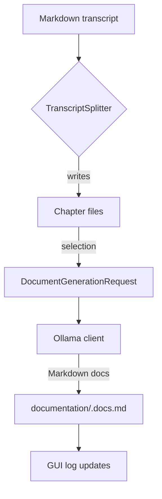
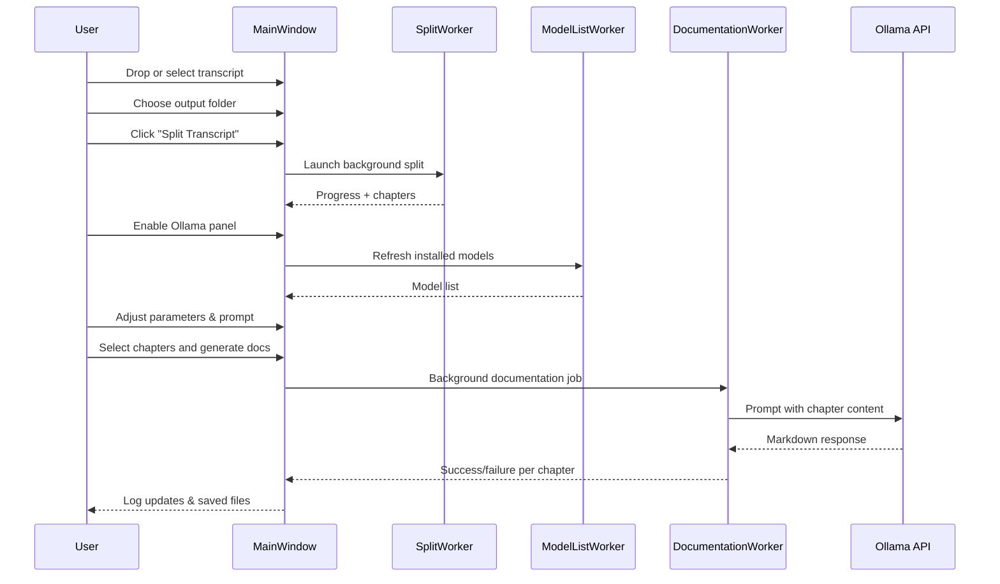

# Docalypt

Docalypt turns long-form Markdown transcripts into timestamped chapter files and
optionally generates supporting documentation for each chapter with a local
Ollama model. The PySide6 desktop application and the CLI share the same
splitting and documentation pipeline so that every interface behaves
identically.

---

## Key capabilities

- **Reliable splitting** – the chapter generation workflow and on-disk layout
  remain backward compatible with the original tool and honour the existing
  `config.toml` options.
- **Responsive desktop app** – drag & drop a transcript, monitor progress, and
  launch documentation jobs without freezing the UI thanks to worker threads.
- **Integrated Ollama controls** – discover installed models, tune generation
  parameters (temperature, top-p, max tokens, presence/frequency penalties,
  repeat penalty, top-k), and craft prompts from a dedicated GUI tab.
- **Dedicated documentation folder** – generated Markdown lives under a
  `documentation/` subdirectory next to the chapter files, keeping source and
  AI output clearly separated.
- **Single codebase** – configuration, splitting, and documentation helpers are
  packaged for reuse by both the GUI and the CLI.

## Repository layout

```text
.
├── docalypt/
│   ├── config.py            # Configuration loading helpers
│   ├── documentation.py     # Documentation workflow and prompt handling
│   ├── gui/
│   │   ├── common.py        # Shared Qt workers and log handler
│   │   └── main_window.py   # Main PySide6 interface
│   ├── ollama.py            # Ollama HTTP helpers and prompt template
│   └── splitting.py         # Transcript splitting engine
├── cli.py                   # Command-line entry point
├── main.py                  # Desktop GUI launcher
└── docs/
    └── ARCHITECTURE.md      # Additional architectural notes
```

### High-level architecture



### GUI workflow



## Getting started

1. **Clone the repository**
   ```bash
   git clone https://github.com/yourname/docalypt.git
   cd docalypt
   ```
2. **Create a virtual environment and install dependencies**
   ```bash
   python -m venv .venv
   source .venv/bin/activate  # On Windows: .venv\Scripts\activate
   pip install -r requirements.txt  # Install PySide6, click, toml, requests
   ```
3. **(Optional) Install and run Ollama**
   - Download from [ollama.com](https://ollama.com/).
   - Start the Ollama service and pull the models you want to use, e.g.:
     ```bash
     ollama pull llama3
     ```

## Running Docalypt

### Desktop application

```bash
python main.py
```

Key controls in the **LLM / Ollama** section:

- **Enable documentation generation with Ollama** – toggles the documentation
  workflow.
- **Model selector** – populated with locally installed models via the
  **Refresh models** button (which calls the Ollama API in a background thread).
  You can also type a model name manually.
- **Generation parameters** – temperature, top-p, max tokens, presence penalty,
  frequency penalty, repeat penalty, and top-k map directly to the Ollama
  request payload.
- **Prompt ingestion tab** – customise the Markdown prompt template used for
  each chapter. A reset button restores the default template.
- **Chapter list** – select the chapters that should receive generated
  documentation, then click **Generate documentation**.

Each generated Markdown file is saved to
`<output_dir>/documentation/<chapter_basename>.docs.md`. The log panel records
successes and failures for every chapter so you can quickly identify problems.

### Command-line interface

```bash
python cli.py transcript.md --output-dir ./chapters
```

The CLI preserves the existing behaviour for splitting transcripts and respects
configuration loaded from `config.toml`.

## Troubleshooting

- Ensure Ollama is running locally before refreshing the model list or starting
  documentation jobs.
- If no models appear, use the log panel to inspect errors from the Ollama
  service and verify that the API is reachable at the default endpoint.
- The GUI keeps heavy work in worker threads. If you need to exit while jobs
  are running, wait for them to finish or stop the Ollama task from the Ollama
  CLI.

## Development notes

- Format code with your preferred tool; the project targets Python 3.9+.
- Run a quick import check before committing:
  ```bash
  python -m compileall docalypt cli.py main.py
  ```
- Additional diagrams and rationale live in [`docs/ARCHITECTURE.md`](docs/ARCHITECTURE.md).

Enjoy documenting your transcripts!
