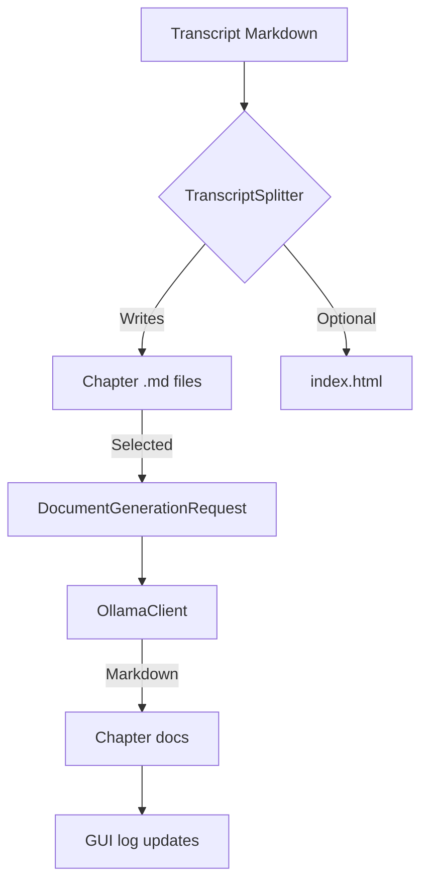
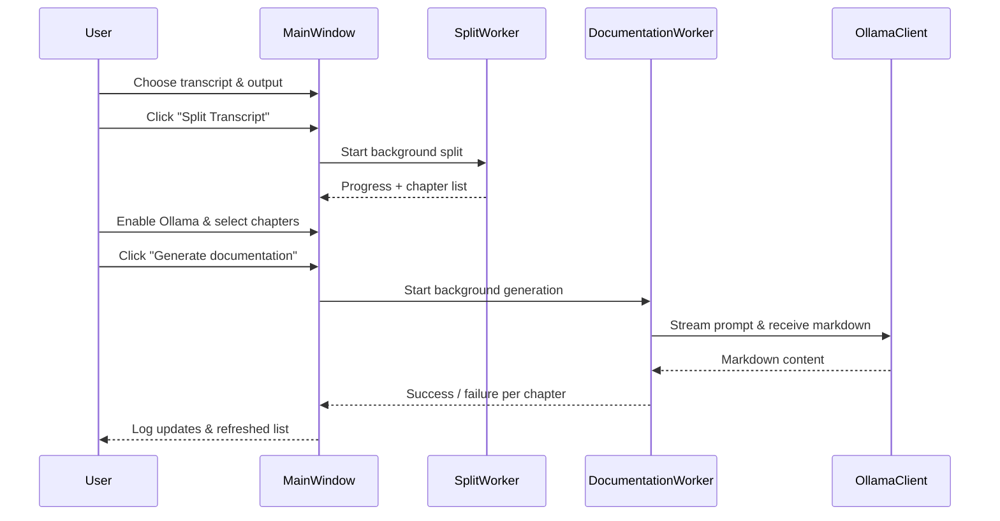

# Docalypt

Docalypt is a desktop and command-line application that turns long-form Markdown
transcripts into neatly organised chapter files and, optionally, generates
chapter documentation with a local Ollama model.

---

## Highlights

- **Unified architecture** – reusable core modules for configuration, splitting
  and documentation across the CLI and both GUIs.
- **Rich PySide6 interface** – drag & drop transcripts, monitor progress, and
  launch Ollama-powered documentation generation without blocking the UI.
- **Compact GUI** – a streamlined window for quick jobs with one-click
  documentation.
- **CLI parity** – the command-line interface retains all previous flags while
  benefiting from the refactored splitting engine.

## Project layout

```text
.
├── docalypt/
│   ├── config.py          # Load persisted configuration
│   ├── documentation.py   # High-level documentation workflow helpers
│   ├── gui/               # PySide6 user interfaces
│   ├── ollama.py          # HTTP client and prompt builder
│   └── splitting.py       # Transcript splitting engine
├── cli.py                 # Click-based CLI entry point
├── compact_gui.py         # Compact GUI launcher
├── main.py                # Full GUI launcher
└── docs/
    └── ARCHITECTURE.md    # Short architectural notes
```

### Architecture overview



### GUI workflow



## Installation

1. **Clone the repository**
   ```bash
   git clone https://github.com/yourname/docalypt.git
   cd docalypt
   ```
2. **Install dependencies** (example using pip)
   ```bash
   python -m venv .venv
   source .venv/bin/activate
   pip install -r requirements.txt  # or install PySide6, click, toml manually
   ```

> Docalypt targets Python 3.9+. PySide6 is required for the GUI; Click and toml
> are required for the CLI.

## Usage

### CLI

```bash
python cli.py transcript.md --output-dir ./chapters --html
```

### Full GUI

```bash
python main.py
```

### Compact GUI

```bash
python compact_gui.py
```

## Ollama integration

1. Install and run [Ollama](https://ollama.com/).
2. Download a local model, for example `ollama run llama3`.
3. In the GUI, enable the **LLM / Ollama** section, enter the model name, tweak
   parameters, select chapters, and click **Generate documentation**.

Each documentation file is saved alongside the chapter as `<chapter>.docs.md`.

## Contributing

- Format code with `black` and `isort`.
- Run `python -m compileall docalypt cli.py main.py compact_gui.py` before
  submitting changes.

For further architectural notes, read [`docs/ARCHITECTURE.md`](docs/ARCHITECTURE.md).
