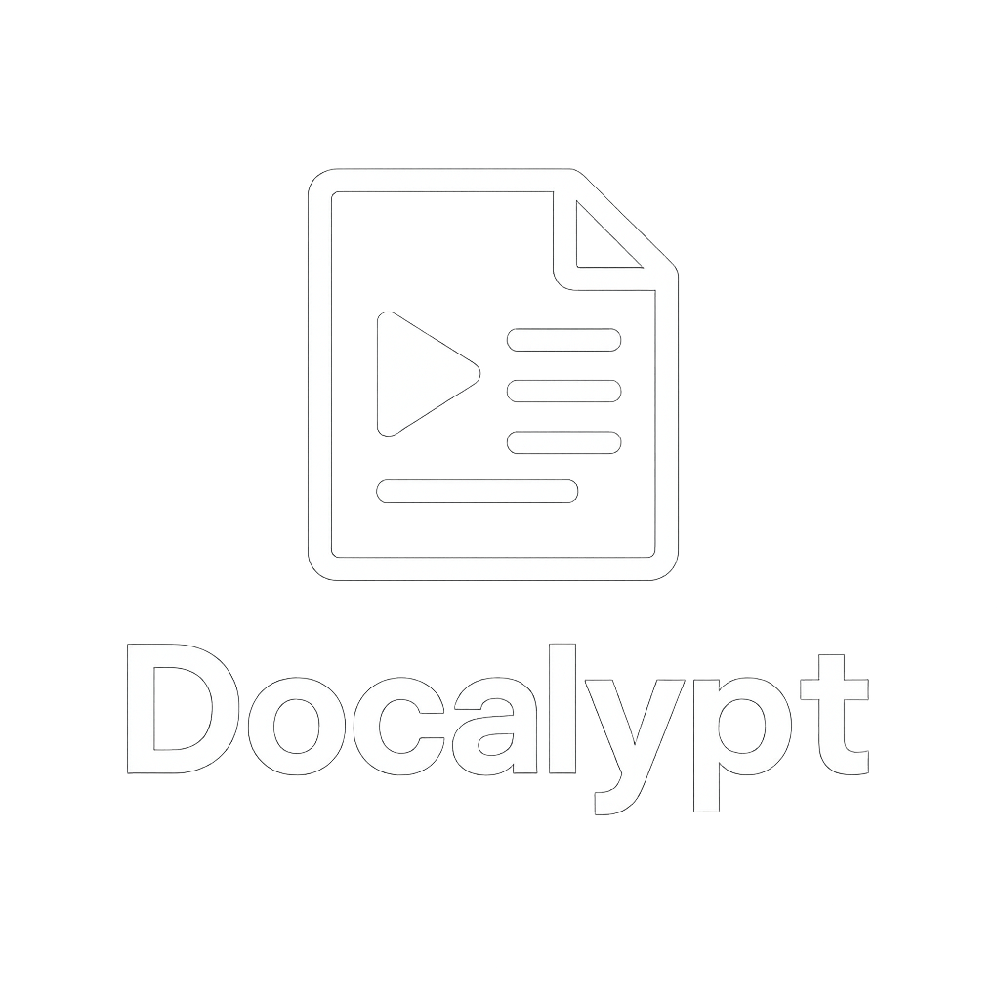
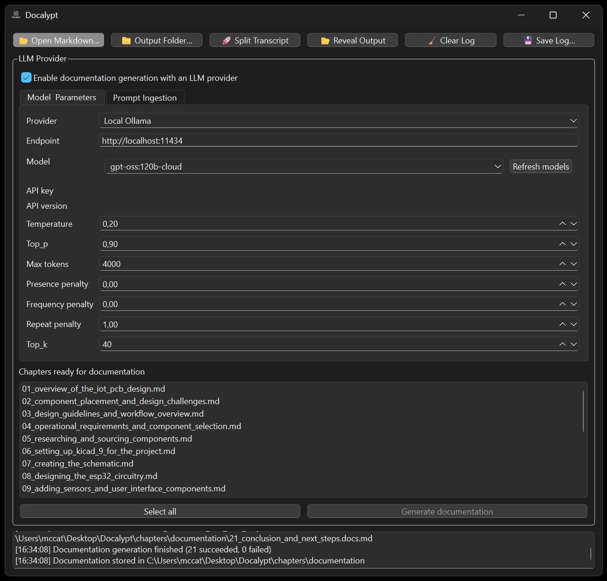

# Docalypt

[](https://www.python.org/)
[](https://doc.qt.io/qtforpython-6/)
[](https://ollama.com/)
[](#running-docalypt)



> **Docalypt** automates the conversion of long-form Markdown transcripts into structured, timestamped chapter files. It optionally enriches each chapter with AI-generated documentation powered by a local **Ollama** model. Both the **PySide6 desktop application** and the **command-line interface** share a unified core pipeline for splitting, organizing, and documenting transcripts. This ensures consistent behavior across every interface—whether you're scripting in the terminal or working visually in the GUI.

---

<div style="text-align: center;">
  
</div>

---

## Key capabilities

* **Reliable splitting**   the chapter generation workflow and on-disk layout
  remain backward compatible with the original tool.
* **Responsive desktop app**   drag & drop a transcript, monitor progress, and
  launch documentation jobs without freezing the UI thanks to worker threads.
* **Integrated Ollama controls**   discover installed models, tune generation
  parameters (temperature, top-p, max tokens, presence/frequency penalties,
  repeat penalty, top-k), and craft prompts from a dedicated GUI tab.
* **Flexible LLM providers**   switch between local Ollama instances and hosted
  services such as OpenAI or Anthropic by editing a simple `.env` file.
* **Dedicated documentation folder**   generated Markdown lives under a
  `documentation/` subdirectory next to the chapter files, keeping source and
  AI output clearly separated.
* **Single codebase**   configuration, splitting, and documentation helpers are
  packaged for reuse by both the GUI and the CLI.

## Repository layout

```bash
├── Docalypt/
│   ├── documentation.py     # Documentation workflow and prompt handling
│   ├── gui/
│   │   ├── common.py        # Shared Qt workers and log handler
│   │   └── main_window.py   # Main PySide6 interface
│   ├── llm.py               # LLM provider clients and prompt template
│   └── splitting.py         # Transcript splitting engine
├── cli.py                   # Command-line entry point
├── main.py                  # Desktop GUI launcher
└── docs/
    └── ARCHITECTURE.md      # Additional architectural notes
```

## Getting started

1. **Clone the repository**

   ```bash
   git clone https://github.com/CagriCatik/Docalypt.git
   cd Docalypt
   ```

2. **Create a virtual environment and install dependencies**

   ```bash
   python -m venv .venv
   source .venv/bin/activate  # On Windows: .venv\Scripts\activate
   pip install -r requirements.txt  # Install PySide6, click, toml, requests
   ```

3. **Configure environment variables**

   Copy the sample configuration and fill in the provider you plan to use.

   ```bash
   cp .env.example .env
   ```

   * `DOCALYPT_LLM_PROVIDER` accepts `ollama`, `openai`, or `anthropic`.
   * Provide the matching API key and endpoint URLs when using hosted models.

4. **Install and run Ollama**

   * Download from [ollama.com](https://ollama.com/).
   * Start the Ollama service and pull the models you want to use, e.g.:

     ```bash
     ollama pull llama3
     ```

## Demo: from YouTube video to chapters and docs

This demo walks through using Docalypt with a real-world hardware video:

> [Design & assemble an ESP32 IoT 4-layer PCB](https://www.youtube.com/watch?v=LO9AO0XTX3M)

### 1. Export the YouTube transcript

Use any YouTube transcript exporter or manual copy of the transcript and save it
as a Markdown file, for example:

```text
transcripts/
└── esp32_iot_4_layer_pcb.md
```

Guidelines for the input file:

* Use plain text or Markdown.
* Preserve timestamps if the exporter provides them.
* Keep the entire video transcript in a single file.

### 2. Split the transcript into chapters (CLI)

Run Docalypt on the exported transcript:

```bash
python cli.py transcripts/esp32_iot_4_layer_pcb.md --output-dir ./demo_chapters
```

After the run you will have a structure similar to:

```text
chapters/
├── 000_intro.md
├── 010_schematic_overview.md
├── 020_layer_stackup.md
└── 030_routing_strategies.md
```

### 3. Generate documentation with Ollama (GUI)

You can now use the desktop app to generate per-chapter documentation from the
same transcript:

1. Start the GUI:

   ```bash
   python main.py
   ```

2. In the main window:

   * Drag and drop `transcripts/esp32_iot_4_layer_pcb.md` or select it via the
     file dialog.
   * Choose `./demo_chapters` (or another directory) as the output folder.
   * Click **Split Transcript** and wait for the chapters to appear in the list.

3. Enable and configure Ollama:

   * Open the **LLM / Ollama** tab.
   * Check **Enable documentation generation with Ollama**.
   * Click **Refresh models** and select your local model (for example `llama3.2:1b`).
   * Optionally tune temperature, max tokens, and other parameters.
   * Optionally adjust the prompt template in the Prompt tab to focus on PCB
     design decisions, trade-offs, and best practices.

4. Generate the docs:

   * In the chapter list, select the chapters that you want documentation for
     (for example, only the routing and layer stackup chapters).
   * Click **Generate documentation**.

Docalypt will create Markdown documentation files like:

```text
chapters/documentation/
├── 000_intro.docs.md
├── 010_schematic_overview.md
├── 010_schematic_overview.docs.md
├── 020_layer_stackup.md
├── 020_layer_stackup.docs.md
├── 030_routing_strategies.md
└── 030_routing_strategies.docs.md
```

Each `.docs.md` file contains AI-generated notes, summaries, or explanations
derived from the corresponding chapter and the prompt you configured.

## Running Docalypt

### Desktop application

```bash
python main.py
```

Key controls in the **LLM / Ollama** section:

* **Enable documentation generation with Ollama**   toggles the documentation
  workflow.
* **Model selector**   populated with locally installed models via the
  **Refresh models** button (which calls the Ollama API in a background thread).
  You can also type a model name manually.
* **Generation parameters**   temperature, top-p, max tokens, presence penalty,
  frequency penalty, repeat penalty, and top-k map directly to the Ollama
  request payload.
* **Prompt ingestion tab**   customise the Markdown prompt template used for
  each chapter. A reset button restores the default template.
* **Chapter list**   select the chapters that should receive generated
  documentation, then click **Generate documentation**.

Each generated Markdown file is saved to
`<output_dir>/documentation/<chapter_basename>.docs.md`. The log panel records
successes and failures for every chapter so you can quickly identify problems.

### Command-line interface

```bash
python cli.py transcript.md --output-dir ./chapters
```

The CLI preserves the existing behaviour for splitting transcripts and respects
configuration loaded from `config.toml`.

## Troubleshooting

* Ensure Ollama is running locally before refreshing the model list or starting
  documentation jobs.
* If no models appear, use the log panel to inspect errors from the Ollama
  service and verify that the API is reachable at the default endpoint.
* The GUI keeps heavy work in worker threads. If you need to exit while jobs
  are running, wait for them to finish or stop the Ollama task from the Ollama
  CLI.

## Development notes

* Additional diagrams and rationale live in [**architecture**](docs/ARCHITECTURE.md).
