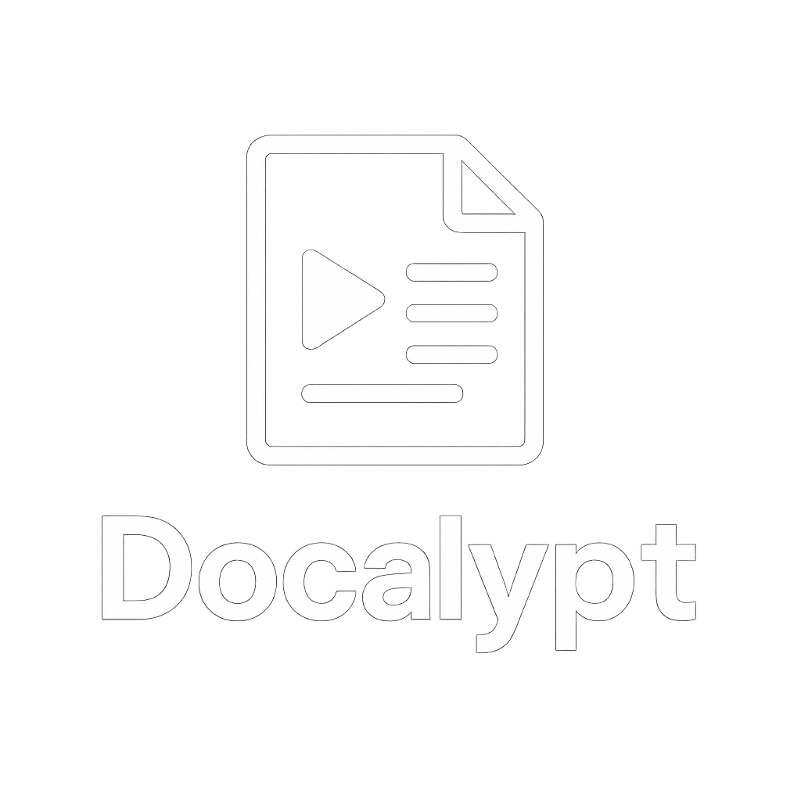
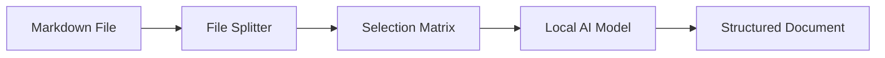
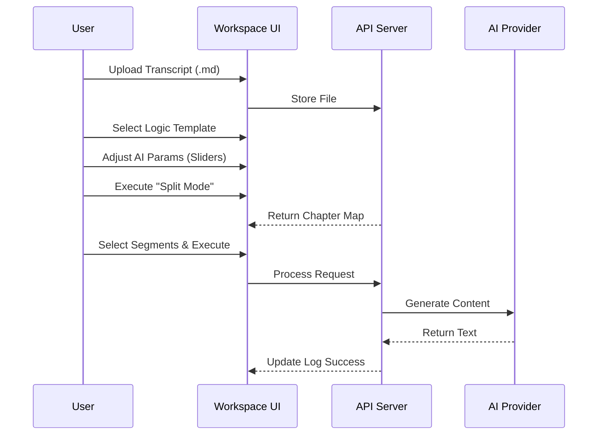
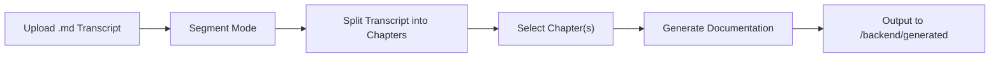
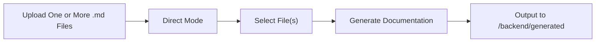

<p align="center">
  
</p>

---

<p align="center">
Docalypt is a utilitarian, high-density workspace designed to transform raw transcripts and markdown archives into structured technical documentation using local AI models (via Ollama) or cloud providers.
</p>


```mermaid
graph LR
    Input[Markdown File] --> Split[File Splitter]
    Split --> Matrix[Selection Matrix]
    Matrix --> AI[Local AI Model]
    AI --> Output[Structured Document]
```

## Core Features

- **Decoupled Architecture**: Clean separation between a FastAPI backend and a React/Vite frontend.
- **AI Control**: Fine-tune output with Temperature, Top P, Novelty Penalty, and Frequency Penalty.
- **File Splitting**: Automatically segment long transcripts into logical chapters based on markdown headings.
- **Live Action Log**: Real-time feedback and system health monitoring.

## Project Structure

The codebase is organized into two primary domains:

### `/backend`

The engine responsible for text processing, segment management, and AI orchestration.

- **`server.py`**: High-performance FastAPI server.
- **`docalypt/`**: Core library for chapter splitting and document generation.
- **`transcripts/`**: Ingested data storage.
- **`generated/`**: Final output hub.

### `/frontend`

- A compact, professional UI built with Tailwind CSS v4 and Lucide-React.

## Installation & Setup

### 1. Requirements

- Python 3.10+
- Node.js 18+
- [Ollama](https://ollama.com/) (running locally)

### 2. Backend Setup

```bash
cd backend
python -m venv venv
# Windows: venv\Scripts\activate | Linux/Mac: source venv/bin/activate
pip install -r requirements.txt
python server.py
```

### 2. Configuration (Optional)

The backend reads environment variables from `backend/.env`. Key settings:

- `DOCALYPT_CORS_ORIGINS`: Comma-separated list of allowed origins.
- `DOCALYPT_TRANSCRIPTS_DIR`: Override the transcripts storage path.
- `DOCALYPT_GENERATED_DIR`: Override the generated docs output path.
- `DOCALYPT_PROMPTS_DIR`: Override the prompts template folder.

### 3. Frontend Setup

```bash
cd frontend
npm install
npm run dev
```

The application will be accessible at [http://localhost:5173](http://localhost:5173).

## Usage Workflow


```mermaid
sequenceDiagram
    participant U as User
    participant F as Workspace UI
    participant B as API Server
    participant A as AI Provider

    U->>F: Upload Transcript (.md)
    F->>B: Store File
    U->>F: Select Logic Template
    U->>F: Adjust AI Params (Sliders)
    U->>F: Execute "Split Mode"
    B-->>F: Return Chapter Map
    U->>F: Select Segments & Execute
    F->>B: Process Request
    B->>A: Generate Content
    A-->>B: Return Text
    B-->>F: Update Log Success
```

## Usage Modes

### Segment Mode (Split + Select)

Use this when you want the system to break a long transcript into chapter files first, then select specific chapters for generation.


```mermaid
flowchart LR
    A[Upload .md Transcript] --> B[Segment Mode]
    B --> C[Split Transcript into Chapters]
    C --> D["Select Chapter(s)"]
    D --> E[Generate Documentation]
    E --> F[Output to /backend/generated]
```

### Direct Mode (Batch Upload + Generate)

Use this when you already have multiple clean markdown files and want to process them directly without splitting.


```mermaid
flowchart LR
    A[Upload One or More .md Files] --> B[Direct Mode]
    B --> C["Select File(s)"]
    C --> D[Generate Documentation]
    D --> E[Output to /backend/generated]
```

### Notes

- The **System Prompt** and **Template** can be reset to backend defaults at any time under `backend/prompts`.

## Testing

Run backend unit and integration tests using pytest:

```bash
cd backend
pytest tests/
```

Run frontend build/lint checks:

```bash
cd frontend
npm run build
npm run lint
```
