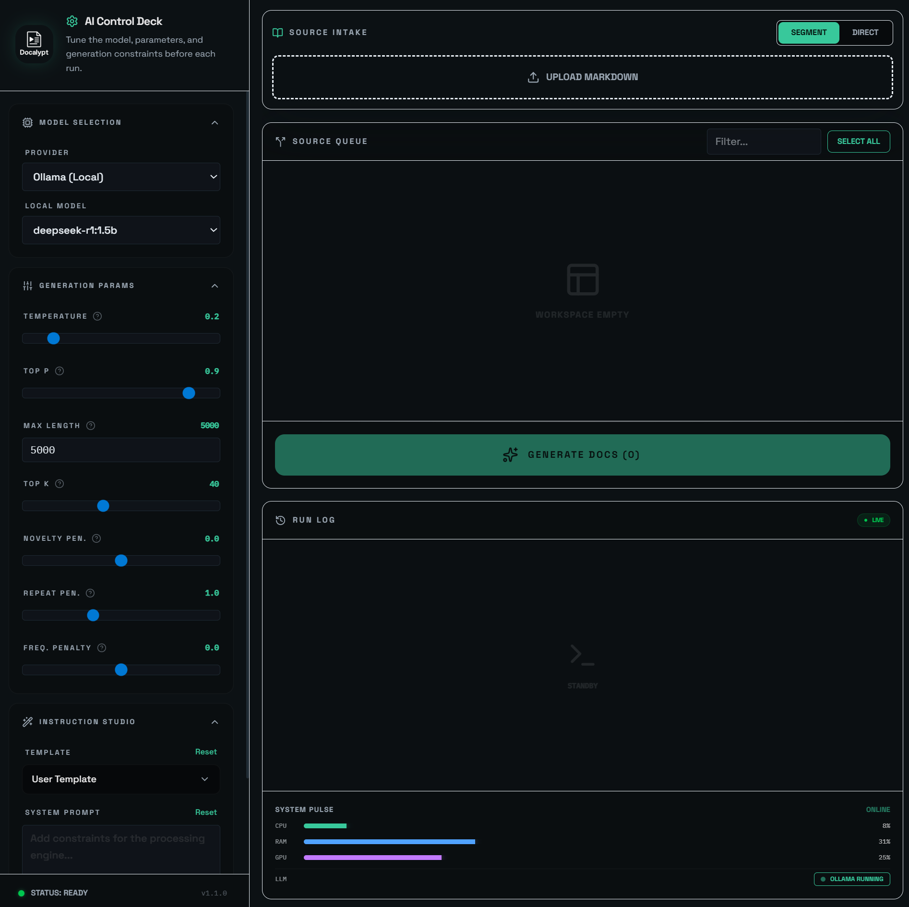
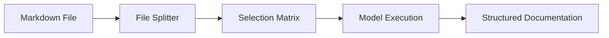
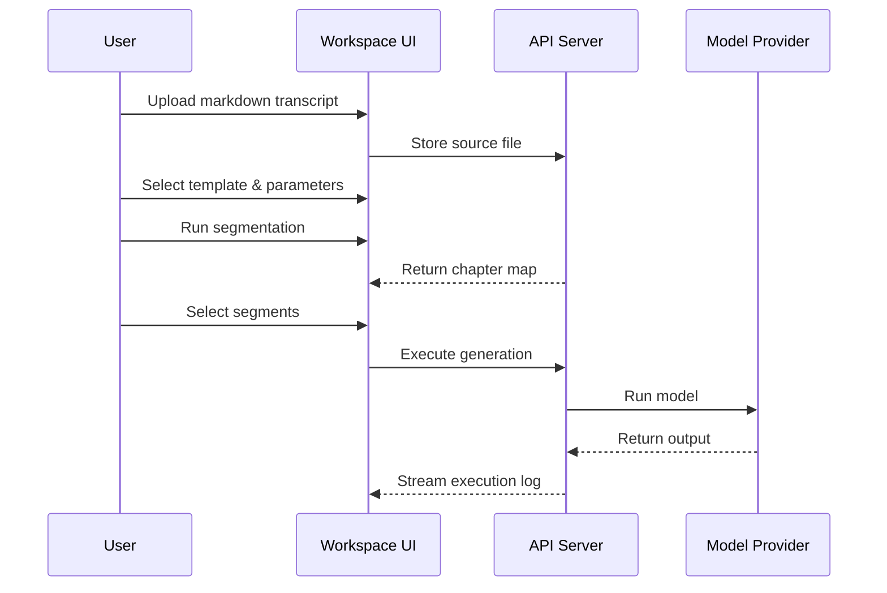
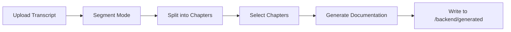
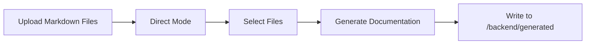

<p align="center">
  
</p>

---

<p align="center">
<b>Docalypt</b> is a high-density documentation workspace for transforming raw transcripts and markdown archives into precise, structured technical documentation.  
It is designed for engineers who need system-level clarity, deterministic structure, and repeatable outputs—not summaries, not prose polishing.
</p>

<p align="center">
  
</p>

<p align="center">
Docalypt decomposes large, unstructured inputs into explicit segments, applies strict templates, and generates documentation that preserves technical intent, assumptions, and boundaries. The focus is transformation, not abstraction.
</p>


```mermaid
graph LR
    Input[Markdown File] --> Split[File Splitter]
    Split --> Matrix[Selection Matrix]
    Matrix --> AI[Model Execution]
    AI --> Output[Structured Documentation]
```

---

## Design Philosophy

Docalypt treats documentation as an engineering artifact.

* **Structure first**: segmentation and selection are explicit, not implicit.
* **Deterministic workflows**: the same input, template, and parameters produce the same class of output.
* **High signal density**: output favors accuracy, traceability, and technical completeness over readability fluff.
* **Human-in-the-loop**: users control segmentation, selection, prompts, and generation parameters at every step.

---

## Core Features

* **Decoupled Architecture**
  A clean separation between a FastAPI backend (processing and orchestration) and a React/Vite frontend (control and inspection).

* **Segment-Aware Processing**
  Long markdown transcripts are split into logical chapters using heading structure, enabling selective and targeted generation.

* **Explicit Selection Matrix**
  Choose exactly which segments are processed. Nothing is implicit or hidden.

* **Fine-Grained Model Control**
  Adjust Temperature, Top-P, Frequency Penalty, and Novelty Penalty to match the required documentation style and rigor.

* **Live Execution Log**
  Real-time visibility into system actions, model calls, and generation state.

---

## Project Structure

The repository is split into two primary domains:

### `/backend`

The execution engine responsible for segmentation, prompt orchestration, and document generation.

* **`server.py`**
  FastAPI server exposing the processing pipeline.

* **`docalypt/`**
  Core library for markdown parsing, chapter splitting, and generation logic.

* **`transcripts/`**
  Storage for ingested source material.

* **`generated/`**
  Output directory for generated documentation.

### `/frontend`

A compact, purpose-built workspace UI.

* Built with React, Vite, Tailwind CSS v4, and Lucide-React.
* Focused on inspection, control, and execution—not decoration.

---

## Installation & Setup

### Requirements

* Python 3.10+
* Node.js 18+
* Ollama running locally (or a configured external provider)

---

### Backend Setup

```bash
cd backend
python -m venv venv
# Windows: venv\Scripts\activate
# Linux/Mac: source venv/bin/activate
pip install -r requirements.txt
python server.py
```

---

### Configuration (Optional)

Environment variables are read from `backend/.env`.

Key options:

* `DOCALYPT_CORS_ORIGINS` – Allowed frontend origins
* `DOCALYPT_TRANSCRIPTS_DIR` – Override transcript storage path
* `DOCALYPT_GENERATED_DIR` – Override output directory
* `DOCALYPT_PROMPTS_DIR` – Override prompt/template location

---

### Frontend Setup

```bash
cd frontend
npm install
npm run dev
```

The workspace will be available at:
**[http://localhost:5173](http://localhost:5173)**

---

## Usage Workflow


```mermaid
sequenceDiagram
    participant U as User
    participant F as Workspace UI
    participant B as API Server
    participant A as Model Provider

    U->>F: Upload markdown transcript
    F->>B: Store source file
    U->>F: Select template & parameters
    U->>F: Run segmentation
    B-->>F: Return chapter map
    U->>F: Select segments
    F->>B: Execute generation
    B->>A: Run model
    A-->>B: Return output
    B-->>F: Stream execution log
```

---

## Usage Modes

### Segment Mode (Split → Select → Generate)

Use this for large or unstructured transcripts.


```mermaid
flowchart LR
    A[Upload Transcript] --> B[Segment Mode]
    B --> C[Split into Chapters]
    C --> D[Select Chapters]
    D --> E[Generate Documentation]
    E --> F[Write to /backend/generated]
```

---

### Direct Mode (Batch Generate)

Use this for already-clean markdown files that do not require segmentation.


```mermaid
flowchart LR
    A[Upload Markdown Files] --> B[Direct Mode]
    B --> C[Select Files]
    C --> D[Generate Documentation]
    D --> E[Write to /backend/generated]
```

---

## Notes

* System prompts and templates can be reset to backend defaults at any time via `backend/prompts`.
* Docalypt does not attempt to “improve” content stylistically. It enforces structure and preserves meaning.

---

## Testing

### Backend

```bash
cd backend
pytest tests/
```

### Frontend

```bash
cd frontend
npm run build
npm run lint
```
