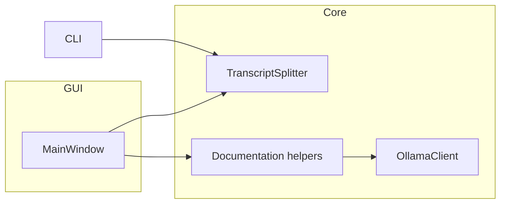

# Docalypt Architecture Notes

The project is organised into three layers:

1. **Core services** (`docalypt.splitting`, `docalypt.documentation`,
   `docalypt.ollama`) provide reusable functionality for parsing transcripts,
   preparing prompts, and calling the local Ollama server.
2. **Presentation** (`docalypt.gui.main_window`) delivers the PySide6 desktop
   interface backed by shared worker classes for long-running tasks.
3. **Entrypoints** (`cli.py`, `main.py`) load either the command-line tool or the
   GUI while delegating work to the core modules.

## Threading model

- Splitting and documentation run inside Qt `QThread` workers to keep the UI
  responsive.
- Workers emit progress and status signals consumed by the GUI log panel.
- The CLI uses the same `TranscriptSplitter` but runs synchronously, making it
  easy to test outside the GUI.

## Documentation output

- Documentation files are written to a dedicated `documentation/` subdirectory
  inside the chosen output folder.
- `DocumentGenerationRequest.destination_dirname` controls the target directory
  name so future front-ends can redirect output without rewriting core logic.
- `DocumentGenerationResult` returns both the chapter path and the generated
  documentation path for precise logging and UI feedback.

## Extensibility

- Add new Ollama parameters by extending `OllamaSettings`; the GUI binds each
  control directly to the dataclass fields.
- Hook additional post-processing by appending to
  `TranscriptSplitter.post_split_hooks`.
- Additional front-ends can reuse the documented request/response types from
  `docalypt.documentation`.
