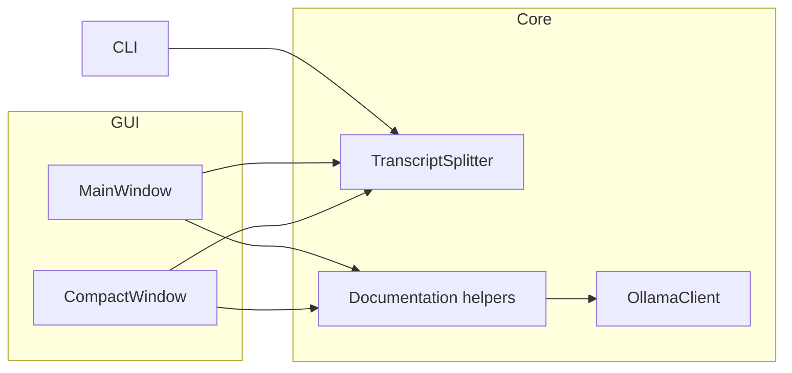

# Docalypt Architecture Notes

This project is organised around three layers:

1. **Core services** (`docalypt.splitting`, `docalypt.documentation`, `docalypt.ollama`)
   provide reusable functionality for parsing transcripts, preparing prompts and
   calling the local Ollama server.
2. **Presentation** (`docalypt.gui`) offers both a main window and a compact
   window that share worker classes for long-running tasks.
3. **Entrypoints** (`cli.py`, `main.py`, `compact_gui.py`) load the appropriate
   presentation or command-line UI while delegating all logic to the core.

## Threading model

- Splitting and documentation run inside Qt `QThread` workers to keep the UI
  responsive.
- Workers emit progress and status signals consumed by the GUI log panels.
- The CLI uses the same `TranscriptSplitter` but runs synchronously, making it
  easy to test outside the GUI.

## Extensibility

- Add new Ollama parameters by extending `OllamaSettings`; GUI controls bind
  directly to the dataclass fields.
- Hook additional post-processing by appending to `TranscriptSplitter.post_split_hooks`.
- Additional front-ends can reuse the documented request/response types from
  `docalypt.documentation`.
