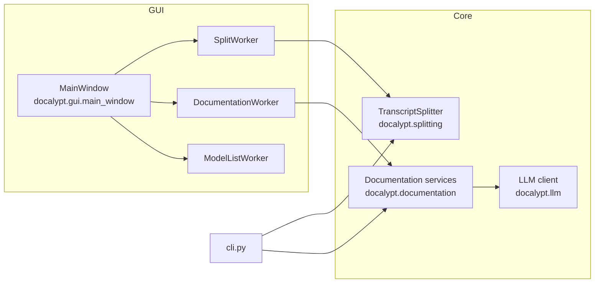
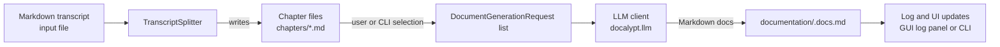
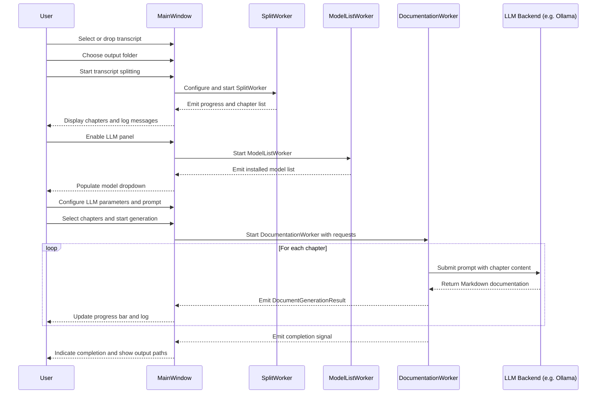

# Docalypt Architecture

## 1. Architectural Overview

Docalypt is structured as a layered desktop application with a clear separation between:

1. Core services (framework-agnostic business logic)
2. Presentation layer (PySide6 GUI)
3. Entrypoints (CLI and GUI bootstrap)

Core modules expose stable, reusable APIs for transcript splitting, documentation generation, and interaction with LLM backends. The GUI and CLI are thin orchestration layers that depend on these core modules but never the other way around.

Design goals:

* Core logic is reusable, testable, and independent of Qt.
* Presentation is replaceable (CLI, desktop GUI, future web frontends).
* Long-running operations execute off the main thread and report progress via well-defined channels.
* File layout and output formats are deterministic for easy automation and inspection.

---

## 2. Architecture Layers

### 2.1 Core Services

Packages:

* `docalypt.splitting`
* `docalypt.documentation`
* `docalypt.llm`

These modules form the domain layer. They do not import from PySide6, CLI parsing libraries, or UI code.

#### 2.1.1 docalypt.splitting

Responsibilities:

* Parse a single transcript (typically Markdown or plain text) into a set of chapter files.
* Apply configurable rules and heuristics for chapter boundaries.
* Invoke optional post-processing hooks after splitting completes.

Typical responsibilities:

* Accept:

  * Path or text of the source transcript.
  * Splitting configuration (e.g. target chapter length, heading markers, optional regex patterns).
* Produce:

  * A list of chapter descriptors and corresponding files on disk.
  * Progress callbacks or status reporting hooks for observers (GUI workers, CLI logging).

Key concepts:

* `TranscriptSplitter`

  * Pure Python class responsible for:

    * Reading the input transcript.
    * Computing chapter boundaries.
    * Writing chapter files under a dedicated chapters directory, e.g.:

      * `<output_root>/chapters/<chapter_n>.md`
    * Invoking `post_split_hooks`.
  * Does not depend on Qt or any UI.

* `TranscriptSplitter.post_split_hooks`

  * A list of callables that receive the splitting result.
  * Intended for:

    * Additional indexing.
    * Automatic cleanup.
    * Additional derived files (e.g. a chapter index).
  * Allows extension without modifying core splitting behavior.

#### 2.1.2 docalypt.documentation

Responsibilities:

* Define request/response types for documentation generation.
* Coordinate chapter-based document generation with an LLM client.
* Manage destination file structure and file naming.
* Aggregate per-chapter results for reporting and UI display.

Core types:

* `DocumentGenerationRequest`

  * Represents a single documentation unit to be generated.
  * Typical fields (conceptually):

    * `chapter_path`: path to the chapter source file.
    * `destination_dirname`: subdirectory name under the chosen output directory (`documentation/` by default).
    * LLM-related parameters (model name, prompt template, temperature, etc.).
  * Designed to be constructed by either CLI or GUI frontends.

* `DocumentGenerationResult`

  * Represents the output of a generation run for a single chapter.
  * Contains:

    * `chapter_path`: original chapter source.
    * `documentation_path`: path to the generated documentation file.
    * Status information (success/failure, error message if any).
  * Used by the GUI for logging and by the CLI for structured output.

Responsibilities of the module:

* Provide a function or service to:

  * Accept a collection of `DocumentGenerationRequest` instances.
  * For each request:

    * Assemble the final prompt (base prompt + chapter content + user-provided options).
    * Call the LLM client.
    * Write the resulting Markdown documentation file into:

      * `<output_root>/<destination_dirname>/<chapter_basename>.docs.md`
    * Return `DocumentGenerationResult`.
* Remain unaware of threading or Qt specifics. It runs synchronously from the perspective of callers.

#### 2.1.3 docalypt.llm

Responsibilities:

* Provide a unified API for LLM calls, supporting both local (Ollama) and remote providers.
* Encapsulate connection details, authentication, and request shaping.
* Map `LLMSettings` into the correct provider-specific options.

Core concepts:

* `LLMSettings`

  * Configuration container for LLM behavior.
  * Typically includes:

    * Model identifier (e.g. "llama3:8b").
    * Backend type (e.g. "ollama", "openai", etc.).
    * Base URL / endpoint for backend.
    * Temperature, max tokens, and other generation parameters.
    * Optional timeouts or retry settings.

* LLM client abstraction

  * Exposes a small surface area, for example:

    * `generate(prompt: str) -> str`
    * Optional streaming variants.
  * Hides transport details (HTTP client, streaming protocol, etc.).
  * Enables alternative implementations (mock clients for testing, other providers).

By centralizing LLM access here, the rest of the system is shielded from:

* HTTP APIs and authentication details.
* Provider-specific response formats.
* Error classification and retry semantics.

---

### 2.2 Presentation Layer (GUI)

Module:

* `docalypt.gui.main_window`

Responsibilities:

* Provide the PySide6 desktop UI:

  * File selection (transcripts, output directory).
  * LLM configuration panel backed by `LLMSettings`.
  * Progress view, logs, and chapter selection for documentation generation.
* Spawn and manage worker threads for long-running operations:

  * `SplitWorker`
  * `ModelListWorker`
  * `DocumentationWorker`
* Connect worker signals to GUI widgets:

  * Progress updates.
  * Log messages.
  * Completion status and per-chapter results.

#### 2.2.1 MainWindow

High-level responsibilities:

* Maintain UI state:

  * Selected transcript path.
  * Output directory.
  * List of generated chapters.
  * LLM configuration settings.
  * Selected chapters for generation.
* Manage worker lifecycle:

  * Construct workers with appropriate arguments (paths, configuration objects, request lists).
  * Connect worker signals to slots in the main thread.
  * Disable/enable UI controls while workers are running.
* Ensure main-thread-only access to Qt widgets:

  * Workers never touch UI directly.
  * Workers communicate exclusively via Qt signals.

#### 2.2.2 Worker Classes (QThread-based)

Workers are thin adapters that:

* Execute core services in background threads.
* Translate domain-level events into Qt signals.
* Never depend on GUI components, only on core modules and data classes.

Typical workers:

* `SplitWorker`

  * Inputs:

    * Transcript file path.
    * Splitting configuration and output directory.
  * Behavior:

    * Runs `TranscriptSplitter` synchronously inside `run()`.
    * Emits signals for:

      * Progress updates (e.g. chapters processed).
      * Final list of chapter paths.
      * Errors if splitting fails.

* `ModelListWorker`

  * Inputs:

    * LLM backend configuration (base URL etc.).
  * Behavior:

    * Queries the LLM backend (e.g. Ollama) for installed models.
    * Emits:

      * A list of model identifiers.
      * Error signal if the backend is unreachable.

* `DocumentationWorker`

  * Inputs:

    * A list of `DocumentGenerationRequest` objects.
    * Shared `LLMSettings`.
  * Behavior:

    * Iterates requests and calls documentation generation services.
    * Emits per-chapter signals:

      * Progress (current index / total).
      * Success with `DocumentGenerationResult`.
      * Failure with detailed error information.
    * Emits a final completion signal when all requests are processed or a fatal error occurs.

Threading rules:

* Workers subclass `QThread` or use `QObject` moved to a `QThread` to avoid blocking the GUI event loop.
* All Qt signals emitted from workers are received and handled on the main thread.
* Core services remain unaware of QThread; they are run like normal synchronous Python code.

---

### 2.3 Entrypoints

Files:

* `cli.py`
* `main.py`

Responsibilities:

* Provide minimal, targeted startup modes without duplicating domain logic.

#### 2.3.1 cli.py

* Parse command-line arguments:

  * Transcript path.
  * Output directory.
  * Optional settings (e.g. model, prompt file, temperature).
* Instantiate core services directly:

  * Run `TranscriptSplitter` synchronously.
  * Optionally invoke documentation generation for all or selected chapters.
* Emit logs to stdout/stderr:

  * Progress and error messages.
  * Paths to written chapter and documentation files.
* Provide a simple, scriptable interface for automation and testing.

#### 2.3.2 main.py

* Initialize QApplication.
* Construct and show `MainWindow`.
* Delegate user actions entirely to GUI and worker classes.
* Do not contain business logic.

---

## 3. Threading and Execution Model

Execution characteristics:

* GUI:

  * The Qt main thread owns all widgets and event delivery.
  * Long-running operations (splitting, model listing, documentation generation) run in worker threads.
  * Workers communicate via typed signals carrying:

    * Progress percentages or current counts.
    * Status messages for logs.
    * Structured results (`DocumentGenerationResult` instances).
* CLI:

  * Operations are synchronous and blocking.
  * Behavior is deterministic and suitable for unit tests.
  * No Qt dependencies.

Benefits:

* The GUI remains responsive while processing large transcripts or generating many chapter documents.
* Core logic can be tested without Qt.
* The CLI and GUI share identical underlying behavior, improving consistency and debuggability.

---

## 4. Documentation Output Model

Output layout:

* All generated documentation is placed in a subdirectory under the chosen output directory:

  * `<output_root>/<destination_dirname>/`
  * By default, `destination_dirname` is `"documentation"`.
* For each chapter:

  * Chapter files are created in a `chapters` directory (conventionally).
  * Documentation is written as Markdown:

    * `documentation/<chapter_basename>.docs.md`

Key properties:

* `DocumentGenerationRequest.destination_dirname`

  * Controls the subdirectory name where documentation files are written.
  * Enables alternate front-ends to adjust the layout (e.g. `"docs"`, `"api_docs"`) without modifying core logic.
* `DocumentGenerationResult`

  * Always returns:

    * `chapter_path`: the source chapter file.
    * `documentation_path`: the final documentation file.
  * Allows:

    * GUI to show clickable links to generated files.
    * CLI to print machine-readable mappings between source chapters and generated docs.

This structure makes it straightforward to:

* Post-process generated documentation (e.g. static site generation).
* Integrate with external tools like MkDocs or Sphinx by pointing them at the `documentation/` tree.

---

## 5. Extensibility

Docalypt is intentionally designed for extension with minimal change to existing code.

Extension points:

* LLM configuration:

  * New LLM-related options are introduced by extending the `LLMSettings` dataclass.
  * GUI widgets (e.g. text fields, sliders) bind directly to `LLMSettings` fields.
  * The LLM client adapter maps these fields to provider-specific parameters.

* Post-splitting processing:

  * Additional logic after transcript splitting can be registered in `TranscriptSplitter.post_split_hooks`.
  * Examples:

    * Generating a JSON index of chapters.
    * Building a TOC file.
    * Validating chapter file naming.

* New frontends:

  * Additional interfaces (e.g. web UI, editor plugins) can:

    * Call into `docalypt.splitting` and `docalypt.documentation`.
    * Reuse `LLMSettings` and LLM client abstractions.
  * No dependency on PySide6 is required for these frontends.

* Alternative LLM providers:

  * New backends can implement the same logical client interface.
  * Selection is controlled by `LLMSettings` (backend type, endpoint).
  * The rest of the system remains unchanged.

---

## 6. High-Level Processing Flow

### 6.1 Transcript to Documentation

Summary of the pipeline:

1. A user or script provides a transcript and output directory.
2. `TranscriptSplitter` produces chapter files.
3. Selected chapters are transformed into `DocumentGenerationRequest` objects.
4. The documentation service calls the LLM client for each request.
5. Markdown documentation files are written to the configured destination directory.
6. Frontends receive structured results and update their respective views/logs.

---

## 7. GUI Interaction Workflow

This interaction model ensures that:

* The user always sees real-time feedback (progress, logs, errors).
* All heavy work (splitting, model discovery, documentation generation) runs off the main thread.
* The GUI remains responsive regardless of transcript size or number of chapters.

---

## 8. Error Handling and Logging

Error handling principles:

* Core modules raise structured exceptions or return error-rich result objects.
* Worker threads:

  * Catch exceptions.
  * Convert them into error signals with user-oriented messages plus internal details when needed.
* GUI:

  * Logs all status lines in a text panel.
  * Surfaces blocking failures (e.g. failed to contact LLM backend) via dialogs.
* CLI:

  * Writes errors to stderr.
  * Uses exit codes to indicate failure to calling scripts.
