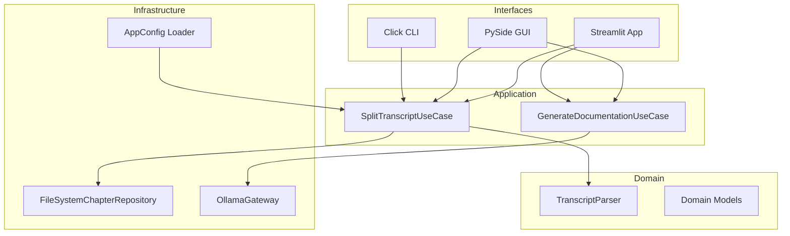

# Docalypt Architecture Overview

Docalypt now follows a layered architecture that separates pure business logic
from infrastructure and presentation concerns.

## Layer responsibilities

- **Domain (`docalypt/domain`)** holds immutable data structures such as
  `Chapter`, `ChapterDocument`, and the pure `TranscriptParser` used to extract
  segments from raw Markdown transcripts.
- **Application (`docalypt/application`)** coordinates use-cases. Each use-case
  accepts domain services and infrastructure ports, returning structured result
  objects that are consumed by the interfaces.
- **Infrastructure (`docalypt/infrastructure`)** contains adapters for the
  filesystem (`FileSystemChapterRepository`), configuration (`load_app_config`),
  and the Ollama HTTP gateway. The infrastructure is the only layer that performs
  I/O.
- **Interfaces (`docalypt/interfaces`)** exposes the CLI, existing PySide
  windows, and the new Streamlit web UI. Each interface wires user input into the
  application use-cases and listens for domain-level results instead of reaching
  into infrastructure details.

## Worker model

- The PySide GUI continues to execute splitting and documentation generation in
  background `QThread` workers. Workers now use the application services to
  produce results so behaviour is consistent with the CLI and Streamlit front-ends.
- The CLI and Streamlit interfaces call the same use-cases synchronously while
  reporting progress via callbacks or Streamlit widgets.

## Documentation output

- The filesystem repository writes chapter Markdown files and uses a Jinja2
  template to render an `index.html` when requested.
- Documentation jobs write results to a configurable `documentation/` folder
  beneath the chapter directory. The `DocumentOutcome` structure exposes both the
  source chapter and destination document paths so front-ends can present clear
  feedback.

## Extending the system

- Add new persistence mechanisms by implementing the `ChapterRepository`
  protocol and wiring it into the application services.
- Add a different LLM backend by providing an object that implements the
  `DocumentationGateway` protocol and injecting it into the documentation
  use-case.
- Front-ends should reside in `docalypt/interfaces/<channel>/` and depend only on
  application services. This keeps UI churn from rippling through the business
  logic.
