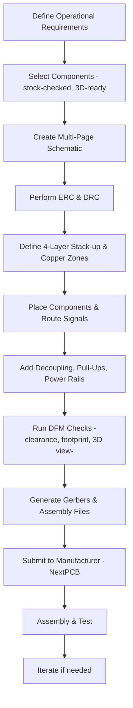
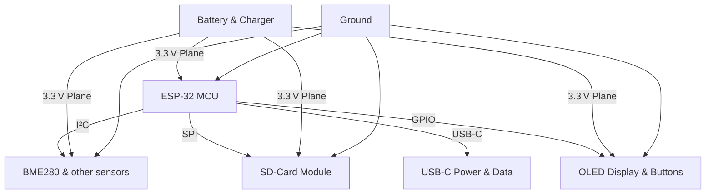

# Operational Requirements and Component Selection  

---

## 1. High‑Level Design Goals  

The board was conceived to satisfy three **top‑level requirements**:

| Requirement | Rationale |
|------------|-----------|
| **Demonstration platform** – a medium‑complexity PCB that can be used to record a tutorial video. | Guarantees that the design remains approachable while still showcasing advanced KiCad features. |
| **Modern MCU with wireless capability** – an ESP‑32 (Wi‑Fi/BLE) with ample processing headroom. | Provides a realistic IoT use‑case and forces the inclusion of power‑management, sensor, and storage subsystems. |
| **Manufacturability at a professional fab** – the final design must be fabricable by NextPCB (or an equivalent low‑cost, high‑volume house). | Drives component‑availability checks, DFM‑friendly footprints, and a stack‑up that matches typical fab capabilities. |

A **“plus‑one”** requirement was added: the board must be **four‑layer** to accommodate the required signal density, power distribution, and EMI control while still being cost‑effective.  [Verified]

---

## 2. Component Selection Strategy  

### 2.1 Availability‑First Sourcing  

* **Primary distributor:** SnapMagic (or any equivalent distributor with real‑time stock data).  
* **Selection criteria:**  
  * In‑stock status → guarantees that the BOM can be fulfilled without lead‑time surprises.  
  * Presence of a **3‑D model** in the distributor’s library → enables visual clearance checks in the 3‑D viewer.  
  * Well‑defined **footprint** that matches the KiCad library (or a verified custom footprint).  

By anchoring the BOM to a live‑stock source, the design team eliminates the classic “design‑then‑search” loop that often leads to last‑minute part swaps. [Inference]

### 2.2 Critical vs. Non‑Critical Parts  

* **Critical parts** (e.g., USB‑C receptacle, power‑management ICs, ESP‑32 module) were cross‑checked against multiple distributors and locked to a single part number with a verified footprint and 3‑D model.  
* **Non‑critical passive components** (standard resistors, generic capacitors) were left as generic values in the schematic, allowing the fab to source the cheapest equivalent.  

### 2.3 3‑D Model Integration  

Every component that could affect board height or mechanical clearance (connectors, sensors, the USB‑C jack) received a representative 3‑D model. This practice:  

* Confirms that there are **no physical interferences** once the board is populated.  
* Provides a **visual aid** for reviewers and for the assembly house to verify component orientation. [Verified]

---

## 3. Signal Conditioning and Power Integrity  

### 3.1 Decoupling Strategy  

* **Placement:** Decoupling capacitors are placed **as close as possible** to each IC’s power pins (e.g., C8 sits directly on top of the ESP‑32).  
* **Types & values:** A mix of **ceramic** (high‑frequency) and **tantalum** (low‑frequency) devices is used to cover a broad spectrum of noise. The exact values are taken from each device’s datasheet. [Verified]  

**Why it matters:**  
* Near‑pin placement minimizes loop inductance, improving transient response and reducing voltage droop during high‑current events. [Inference]  
* A solid ground plane underneath the decoupling network provides a low‑impedance return path, further suppressing EMI. [Inference]

### 3.2 Pull‑Up / Pull‑Down Resistors  

* **I²C bus (SDA/SCL)** to the BME280 sensor uses pull‑up resistors on both lines, ensuring reliable startup and bus arbitration.  
* Pull‑ups are sized according to the bus capacitance and the ESP‑32’s I²C driver specifications (as recommended in the sensor’s datasheet). [Verified]

### 3.3 Power‑Rail Decoupling  

* The **3.3 V inner plane** is reinforced with a **large copper pour** that acts as a distributed bulk capacitor, reducing voltage ripple across the board. [Inference]  

---

## 4. Schematic Organization  

A **multi‑page schematic** was adopted to keep the design readable:

| Page | Content |
|------|---------|
| **Root** | Power management, battery‑charging circuitry. |
| **Page 2** | ESP‑32 core, SD‑card interface, USB power‑delivery. |
| **Page 3** | Sensor cluster (BME280, etc.). |
| **Page 4** | User‑interface: OLED display, breakout GPIOs, reset/boot buttons. |

Segregating functional blocks prevents a single, unwieldy sheet and makes **ERC** (Electrical Rule Check) runs faster because each page can be validated independently. [Verified]

---

## 5. PCB Stack‑up and Layer Allocation  

The board uses a **four‑layer stack‑up** that balances cost, signal integrity, and thermal performance:

```
Top Layer      – Signal (components, routing)
Inner Layer 1  – Ground plane (continuous pour)
Inner Layer 2  – 3.3 V power plane (solid pour)
Bottom Layer   – Signal (additional routing, test points)
```

* **Ground plane** provides a low‑impedance return for high‑speed signals and a shield against radiated emissions. [Verified]  
* **Power plane** supplies a stable 3.3 V rail to the ESP‑32 and peripherals, reducing IR drop and simplifying decoupling. [Inference]  
* **Signal layers** are kept relatively sparse to ease routing and to keep the copper density within fab tolerances. [Inference]

### 5.1 Stack‑up Justification  

* **Four layers** are the minimum required to separate analog/digital grounds, provide a dedicated power plane, and still leave enough routing channels for the dense ESP‑32 pinout.  
* The chosen stack‑up is compatible with standard **FR‑4** processes used by NextPCB, avoiding the need for exotic materials or micro‑vias. [Verified]

---

## 6. Copper Zones, Trace Widths, and Thermal Management  

### 6.1 Copper Zones  

* **Ground zone** (inner layer 1) is a solid pour that follows the board outline, with a clearance margin to prevent accidental shorts.  
* **3.3 V zone** (inner layer 2) mirrors the ground pour, providing a low‑impedance distribution network for the entire board.  
* **Power‑rail zones** on the outer signal layers are used for high‑current paths (e.g., the main 3.3 V feed from the regulator to the ESP‑32).  

These zones improve **thermal spreading** and reduce voltage drop across the board, especially under burst loads from Wi‑Fi transmission. [Inference]

### 6.2 Trace Width Selection  

* **Power traces** are deliberately wide (often several mils) to handle the board’s peak current without excessive heating.  
* **Signal traces** are kept narrow (typical 6‑8 mil) because they carry only low‑current logic signals.  
* Widths were chosen based on the **KiCad Design Rules** and the manufacturer’s **current‑carrying capacity charts**. [Verified]  

### 6.3 Thermal Considerations  

* The solid copper planes act as **heat sinks**, dissipating heat generated by the ESP‑32 and the voltage regulator.  
* No dedicated thermal vias were required because the power dissipation stays within the limits of the chosen copper thickness and board size. [Speculation]

---

## 7. Design‑for‑Manufacturability (DFM) Practices  

| Practice | Benefit |
|----------|---------|
| **Verified footprints** (matching manufacturer‑approved land patterns) | Eliminates assembly re‑work caused by mis‑aligned pads. |
| **3‑D clearance checks** using the integrated model viewer | Detects mechanical clashes before fabrication. |
| **Standardized pad sizes** for common passives | Allows the fab to use generic stencil files, reducing cost. |
| **Explicit BOM fields** (manufacturer part number, distributor link, 3‑D model reference) | Streamlines the procurement and assembly workflow for the fab. |
| **Avoidance of blind/micro‑vias** | Keeps the board within the capabilities of low‑cost fab houses like NextPCB. |

By embedding these DFM considerations early, the design remains **cost‑effective** while still meeting the functional requirements. [Verified]

---

## 8. Development Workflow Overview  



The flow emphasizes **early verification of component availability** and **continuous DFM checks**, which are crucial for a smooth hand‑off to the fab. [Verified]

---

## 9. Subsystem Interaction Diagram  



The diagram shows the **primary signal paths** and the shared **power/ground infrastructure**, reinforcing why a dedicated ground and 3.3 V plane are essential for reliable operation. [Verified]

---

### Key Takeaways  

* **Signal integrity** starts with proper decoupling and pull‑up placement; proximity to IC pins is non‑negotiable.  
* **Component sourcing** should be locked to in‑stock parts with verified footprints and 3‑D models to avoid late‑stage redesigns.  
* A **four‑layer stack‑up** with dedicated ground and power planes provides the necessary EMI shielding and low‑impedance distribution for an ESP‑32‑centric IoT board while staying within low‑cost fab capabilities.  
* **DFM awareness** throughout the design (footprints, clearances, via strategy) ensures that the board can be fabricated and assembled without costly iterations.  

By adhering to these practices, the resulting PCB meets the operational goals, remains manufacturable at a modern fab, and serves as a solid reference design for future IoT projects.