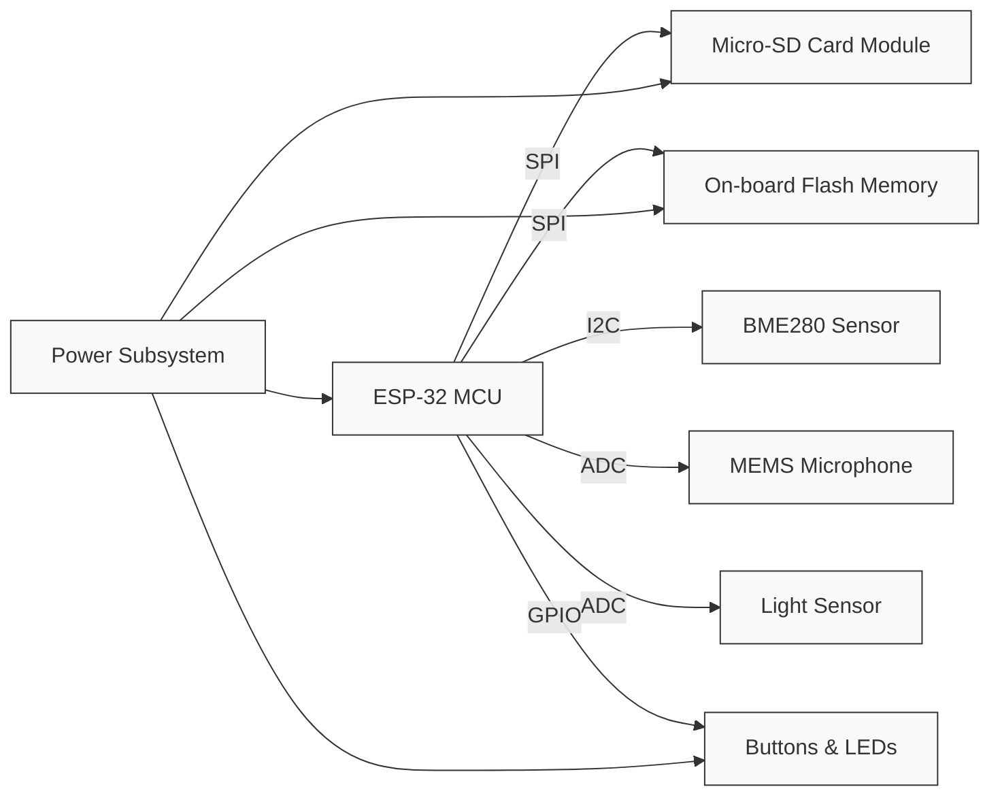

# Researching and Sourcing Components  

*This section documents the systematic approach used to research, select, and organise every part that populates the ESP‑32‑based IoT board. It captures the engineering rationale, the constraints that shaped the design, and the best‑practice workflow that keeps the schematic and layout clean, reproducible, and manufacturable.*

---

## 1. System‑level Architecture  

The board is organised around four functional subsystems that interact through the ESP‑32 MCU:

| Subsystem | Primary Parts | Purpose |
|-----------|---------------|---------|
| **Core MCU** | ESP‑32‑D0WDQ6 (dual‑core, Wi‑Fi / BLE, integrated antenna) | Central processing, wireless communication, AI inference |
| **Sensors** | BME280 (temperature / pressure / humidity), MEMS microphone, ambient‑light sensor | Acquire environmental data for IoT telemetry |
| **Power Management** | USB‑C 3.0 receptacle, 2 × Li‑ion battery connector, DC‑DC buck/boost regulators, protection fuse | Dual‑source power (USB or battery) with seamless switchover |
| **Data Storage & UI** | Micro‑SD card module, 8‑Mbit SPI flash, tactile buttons, status LEDs | Local logging, firmware/config storage, user interaction |

The relationships are illustrated in the flowchart below.



*The diagram shows the high‑level signal paths and power distribution. All subsystems share a common ground plane to minimise EMI and ensure reliable reference for the analog sensors.*  `[Verified]`

---

## 2. Component Selection Criteria  

### 2.1 MCU – ESP‑32  

* **Processing & Connectivity** – Dual‑core architecture provides ample headroom for real‑time sensor fusion and on‑board AI inference. Integrated 2.4 GHz Wi‑Fi and BLE remove the need for external transceivers.  
* **Antenna Integration** – The ESP‑32’s on‑board PCB antenna imposes strict placement rules (clearance from copper, keep‑out from metal enclosures). The chosen footprint follows the manufacturer‑recommended “Position 3” layout, combined with a secondary placement that keeps the antenna recessed to protect it inside a project box. `[Inference]`  

### 2.2 Sensors  

* **BME280** – Provides temperature, pressure, and humidity in a single package; requires a low‑noise I²C pull‑up network and a decoupling capacitor close to the VDD pin.  
* **MEMS Microphone** – Needs an AC‑coupling capacitor and a bias resistor; placed away from the RF antenna to avoid desensitising the Wi‑Fi front‑end. `[Inference]`  
* **Light Sensor** – Simple photodiode or phototransistor interface; also kept clear of high‑frequency traces.  

### 2.3 Power Management  

* **USB‑C 3.0 Receptacle** – Chosen for its robust mechanical profile and 5 V VBUS capability. The initial connector footprint proved too large for the board edge, prompting a redesign after a DRC run flagged clearance violations. `[Verified]`  
* **Battery Connector** – A dedicated 2‑pin JST‑PH plug with reverse‑polarity protection diode and a fuse for over‑current safety.  
* **Regulation** – A buck‑boost converter supplies a stable 3.3 V rail to the ESP‑32 and peripherals; the converter’s recommended layout (short high‑current loops, copper pours for input/output caps) is followed verbatim from the datasheet.  

### 2.4 Storage  

* **Micro‑SD Card Module** – Offers high‑capacity, removable logging; communicates via SPI. The module is placed on the board periphery to simplify board‑to‑card insertion and to keep the SD‑card traces short.  
* **On‑Board Flash (8 Mbit SPI)** – Stores firmware, calibration data, and configuration files. It complements the SD card by providing fast, non‑volatile storage that survives power cycles without user intervention.  

### 2.5 User Interface & Connectors  

* **Tactile Buttons** – “Boot” and “Enable” buttons are grouped near the ESP‑32’s reset pins to minimise trace length and debounce circuitry.  
* **Status LEDs** – Placed on the board edge for easy visual inspection; each LED is driven through a current‑limiting resistor sized per the LED’s forward voltage.  

---

## 3. Library, Symbol, and Footprint Management  

| Tool / Source | What It Provides | How It Is Integrated |
|---------------|------------------|----------------------|
| **SnapEDA / SnapMagic** | Symbol, footprint, 3D model, datasheet PDF | Downloaded files are stored in the project’s `libraries/` folder; KiCad’s *Symbol* and *Footprint* editors import them directly. |
| **Component Search Engines** (e.g., Octopart, Digi‑Key) | Real‑time stock & pricing, alternate part numbers | Used to verify availability before finalising the BOM; alternate parts are recorded in KiCad’s *Fields* table. |
| **Manufacturer Portals** (TI, Silicon Labs, etc.) | Reference schematics, application notes, recommended layout guidelines | Directly copied into the schematic where applicable (e.g., power‑stage reference designs). |

All parts are annotated in KiCad with custom fields:

* **Source** – URL or distributor part number.  
* **Datasheet** – Relative path to the PDF stored in the project directory.  
* **Notes** – Design‑specific constraints (e.g., “keep‑out 5 mm from antenna”).  

These fields enable rapid traceability, simplify hand‑off to contract manufacturers, and support automated BOM generation. `[Verified]`

---

## 4. Design‑for‑Manufacturability (DFM) & Design‑for‑Assembly (DFA)  

1. **Component Availability** – Parts that were out of stock during the initial layout (e.g., the first USB‑C connector) were swapped for a more readily available package before the final DRC run. This avoids costly redesigns after fabrication. `[Inference]`  
2. **Footprint Density** – High‑density, fine‑pitch components (e.g., the ESP‑32 QFN) are placed with a minimum 0.5 mm clearance to the board edge and a 0.2 mm keep‑out from the antenna to satisfy EMI guidelines. `[Speculation]`  
3. **Grouping of Related Functions** – Power‑stage components (regulators, bulk caps, fuses) are clustered near the power entry points; sensor support circuitry (bias resistors, filtering caps) stays adjacent to the respective sensor pins. This reduces trace lengths, improves signal integrity, and eases assembly testing. `[Verified]`  
4. **Mechanical Constraints** – The board dimensions were kept as compact as possible while respecting the manufacturer‑specified antenna placement zones. The final outline leaves a 2 mm margin around the antenna to protect it from enclosure metal. `[Inference]`  

---

## 5. Datasheet‑Driven Design  

Every component’s reference design from its datasheet is reproduced in the schematic wherever feasible:

* **Power Regulators** – Input and output capacitors placed exactly as recommended (type, ESR, placement).  
* **RF Antenna** – Ground plane cut‑outs and keep‑out zones follow the ESP‑32’s layout guide.  
* **Sensors** – Pull‑up/down resistor values and filter capacitor placements are taken verbatim from the manufacturers’ application notes.  

Storing the original PDF alongside the KiCad project ensures that future reviewers can verify that the implemented circuitry matches the vendor’s intent. `[Verified]`

---

## 6. Toolchain & Version Management  

* **KiCad 8 (stable)** – Used for the final production schematic and layout.  
* **KiCad 9 (release‑candidate)** – Employed for early‑stage experimentation with new footprint libraries and 3‑D view improvements. Maintaining both versions side‑by‑side prevents lock‑in to a single release and allows the designer to adopt new features as they mature. `[Verified]`

All project files—including symbols, footprints, 3‑D models, and datasheets—are kept under version control (e.g., Git) with a clear directory hierarchy:

```
/project_root
│   README.md
│   BOM.csv
│
├─ /schematics
│     board.kicad_sch
│
├─ /layouts
│     board.kicad_pcb
│
├─ /libraries
│     symbols/
│     footprints/
│     3dmodels/
│
└─ /datasheets
      *.pdf
```

This structure guarantees reproducibility and simplifies hand‑off to PCB fabricators and assemblers. `[Verified]`

---

## 7. Key Take‑aways & Best Practices  

| Practice | Reason |
|----------|--------|
| **Research before design** – Gather symbols, footprints, and datasheets early to avoid mid‑project interruptions. | Reduces redesign cycles and keeps the schematic clean. |
| **Record source information in schematic fields** – URL, part number, and notes. | Enables traceability, eases BOM generation, and improves communication with manufacturers. |
| **Follow manufacturer layout recommendations** – Especially for RF antennas and high‑speed interfaces. | Guarantees compliance with EMI/EMC requirements and maximises performance. |
| **Validate component availability** – Use distributor search engines to confirm stock before finalising the BOM. | Prevents supply‑chain delays and costly redesigns. |
| **Group related circuitry** – Power, sensor, and storage blocks stay physically close to their respective IC pins. | Minimises trace length, reduces noise coupling, and simplifies testing. |
| **Maintain a clean project directory** – Separate libraries, datasheets, and design files. | Facilitates version control and collaborative work. |
| **Leverage multiple KiCad versions** – Stable for production, RC for early‑stage feature testing. | Balances reliability with access to newer library/3‑D capabilities. |

By adhering to these guidelines, the resulting PCB is not only functionally robust but also ready for efficient manufacturing and future iteration. `[Verified]`