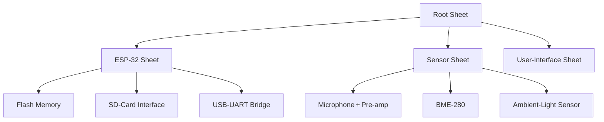

# Designing the ESP‑32 Circuitry  

*This section documents the schematic architecture, component choices, and PCB‑level considerations for the ESP‑32‑C3‑based board. All recommendations follow the design decisions made in the schematic and are annotated with the level of certainty.*  

---  

## 1. Overview  

The board is split into three hierarchical schematic sheets:

| Sheet | Purpose | Designator Prefix | Colour (for visual aid) |
|------|---------|-------------------|------------------------|
| **Root** | Power entry, USB connector, global nets | – | – |
| **ESP‑32** | Core MCU, USB‑UART bridge, flash, SD‑card, status LEDs | U3‑U6, R‑C, J‑ | Light‑blue |
| **Sensors** | Microphone pre‑amp, BME‑280, ambient‑light sensor | U‑, R‑, C‑ | Green |
| **User‑Interface** | Buttons, displays, optional peripherals | – | Orange |

The hierarchy enables clean net‑label propagation between subsystems and simplifies ERC/DRC checks.  

*The diagram reflects the logical sheet relationships used in the design.*  

---  

## 2. Hierarchical Schematic Organization  

* **Sheet Labels** – Hierarchical labels (`USB_DP`, `USB_DN`, `VBUS`, `VDD33`) are placed on the ESP‑32 sheet and exposed on the root sheet via *Place Sheet Pins*. This method guarantees a single source of truth for each net and avoids accidental duplication.  
* **Colour‑Coded Symbols** – Symbol fill colours (with opacity) are used to visually separate functional blocks. This practice improves readability during review and reduces the chance of wiring errors.  
* **Designator Consistency** – All components are renamed to match the engineering notes (e.g., `U5` = ESD suppressor, `U4` = CP2102 USB‑UART bridge, `U3` = ESP‑32‑C3, `U6` = SPI flash). Consistent designators simplify BOM generation and downstream assembly documentation.  

> **Best practice:** Keep a master spreadsheet of designators ↔︎ functional description and verify it against the schematic before proceeding to layout. `[Verified]`  

---  

## 3. USB Interface  

### 3.1 USB‑UART Bridge (CP2102)  

* **Footprint** – QFN‑20 package (`U4`). Selecting the correct land pattern is critical for reliable soldering; the 0.5 mm pitch requires a minimum aperture of 0.2 mm for via‑in‑pad if used.  
* **ESD Protection (U5)** – A dedicated ESD suppressor (`U5`, 2SC6 package) is placed directly on the D+ / D‑ lines. The suppressor clamps high‑voltage spikes before they reach the CP2102, preserving device integrity.  
* **Differential Pair Routing** – Net names `USB_DP` and `USB_DN` include the `+` / `‑` suffixes, allowing the layout tool to treat them as a differential pair. Controlled‑impedance routing (≈ 90 Ω differential) is recommended for USB 2.0 high‑speed operation.  

* **Voltage Ladder for VBUS Detection** – A resistor divider formed by `R12 = 22 kΩ` and `R13 = 47.5 kΩ` creates a scaled VBUS voltage (`VBUS`) that feeds the ESP‑32’s VBUS‑sense pin.  
* **Decoupling** – `C11 = 1 µF` placed close to the CP2102 VDD pin filters USB power fluctuations.  

> **Design tip:** Keep the USB trace length under 5 cm and maintain a constant spacing to the ground plane to preserve impedance. `[Inference]`  

### 3.2 Power‑On Reset & Boot  

* **Reset Network** – `R11 = 1 kΩ` pulls the ESP‑32 reset pin low through the reset button; a 0.1 µF (`C10`) and 4.7 µF (`C9`) capacitor pair provide the required RC time constant for a clean power‑on reset.  
* **Boot Button** – Connected to the ESP‑32 `GPIO0` (boot mode select) with a pull‑up resistor (`R16 = 50 Ω` series) to limit inrush current when the button is pressed.  

> **Reliability note:** Series resistors on GPIO lines help protect the MCU from electro‑static discharge and accidental short circuits. `[Verified]`  

---  

## 4. Core ESP‑32‑C3 Block  

### 4.1 Pin Assignment Strategy  

| ESP‑32 Pin | Function | Net Name | Remarks |
|------------|----------|----------|---------|
| `EN` | Power‑enable | `EN` | Connected to reset network |
| `GPIO0` | Boot mode select | `BOOT` | Tied to button |
| `GPIO2` | I²C SCL (BME‑280) | `SCL` | Pull‑up 4.7 kΩ (`R24`, `R25`) |
| `GPIO3` | I²C SDA (BME‑280) | `SDA` | Pull‑up 4.7 kΩ |
| `GPIO4‑7` | SPI (Flash & SD) | `MOSI`, `MISO`, `SCK`, `CS` | Series 50 Ω resistors (`R16`, `R19`, `R22`) for signal conditioning |
| `GPIO8` | LED TX indicator | `LED_TX` | Red LED + 330 Ω current‑limit |
| `GPIO9` | LED RX indicator | `LED_RX` | Green LED + 330 Ω |
| `GPIO10‑11` | UART (debug) | `UART_TX`, `UART_RX` | Optional, routed to test points |

*All GPIOs used for high‑speed interfaces (SPI, UART) are placed near the respective peripheral footprints to minimise trace length and skew.*  

### 4.2 Decoupling Strategy  

* **Near‑Pin Bypass** – Every VDD33 pin of the ESP‑32 receives a 0.1 µF ceramic capacitor (`C7`) placed within 1 mm of the pin. A bulk 10 µF electrolytic (`C8`) is located nearby to handle transient load.  
* **Power‑Rail Separation** – The 3.3 V rail is split into a *digital* domain (ESP‑32, USB bridge) and an *analog* domain (sensor I²C, audio pre‑amp). Separate filtering caps are used to reduce digital noise coupling into analog sections.  

> **DFM tip:** Verify that the capacitor footprints do not violate the minimum copper‑to‑pad clearance rules of the chosen fab house. `[Speculation]`  

---  

## 5. SPI Flash & SD‑Card Subsystems  

### 5.1 Shared SPI Bus  

Both the external flash (`U6`) and the micro‑SD card connector (`J3`) share the SPI bus (`MOSI`, `MISO`, `SCK`). Chip‑select lines (`CS_FLASH`, `CS_SD`) are individually controlled by the ESP‑32.  

* **Series Resistors** – 50 Ω resistors (`R16`, `R22`) are placed on `MOSI` and `MISO` to dampen ringing and improve signal integrity at the relatively high SPI frequencies (up to 40 MHz).  
* **Pull‑Up on CS_SD** – `R19 = 10 kΩ` pulls the SD‑card CS line high when not selected, preventing accidental activation.  

### 5.2 SD‑Card Connector  

* **Pin Usage (SPI mode)** – Only `CMD` (MOSI), `DAT0` (MISO), `CLK`, and `CS` are routed. The `DAT1‑DAT3` pins are left unconnected (or tied to ground) because SPI mode does not require the 4‑bit SD bus.  
* **Test Points** – Dedicated test points (`TP_MOSI`, `TP_MISO`, `TP_SCK`, `TP_CS_SD`) are placed near the connector to facilitate in‑circuit verification without probing the fine‑pitch pins.  

> **Signal‑integrity note:** Keep the SPI traces short (< 2 cm) and maintain a constant spacing to the ground plane to control impedance. `[Inference]`  

### 5.3 Flash Memory (`U6`)  

* **Power‑up Hold** – The `HOLD` pin is tied to 3.3 V via a 0.1 µF capacitor (`C14`) to keep the flash active during normal operation.  
* **Decoupling** – A 0.1 µF capacitor (`C14`) is placed close to the VCC pin of the flash.  

---  

## 6. Sensor Subsystem (Separate Sheet)  

The sensor sheet hosts:

| Component | Function | Key Connections |
|-----------|----------|-----------------|
| **BME‑280** | Temperature / Humidity / Pressure | I²C (`SCL`, `SDA`) with 4.7 kΩ pull‑ups |
| **Microphone Pre‑amp (MAX4466)** | Analog audio front‑end | Powered from 3.3 V, output to ADC pin |
| **Ambient Light Sensor (TSL2561)** | Light intensity | I²C bus (shared with BME‑280) |
| **Microphone (electret)** | Acoustic source | Coupled to pre‑amp |

All I²C devices share the same pull‑up network; the bus is terminated with the same 4.7 kΩ resistors used on the ESP‑32 sheet (`R24`, `R25`).  

> **Design recommendation:** Keep the I²C lines routed as a differential pair with matched lengths (< 5 mm mismatch) to minimise skew, especially when multiple devices are present. `[Speculation]`  

---  

## 7. Test‑Point Strategy  

Five test points are added for the SPI bus:

| TP | Net |
|----|-----|
| `TP_MOSI` | `MOSI` |
| `TP_MISO` | `MISO` |
| `TP_SCK`  | `SCK` |
| `TP_CS_SD`| `CS_SD` |
| `TP_CS_FLASH`| `CS_FLASH` |

Test points are placed on the top layer with a 0.6 mm drill, compatible with standard probe needles. They enable functional verification of the high‑speed bus without desoldering components.  

> **Manufacturability tip:** Ensure that test‑point pads have a solder mask clearance of at least 0.2 mm to avoid solder bridging during reflow. `[Speculation]`  

---  

## 8. PCB Layout Considerations  

### 8.1 Layer Stack‑up  

A **four‑layer** stack‑up is recommended:

1. **Top Layer** – Components, signal routing (USB, SPI, I²C).  
2. **Ground Plane** – Continuous solid plane for return currents, EMI shielding.  
3. **Power Plane** – 3.3 V distribution, decoupling capacitors placed on both sides of this plane.  
4. **Bottom Layer** – Additional routing, test points, optional ground fills.

The solid ground plane directly beneath the high‑speed USB and SPI traces reduces impedance and provides a low‑inductance return path.  

### 8.2 Controlled‑Impedance Routing  

* **USB D+/D‑** – Route as a 90 Ω differential pair with a spacing of 0.15 mm (typical for 1.6 mm FR‑4). Length matching within 0.13 mm is advisable.  
* **SPI** – While not strictly required, maintaining a characteristic impedance of ~50 Ω and keeping trace lengths matched (< 2 mm mismatch) improves signal integrity at high clock rates.  

### 8.3 Component Placement  

* **USB Bridge** – Placed near the USB connector to minimise D+/D‑ trace length.  
* **ESP‑32** – Centered on the board to equalise trace lengths to peripheral modules (flash, SD, sensors).  
* **Decoupling Capacitors** – Placed on the same side as the associated IC, as close as possible to the power pins (≤ 1 mm).  
* **High‑Current Paths** – The VBUS detection resistor ladder (`R12`, `R13`) and the 3.3 V rail are kept away from high‑frequency signal traces to avoid coupling.  

### 8.4 Design‑for‑Manufacturability (DFM)  

* **Via‑in‑Pad** – Used for QFN packages (CP2102, ESP‑32) to improve thermal performance; ensure annular ring complies with fab house (≥ 0.15 mm).  
* **Silk‑Screen Labels** – Hierarchical sheet names and net identifiers are printed on the silkscreen for easier assembly debugging.  
* **Clearance & Creepage** – Minimum 0.2 mm clearance between high‑speed traces and the USB connector’s shielding is maintained to satisfy standard IPC‑2221 requirements.  

---  

## 9. Design Verification  

* **ERC (Electrical Rule Check)** – Run after each hierarchical sheet is completed to catch un‑connected pins, mismatched net names, and missing power pins.  
* **DRC (Design Rule Check)** – Verify that all trace widths, spacing, and via sizes meet the selected fab house’s capabilities (e.g., 6 mil minimum trace, 6 mil spacing).  
* **Signal‑Integrity Simulation** – For the USB differential pair, a simple SPICE model or a dedicated SI tool can confirm the 90 Ω target.  
* **BOM Review** – Cross‑check component designators against the master spreadsheet to avoid part‑number mismatches.  

> **Best practice:** Perform a “design freeze” after ERC/DRC passes and before layout to prevent late‑stage changes that could invalidate the schematic. `[Verified]`  

---  

## 10. Summary of Key Decisions  

| Decision | Rationale | Impact |
|----------|-----------|--------|
| **Hierarchical sheets** | Improves net management and readability | Easier debugging, modular design |
| **ESD suppressor on USB** | Protects CP2102 from electro‑static events | Increases reliability |
| **Resistor ladder for VBUS** | Provides scaled VBUS voltage to ESP‑32 | Enables USB‑detect without extra IC |
| **Series 50 Ω resistors on SPI** | Damps ringing, improves eye‑diagram | Better high