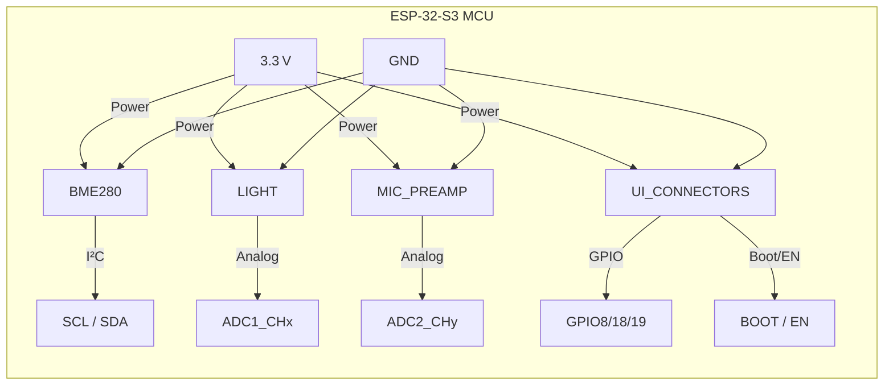

# Adding Sensors & User‑Interface Components  

This section documents the schematic‑level decisions, PCB‑layout considerations, and best‑practice guidelines used when integrating environmental sensors, an analog light sensor, a microphone pre‑amplifier, and the user‑interface circuitry (buttons, transistors, and breakout connectors) with an ESP‑32‑S3 MCU.  

---

## 1. Power Distribution & Decoupling  

| Net | Purpose | Typical Implementation |
|-----|---------|------------------------|
| **3.3 V** | Primary supply for all low‑power peripherals (BME280, light sensor, microphone, UI logic). | A single 3.3 V symbol (`VCC`) is placed on each sheet. All IC VDD and VDDIO pins are tied directly to this net. |
| **GND** | Reference plane for analog and digital sections. | A solid ground plane is kept continuous under the entire board; local ground symbols are used only for schematic clarity. |
| **Decoupling Capacitors** | Suppress supply noise and provide local charge. | 0.1 µF ceramic caps are placed as close as possible to each IC power pin (e.g., C50 for the BME280, C18 for the microphone pre‑amp). The same footprint/value is reused to maintain consistency. `[Verified]` |

**Best practice:**  

- Place a decoupling capacitor within 1 mm of each power pin.  
- Group caps of the same value and footprint to simplify BOM generation.  

---

## 2. I²C Sensor – BME280  

The BME280 environmental sensor is accessed via the I²C bus.  

- **Address selection:** `SDA` and `SCL` are routed to the ESP‑32. `SDO` is tied to GND, fixing the 7‑bit address to **0x76** (hex). `[Verified]`  
- **Pull‑up network:** Two 10 kΩ resistors pull `SDA` and `SCL` up to 3.3 V. The resistors are placed on the same sheet as the sensor to keep the I²C termination compact.  
- **Hierarchical labels:** `SCL` and `SDA` are exported as sheet pins so the same nets can be reused on the ESP‑32 sheet without duplication.  

**Layout tip:** Keep the I²C traces short and parallel, avoid 90° corners, and maintain a consistent spacing from the ground plane to reduce crosstalk. `[Inference]`

---

## 3. Ambient Light Sensor (Analog)  

A simple photodiode‑type sensor is used; it provides an analog voltage proportional to ambient light.  

- **Pull‑up resistor:** 10 kΩ to 3.3 V creates a voltage divider with the photodiode.  
- **Output label:** The analog node is exported as `PHOTO_C` and connected to an ESP‑32 ADC pin.  
- **Grounding:** The sensor’s cathode is tied directly to GND.  

**Design note:** Because the sensor is analog, keep its trace away from high‑frequency digital lines and place a small series resistor (≤ 100 Ω) if the source impedance exceeds the ADC’s recommended limit. `[Speculation]`

---

## 4. Microphone & Preamplifier  

The microphone front‑end consists of a small electret microphone, a gain stage, and a two‑stage voltage‑divider network to match the ESP‑32 ADC range.  

### 4.1. Core Circuit  

| Element | Value | Function |
|---------|-------|----------|
| **C18** | 0.1 µF | Decoupling for the pre‑amp supply rail. |
| **R31** | 100 kΩ | Feedback resistor setting the gain of the op‑amp stage. |
| **C20** | 0.1 µF | AC coupling capacitor after the gain stage. |
| **R29** | 1 MΩ | High‑value input resistor to limit bias current. |
| **R30** | 10 kΩ | Pull‑down to define the DC operating point. |
| **R27 / R29** | 1 MΩ each | Upper voltage‑divider to bias the input at mid‑rail. |
| **R26 / R28** | 2 kΩ each | Lower voltage‑divider to scale the microphone output to the ADC range. |
| **C16** | 0.1 µF | Bypass capacitor across the mid‑point of the divider, improving stability. |
| **MIC_OUT** | – | Hierarchical label exported to the ESP‑32 ADC. |

All components are grouped in a rectangular “box” on the schematic for visual clarity and to aid placement during layout.  

### 4.2. PCB Considerations  

- **Signal integrity:** The microphone output is a low‑level AC signal; keep the trace width narrow (≈ 6 mil) and route it on the top layer with a solid ground plane underneath to provide shielding.  
- **Decoupling:** Place C18 as close as possible to the pre‑amp VDD pin; the ground via should be placed directly beneath the capacitor.  
- **Component placement:** Position the voltage‑divider resistors close together to minimize parasitic capacitance and ensure matching.  

**Inference:** The chosen resistor values create a mid‑rail bias (~1.65 V) suitable for the ESP‑32’s 12‑bit ADC, maximizing dynamic range. `[Inference]`

---

## 5. User‑Interface Sheet  

The UI sheet hosts the display connector, a GPIO breakout, and the boot/enable button circuitry.  

### 5.1. Connectors  

| Connector | Pins | Purpose |
|-----------|------|---------|
| **J4** (Display) | 4‑pin (VCC, GND, SDA, SCL) | I²C interface to an OLED/LED display. |
| **J6** (Breakout) | 5‑pin (VCC, GND, GPIO8, GPIO18, GPIO19) | Exposes spare ESP‑32 pins for external peripherals. |

Both connectors use a straight‑row 0.1 in pitch footprint for easy soldering. Pin 1 is oriented to the top‑left for consistency across all connectors.  

**Best practice:** Align the VCC pin of each connector to the same side of the board to simplify routing of the 3.3 V rail and reduce via count. `[Inference]`

### 5.2. Boot & Enable Logic  

The ESP‑32’s boot mode is controlled by two NPN transistors (BC817) that pull the `BOOT` and `EN` pins low when the corresponding buttons are pressed.  

- **Base resistors:** 10 kΩ (R33, R34) limit base current and form a simple pull‑up when the button is open.  
- **Pull‑up on button pins:** Additional 10 kΩ resistors ensure a defined high level when the switch is released.  
- **Debounce capacitors:** 0.1 µF (C21) on the boot button and 1 µF (C22) on the reset button provide RC filtering to suppress contact bounce.  

Hierarchical sheet pins (`EN_N`, `BOOT`, `DTR`, `RTS`) are exported to the ESP‑32 sheet, allowing the same net names to be used throughout the project.  

**Design tip:** Keep the transistor collector‑emitter path short (< 5 mm) to reduce voltage drop and ensure reliable boot behavior. `[Inference]`

### 5.3. Button Layout  

- **Switches:** Two tactile switches (SW1 = Boot, SW2 = Reset) are placed near the edge of the board for easy access.  
- **Grounding:** Pins 1 & 2 of each switch are tied directly to GND; pins 3 & 4 connect to the pull‑up network and the respective transistor base.  

**Manufacturability note:** Use through‑hole pads for the switches to improve mechanical robustness, especially if the board will be handled frequently. `[Speculation]`

---

## 6. Hierarchical Sheet Management  

All sensor outputs (`SCL`, `SDA`, `PHOTO_C`, `MIC_OUT`) and UI signals (`EN_N`, `BOOT`, `DTR`, `RTS`, GPIO breakout pins) are exported via **sheet pins**. This approach:

1. **Reduces net duplication** – a single net definition appears on the ESP‑32 sheet, avoiding mismatched names.  
2. **Improves readability** – each functional block (sensors, UI) can be edited independently.  
3. **Facilitates reuse** – the same sensor sheet can be dropped into other projects with minimal changes.  

The “Place sheet pin” tool is used to copy hierarchical labels from the source sheet to the destination sheet, preserving orientation and net direction.  

---

## 7. Symbol‑Footprint Association & Validation  

Before moving to the layout editor, each schematic symbol is linked to a PCB footprint:

- **Standard parts** (resistors, capacitors, connectors) use the manufacturer‑approved 0603/0805 or 0.1 in pitch footprints.  
- **ICs** (BME280, ESP‑32) are assigned footprints that include a 0.5 mm‑pitch castellated pad array and a thermal pad where applicable.  

After association, the **Electrical Rules Check (ERC)** is run to catch:

- Unconnected pins (e.g., missing `SDA`/`SCL` connections).  
- Power‑net mismatches (e.g., VDDIO not tied to 3.3 V).  
- Hierarchical label conflicts.  

A subsequent **Design Rules Check (DRC)** validates clearance, trace width, and via sizes against the chosen PCB fab house’s capabilities.  

**Best practice:** Perform ERC and DRC early and iteratively; fixing errors at the schematic stage prevents costly layout re‑work. `[Verified]`

---

## 8. High‑Level Block Diagram  

*The diagram shows the power distribution, signal paths, and hierarchical connections between the ESP‑32 and the peripheral blocks.* `[Verified]`

---

## 9. Key Takeaways & Recommendations  

| Aspect | Recommendation |
|--------|----------------|
| **Power & Decoupling** | Use a dedicated 0.1 µF capacitor per IC; keep the trace to the capacitor as short as possible. |
| **I²C Bus** | Pull‑up resistors of 10 kΩ are sufficient for low‑speed sensors; keep the bus lines parallel and close to the ground plane. |
| **Analog Sensors** | Provide a clean bias network (voltage divider) and AC‑coupling capacitor; route analog traces away from noisy digital nets. |
| **Button Debounce** | Simple RC filtering (10 kΩ + 0.1 µF) works for most tactile switches; increase capacitance for slower mechanical contacts. |
| **Hierarchical Design** | Export all inter‑block nets via sheet pins; this reduces net clutter and eases future reuse. |
| **Footprint Selection** | Match the footprint to the component’s actual package; verify land‑pattern dimensions against the manufacturer’s datasheet. |
| **ERC/DRC Workflow** | Run ERC after every major schematic change; run DRC after any net or component move in the layout. |
| **Documentation** | Keep a “truth‑table” image or note attached to complex logic (e.g., boot‑mode transistor network) for future maintainers. |

By adhering to these guidelines, the sensor and user‑interface sections integrate cleanly with the ESP‑32 core, maintain signal integrity, and remain manufacturable at low cost.