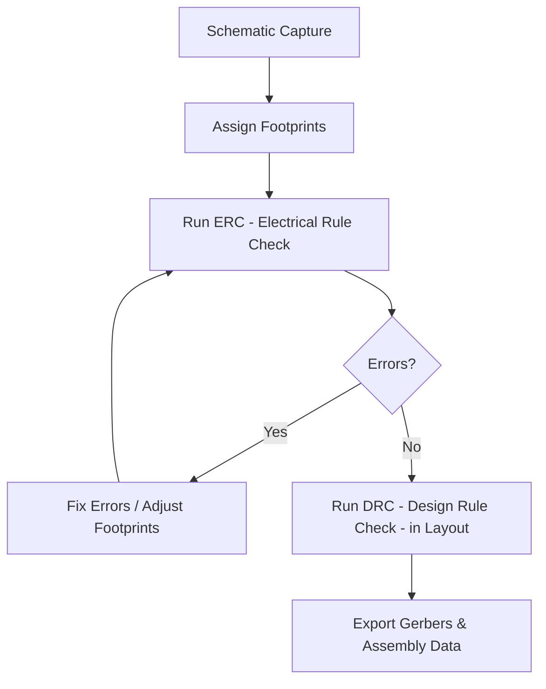

# Validating the Schematic and Assigning Footprints  

This section describes a systematic approach to associating physical footprints with schematic symbols, verifying electrical integrity with an ERC run, and preparing the design for layout. The workflow is illustrated in the diagram below.

---

## 1. Footprint Assignment Strategy  

### 1.1. Start with Existing Associations  

Many symbols (e.g., the fuse **F1** and connector **J1**) already carry a footprint reference. Verify that these legacy links are still appropriate for the current design.  

### 1.2. Choose a Standard Package for Passives  

For the bulk of resistors and capacitors the designer selected the **0805 (2012 mm) SMD** package. This size offers a good compromise between board real‑estate, component cost, and assembly difficulty. Smaller packages would reduce area but increase placement tolerance and assembly expense, while larger packages would waste space and raise BOM cost.  

> **Design trade‑off:** *0805 was chosen to balance size and cost* **[Inference]**.

### 1.3. Use Multi‑Select & Filtering  

KiCad (or any modern EDA tool) allows bulk selection of symbols using **Shift‑click** and **Ctrl‑click**. After selecting a group, the **Library → Footprint** pane can be filtered to display only relevant footprints, dramatically reducing the search space.  

*Tip:* When a filter is active a faint blue border appears around the filter button – a visual cue that the list is narrowed.  

### 1.4. Assign Specialized Footprints  

- **Tantalum capacitors (C3, C4):** Assigned the **T4 91A** footprint, a dedicated SMD tantalum pad that matches the component’s dimensions.  
- **Resistors:** All resistors share the same 0805 footprint, simplifying the BOM and assembly.  
- **Pin‑header connectors:** Chosen **2.54 mm pitch, vertical** headers (1×04 and 1×05) from the *Connector Pin‑Header* library to ensure compatibility with standard breakout boards.  
- **Test points:** Simple **1.0 mm circular pads** were used, providing easy probing without adding extra parts.  

After each bulk assignment, a quick visual inspection of the schematic confirms that every symbol now has an associated footprint. The editor also offers a **“View Footprint”** button that opens a miniature preview of the selected pad layout.  

---

## 2. Library Management & Filtering  

- **Library Organization:** Keep separate libraries for **Capacitors SMD**, **Resistors SMD**, **Connectors**, and **Test Points**. This logical grouping makes the filter function more effective.  
- **Importing Custom Footprints:** The tantalum footprint was imported into a personal library before assignment. Ensure that the library is added to the project’s **Footprint Configuration** to avoid “library not found” warnings later.  

> **Best practice:** *Maintain a clean, version‑controlled footprint library to prevent mismatches between symbols and pads* **[Verified]**.

---

## 3. Electrical Rule Check (ERC)  

### 3.1. Running ERC  

The **ERC** button on the schematic toolbar launches a scan that reports **Errors**, **Warnings**, and **Exclusions**.  

### 3.2. Typical Errors & Fixes  

| Error | Typical Cause | Fix |
|-------|---------------|-----|
| Power pin not driven (e.g., J1 A4) | Pin flagged as **Power Input** but net lacks a **Power Flag** symbol. | Duplicate the **Power Flag** (⌘ D / Ctrl D) and connect it to the appropriate net (e.g., *VBUS*). |
| Unconnected ground pin (U1 pin 3) | Missing net label or wire. | Add a **GND** label at the junction and wire the pin to it. |
| Additional power‑pin error | Same cause as first error on another net. | Add another Power Flag as needed. |

After correcting each issue, re‑run the ERC until **no errors** remain.  

### 3.3. Handling Warnings  

Common warnings observed:

- **Missing footprint library in configuration** (e.g., JST connector library).  
- **Symbol‑library mismatch** (a symbol was edited locally, diverging from its source library).  
- **Pin‑type conflicts** (directional vs. power pins connected together).  

These warnings can be **ignored**, **excluded**, or **resolved**:

- **Ignore/Exclude:** Right‑click a warning → *Exclude* (single) or *Ignore All* (type).  
- **Re‑include:** Open the **Exclusions** panel, deselect the entry.  

> **Caution:** *Frequent ignoring of warnings may hide genuine design problems; resolve them when feasible* **[Inference]**.

---

## 4. Transition to Layout  

Once the schematic is error‑free and all symbols have footprints, save the project and launch the **PCB Layout Editor** (via the project tree or the schematic toolbar). The layout tool will automatically import the netlist with the assigned footprints, ready for component placement and routing.  

---

## 5. Summary of Best Practices  

| Area | Recommendation |
|------|----------------|
| **Footprint Selection** | Use a single, well‑supported package (e.g., 0805) for the majority of passives to simplify assembly and reduce cost. |
| **Library Hygiene** | Keep libraries organized, version‑controlled, and referenced in the project configuration. |
| **Bulk Assignment** | Leverage multi‑select and filter panes to assign footprints quickly and consistently. |
| **ERC Discipline** | Run ERC early, fix all **errors**, and treat **warnings** as actionable items rather than defaults to ignore. |
| **Power Flags** | Always place a Power Flag on nets that drive power pins; this satisfies the ERC and clarifies intent for downstream tools. |
| **Documentation** | After each major change, perform a visual inspection of the schematic to verify footprint correctness. |
| **Transition** | Save the schematic before opening the layout editor to ensure the latest netlist is used. |

By following this structured workflow, designers can minimize re‑work, ensure manufacturability, and maintain a clean hand‑off from schematic capture to PCB layout.