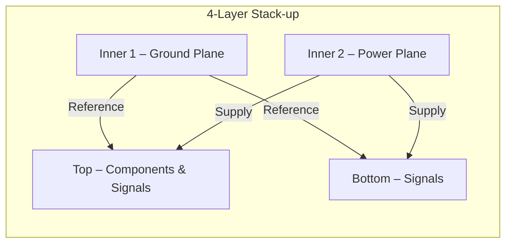

# Setting Up the PCB Layout Editor  

*This chapter documents the complete workflow for preparing a KiCad (or equivalent) PCB layout editor before routing begins. It covers layer‑stack definition, design‑rule configuration, net‑class management, footprint association, and component placement strategy. All recommendations are derived from proven PCB‑engineering practice and are aligned with typical fab house capabilities (e.g., Next PCB).*

---  

## 1. Overview  

Before any copper is drawn, the board editor must be configured to reflect the intended **manufacturing process**, **electrical performance**, and **mechanical constraints**. A well‑defined setup eliminates costly design‑rule violations, reduces the number of design iterations, and ensures that the final Gerbers match the fab’s capabilities.

---  

## 2. Defining the Layer Stack‑up  

### 2.1 Why a 4‑Layer Stack?  

| Consideration | 2‑Layer | 4‑Layer |
|---------------|---------|---------|
| Component density | Limited – routing becomes cramped | Sufficient routing area, dedicated planes |
| Signal integrity | Poor – no reference planes | Ground & power planes provide low‑impedance return paths, reduce EMI and crosstalk |
| Cost | Lowest | Moderate increase (≈ 20 %–30 % over 2‑layer) |
| Manufacturability | Simple | Standard for most hobby‑grade fab houses |

A four‑layer board was chosen to **separate signal routing** (top & bottom copper) from **dedicated reference planes** (inner layers). This architecture yields a clean ground plane, a solid power plane, and ample routing space for the ESP‑32, sensors, and USB interface.

### 2.2 Layer Roles  

| Layer | Assigned Role | Typical Content |
|-------|---------------|-----------------|
| **Top (L1)** | Component placement & signal routing | All SMD parts, high‑speed traces |
| **Bottom (L2)** | Signal routing | Complementary routing, optional ground fills |
| **Inner 1 (L3)** | Ground plane | Large copper pour, stitching vias |
| **Inner 2 (L4)** | Power plane | 3.3 V, 5 V, and other regulated nets |

The ground plane shields the two signal layers, while the power plane distributes the various supply rails.  



*The diagram shows the electromagnetic relationship between signal layers and their reference planes.*  

### 2.3 Physical Stack‑up Parameters  

| Parameter | Chosen Value | Rationale |
|-----------|--------------|-----------|
| **Dielectric material** | FR‑4 (F4) | Widely available, cost‑effective |
| **Copper weight** | 1 oz (outer), 1 oz (inner) | Matches fab’s standard offering; higher weight would increase cost without measurable benefit for ≤ 0.5 A design |
| **Board finish** | ENIG (Electroless Ni‑Au‑Imm) – default | Provides good solderability and flatness for fine‑pitch components |

No changes were required for solder mask or silkscreen layers; the defaults satisfy the design’s aesthetic and assembly needs.

---  

## 3. Design‑Rule Configuration (DRC)  

### 3.1 Aligning DRC with Manufacturer Capabilities  

The fab’s **minimum trace width** for 1 oz outer copper is **0.08 mm**. To keep the board manufacturable and to avoid price spikes associated with sub‑minimum features, the DRC was set to a **conservative 0.20 mm** for most signal nets.  

*All DRC values (trace width, spacing, via drill, annular ring, etc.) must be **≥** the fab’s minimums.*  

### 3.2 Adding Custom Track & Via Sizes  

Commonly used widths were added to the DRC table:

| Width (mm) | Use Case |
|------------|----------|
| 0.20 | General‑purpose signal |
| 0.254 | Slightly higher current or tighter spacing |
| 0.540 | Power nets that require lower resistance |

Differential‑pair settings were also defined (e.g., 0.15 mm spacing, 0.30 mm width) to support USB and SPI high‑speed lines.  

### 3.3 Calculating Trace Widths  

For power nets, the **track‑width calculator** can be used:

```
Required current  ≈ 0.5 A (max ESP‑32 draw)
Copper thickness   = 1 oz ≈ 35 µm
Length ≈ 15 mm
Resulting width ≈ 0.14 mm (outer) → rounded to 0.20 mm for DFM
```

*The calculation demonstrates that the chosen 0.20 mm width provides ample margin while staying within the fab’s cost‑optimal range.* [Inference]  

---  

## 4. Net‑Class Management  

### 4.1 Defining Net Classes in the Schematic  

Net classes were created **before** importing the schematic into the layout editor. This ensures that each class’s electrical constraints (track width, clearance, colour, line style) are automatically applied to the corresponding nets after import.  

Typical net classes:

| Net Class | Typical Nets | Track Width | Clearance |
|-----------|--------------|-------------|-----------|
| **3.3 V Power** | +3.3V, VCC3 | 0.50 mm | 0.20 mm |
| **5 V USB** | +5V, VBUS | 0.30 mm (manually enlarged where space permits) | 0.20 mm |
| **Ground** | GND, GND\_USB | 0.50 mm (plane) | 0.20 mm |
| **SPI** | SCK, MOSI, MISO, CS | 0.25 mm | 0.15 mm |
| **USB‑DP/DM** | D+, D‑ | 0.25 mm | 0.15 mm (differential) |

### 4.2 Assigning Nets to Classes  

Assignments were performed using **regular‑expression matching** (e.g., `^+3\.3V$` → *3.3 V Power*). This method scales well for large designs and eliminates manual per‑net editing.  


*The flow shows how net‑class definitions propagate from schematic to layout.*  

### 4.3 Fine‑Tuning After Import  

Once the schematic is imported, each net class can be edited in the board‑setup dialog to adjust **clearance**, **track width**, and **differential‑pair parameters**. Power nets were deliberately given larger widths (e.g., 0.5 mm for 3.3 V) to reduce voltage drop and thermal rise.  

---  

## 5. Footprint Association & Schematic Import  

### 5.1 Ensuring Symbol‑Footprint Links  

The project’s library structure separated **symbols** and **footprints** into distinct directories. This broke the original library‑provided associations, causing the import tool to report missing footprints (e.g., `MK1`, `Q1`).  

**Resolution steps**

1. Open the symbol’s properties → **Library Link** → re‑assign the correct footprint from the project’s footprint library.  
2. Use the **Footprint Chooser** to select the exact package (e.g., `CUI‑CMC` for the microphone).  
3. Save the symbol and repeat for all missing parts.  

Batch re‑linking was performed by filtering the symbol list to the project’s footprint library and assigning each footprint in turn.  

### 5.2 Import Process  

After all symbols were correctly linked, the **“Update PCB from Schematic”** command was executed. The tool reported successful placement of all components, and the net‑class table was automatically populated with the definitions created earlier.  

---  

## 6. Component Placement Strategy  

### 6.1 High‑Level Placement Guidelines  

| Guideline | Reasoning |
|-----------|-----------|
| **ESP‑32 module** placed at a board edge with a clear antenna clearance zone | Prevents metal near the PCB antenna, reduces detuning and mechanical stress. |
| **High‑speed peripherals (Flash, SD‑card)** placed adjacent to the ESP‑32 | Minimizes trace length, reduces signal‑integrity risk. |
| **User‑interface parts (USB, buttons, LEDs, SD slot)** positioned on board periphery | Improves ergonomics and accessibility. |
| **Power‑regulation block** grouped near the power entry point and ground plane | Simplifies decoupling and reduces voltage‑drop paths. |
| **Sensors** clustered together to share common analog ground and reference planes | Improves noise performance for analog signals. |

Iterative placement was performed: a rough layout was drafted, reviewed, and refined until a final configuration satisfied all mechanical clearances and routing density targets.  

### 6.2 Grid Settings  

- **Footprint placement grid:** 0.025 mm (≈ 1 mil) for fine positioning of small packages.  
- **Routing grid:** 0.05 mm (≈ 2 mil) with override disabled for consistent trace widths.  

The fine grid provides precise control over component orientation, while the coarser routing grid speeds up track drawing without sacrificing DRC compliance.  

### 6.3 Edge‑Cut Definition  

Because the board includes a **cut‑out** for the ESP‑32 antenna, the standard “box” edge‑cut tool could not be used. Instead, the **Line tool** was employed to trace the board outline manually, ensuring the cut‑out clearance matched the manufacturer’s **minimum copper‑to‑edge** requirement.  

---  

## 7. Best Practices & Lessons Learned  

1. **Define net classes early** (in the schematic) and import them; this guarantees that all nets inherit the correct DRC parameters automatically.  
2. **Match DRC to fab capabilities** before routing. Using a value below the fab’s minimum triggers expensive “design‑for‑manufacturability” (DFM) warnings and can increase lead time.  
3. **Separate library directories** only if you also update the symbol‑footprint association paths; otherwise the import tool will flag missing footprints.  
4. **Iterate component placement** before routing. A well‑planned layout reduces the number of “move‑and‑re‑route” cycles, saving time and avoiding accidental DRC violations.  
5. **Leverage regular expressions** for net‑class assignment; this scales to large designs and reduces manual errors.  
6. **Use the calculator tools** (trace‑width, impedance) to justify trace dimensions rather than guessing. This yields a cost‑effective design that still meets electrical requirements.  
7. **Document the stack‑up and DRC** in the project files (e.g., a `board_setup.kicad_pcb` comment block) so that any future team member can quickly verify that the board matches the fab’s spec.  

---  

## 8. Summary  

Setting up the PCB layout editor involves a **systematic sequence**:  

1. Choose an appropriate **layer stack‑up** (4‑layer with dedicated planes).  
2. Configure **physical stack‑up parameters** (dielectric, copper weight, finish).  
3. Align **design‑rule constraints** with the fab’s minimum capabilities.  
4. Create **net classes** in the schematic, assign nets via regex, and fine‑tune after import.  
5. Ensure **symbol‑footprint associations** are correct before importing the schematic.  
6. Perform **strategic component placement** using fine grids and ergonomic guidelines.  

Following this workflow yields a manufacturable, electrically robust board that meets cost targets and minimizes redesign cycles.  

---  

*End of Chapter 11 – Setting Up the PCB Layout Editor*