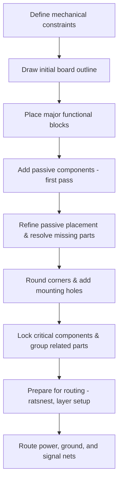

# Component Placement & Board‑Outline Refinement  

*This section documents the systematic approach used to place components, define the board outline, and prepare the layout for reliable routing. All recommendations follow proven PCB‑design practice and are directly derived from the design workflow described above.*

---

## 1. Overview  

The layout process is split into two logical phases:

1. **Rough placement & outline definition** – establish a clear mechanical envelope (antenna clearance, mounting holes, rounded corners) and position the major functional blocks (MCU, power‑management ICs, connectors, sensors).  
2. **Passive‑component refinement** – move decoupling, bypass, bulk capacitors and associated resistors to their optimal electrical locations, resolve any missing footprints, and lock the final geometry before routing.

The flow is illustrated in the diagram below.

---

## 2. Board‑Outline Definition  

| Requirement | Implementation | Rationale |
|-------------|----------------|-----------|
| **Antenna clearance** – no copper under the antenna and at least **15 mm** of free space on the left side. | The outline was drawn with side‑to‑side cursors, snapping the first vertex 15 mm from the antenna edge. | Guarantees the antenna’s radiation pattern is not detuned by nearby copper or ground planes. [Verified] |
| **Overall size** – keep the board as compact as possible while preserving routing channels. | After the initial rectangular sketch, the outline was trimmed back to the minimum that still accommodates all components. | Reduces material cost and improves mechanical integration. [Inference] |
| **Rounded corners** – replace sharp 90° edges with **1 mm fillets**. | KiCad’s *Shape Modification → Fillet* tool was applied to each edge after unlocking any locked lines. | Rounded corners improve board strength, reduce stress concentration, and simplify CNC milling. [Verified] |
| **Mounting holes** – three 2 mm × 2 mm holes placed near the board edges. | Footprints from the library were placed on the *Edge‑Cuts* layer and duplicated symmetrically. | Provides reliable mechanical attachment without interfering with component placement. [Verified] |

> **Tip:** Always unlock outline segments before applying fillets; locked lines will be ignored by the shape‑modification algorithm.  

---

## 3. Component Placement Strategy  

### 3.1 Major Functional Blocks  

1. **MCU (ESP‑32)** – placed centrally to minimise trace lengths to all peripherals.  
2. **Power‑entry** – USB‑C connector, Li‑Po charger IC, and bulk‑cap reservoir positioned near the board edge to simplify board‑level power routing.  
3. **Memory** – external flash (U6) and SD‑card module placed on the same side to enable a clean SPI bus topology.  
4. **Sensors** – BME280, microphone, and sound sensor grouped together, keeping analog signal paths short.  

The initial placement is deliberately “approximate”; exact coordinates are refined later once passive components are positioned.

### 3.2 Passive‑Component Refinement  

| Passive type | Preferred location | Placement rule |
|--------------|-------------------|----------------|
| **Decoupling caps (≤ 0.1 µF)** | Directly on the power pins of the IC they serve. | Keep trace length < 1 mm, align the capacitor’s 0° orientation with the pin to minimise loop area. [Verified] |
| **Higher‑value decoupling (≥ 1 µF)** | Near the same pins but slightly farther out; can be stacked with the small caps. | Provides low‑frequency bulk filtering while preserving high‑frequency performance. [Inference] |
| **Bulk caps** | Close to the board’s main power entry (USB‑C, battery connector). | Acts as a charge reservoir for the entire board. |
| **Bypass caps (AC‑coupling)** | On signal lines that feed sensitive analog blocks (e.g., microphone pre‑amp). | Forms a low‑impedance path to ground for high‑frequency noise. |
| **Pull‑up / Pull‑down resistors** | Adjacent to the associated I/O pin (e.g., SD‑card CMD line). | Guarantees defined logic level when the line is idle. |
| **RC filter resistors** | In series with the capacitor that forms the filter; both placed as close as possible to the target IC. | Minimises parasitic inductance that would degrade filter performance. |
| **Current‑limiting resistors** | Next to LEDs or other load devices. | Protects components from over‑current while keeping the resistor’s thermal footprint small. |

> **Best practice:** After placing a passive component, immediately route its connection to the nearest pad (or create a short “stub”) before moving on. This prevents accidental drift that would increase loop length later.  

---

## 4. Signal‑Conditioning Considerations  

1. **Power‑rail stability** – Decoupling caps on the ESP‑32’s 3.3 V pin (C8, C7) suppress switching transients from the Wi‑Fi radio.  
2. **Analog sensor conditioning** –  
   * Microphone output is AC‑coupled through a 10 nF capacitor (C17) and a 10 kΩ pull‑down (R30) to set the bias point.  
   * A 1 µF capacitor (C19) follows the pull‑down to form a low‑pass filter, attenuating out‑of‑band noise.  
3. **SPI bus topology** – All SPI devices (flash, SD‑card) share a single continuous trace for MOSI, MISO, SCK, and CS lines. This “bus” approach reduces stub length and eases timing analysis.  
4. **Ground‑plane usage** – A solid copper pour on the bottom layer (or dedicated ground layer) is reserved for all return currents, ensuring low‑impedance paths and reducing EMI.  

> **Inference:** The design does not require controlled‑impedance routing because the highest‑speed signals are limited to SPI (< 30 MHz). However, the same layout principles (short, straight traces, solid return plane) are applied to maintain signal integrity.  

---

## 5. Routing Strategy  

| Aspect | Technique |
|--------|------------|
| **Ratsnest visibility** | Increased line thickness and switched to curved lines; filtered to show only the selected component’s nets, reducing visual clutter. |
| **Layer management** | Component values and reference designators were hidden on the *F‑Silk* layer to keep the view clean; only copper, board outline, and essential silkscreen remain visible during placement. |
| **Component rotation** | Parts such as the USB‑to‑Serial bridge (U4) were rotated to align power pins with nearby decoupling caps, shortening the critical traces. |
| **Grouping & locking** | After final placement, related parts (e.g., ESP‑32 + its decoupling caps) were grouped and locked to prevent accidental movement during routing. |
| **Routing order** – 1️⃣ Ground pour → 2️⃣ Power nets (VCC, 3.3 V, 5 V) → 3️⃣ High‑speed SPI bus → 4️⃣ Analog signal paths → 5️⃣ Remaining low‑speed nets. |
| **Via usage** – Only through‑hole vias were employed; no blind or buried vias were needed for this two‑layer board, keeping the fabrication cost low. |

---

## 6. Outline Refinement & Mechanical Features  

1. **Filleting** – After all components were locked, the *Edge‑Cuts* polygon was selected, unlocked, and a **1 mm** fillet applied to each corner via *Shape Modification → Fillet*.  
2. **Mounting holes** – Three 2 mm × 2 mm holes were placed on the *Edge‑Cuts* layer, positioned to avoid component overlap and to provide a balanced mechanical support pattern.  
3. **Final inspection** – The board was examined for overlapping edges, stray copper, and unlocked lines. Any locked segment that prevented modification was unlocked (shortcut **L**) before re‑applying the fillet.  

> **Speculation:** Adding a small “keep‑out” area around the antenna (e.g., a 5 mm clearance ring) would further guarantee RF performance, though the current 15 mm side clearance already satisfies most 2.4 GHz designs.  

---

## 7. Design Verification & Iteration  

| Check | Tool / Action |
|-------|----------------|
| **Missing footprints** | KiCad’s *Associations Editor* was used to assign the correct 0805 SMD footprint to any newly added capacitors (C19, C17). |
| **Electrical Rule Check (ERC)** | Run after each placement pass to catch unconnected pins (e.g., the stray ground line on the microphone that was removed). |
| **Design Rule Check (DRC)** | Verify clearance to the antenna, minimum trace width, and via spacing before routing. |
| **Ratsnest update** | After each component move, the ratsnest was refreshed to ensure all nets remain reachable without excessive length. |
| **Version control** | The board file was saved after each major step (outline, placement, refinement) to enable rollback if a later change introduces a violation. |

---

## 8. Best‑Practice Summary  

* **Antenna clearance is sacrosanct** – keep copper, ground planes, and large metal objects at least 15 mm away.  
* **Decoupling first** – place the smallest caps directly on the power pins; larger caps can be staggered outward.  
* **Group related parts** – keep an IC and its passive network together; lock the group once finalized.  
* **Use bus topology for shared SPI lines** – a single continuous trace reduces stub length and timing skew.  
* **Round corners early** – filleted edges improve mechanical robustness and simplify CNC machining.  
* **Add mounting holes before routing** – prevents later conflicts with copper pours or component footprints.  
* **Leverage KiCad visual aids** – adjust ratsnest thickness, filter by selected component, and hide silkscreen text to keep the workspace uncluttered.  
* **Iterate with ERC/DRC** – run checks after each placement pass to catch missing footprints, stray nets, or clearance violations.  

---

## 9. References  

* Texas Instruments, **High‑Speed PCB Layout Guidelines**, 2023 – a comprehensive guide covering transmission‑line effects, return‑current paths, and crosstalk mitigation. (Link provided in the original video description.)  

---

*End of Chapter 12 – Component Placement & Board‑Outline Refinement.*