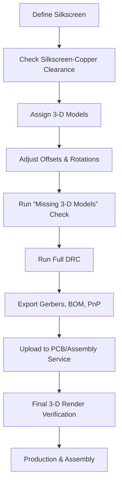

# Adding Silkscreen and Final Touches  

## Overview  

The finalisation stage of a PCB design consists of two tightly coupled activities:

1. **Silkscreen definition** – adding reference designators, functional labels and branding while respecting manufacturing clearances.  
2. **3‑D model completion** – assigning accurate 3‑D STEP/WRL models to every footprint, verifying their placement and orientation, and using the visualisation to spot missing parts or mechanical interferences before the design is handed off to a fabricator/assembler.  

Both steps are essential for a professional hand‑off: the silkscreen guides the assembler and the end‑user, while the 3‑D view provides a quick “reality check” that the board will fit inside its enclosure and that all components are correctly represented for automated pick‑and‑place.

---

## 1. Silkscreen Layout  

### 1.1 Text Placement and Orientation  

* Use the **Text** tool to place labels such as “Charging Power”, “GND”, “+5 V”, etc.  
* Rotate text to **90 °** when the label must run parallel to a board edge or to a mounting hole that has been removed. This reduces the risk of the text being clipped by the board outline and improves readability on the assembled board.  
* Keep a **minimum clearance** of ≈ 0.5 mm (manufacturer‑dependent) between silkscreen strokes and copper features to avoid solder mask erosion during reflow.  

> **Best practice:** Keep silkscreen strings short and use a consistent font size (typically 0.8 mm‑1.0 mm height) to maintain legibility across different board sizes.  

### 1.2 Layer Management  

* Temporarily **disable non‑silkscreen layers** (e.g., copper, solder mask) while reviewing the silkscreen. This isolates the graphics and makes it easier to spot overlaps or missing labels.  
* Verify that the silkscreen does **not intersect** any copper pads, vias, or keep‑out zones. KiCad’s DRC can be configured to flag silkscreen‑copper clearance violations.  

### 1.3 Branding and Documentation  

* Reserve space for **logos** (e.g., “Tech Expo”, “Kicad”) on the back silkscreen layer.  
* Include a **revision identifier** and a **board version** on the silkscreen; this aids traceability during production and field service.  

---

## 2. Completing the 3‑D Model Set  

### 2.1 Why 3‑D Models Matter  

* 3‑D models are used by **pick‑and‑place machines** to calculate component placement coordinates.  
* They enable a **visual inspection** of mechanical clearances (e.g., between a connector and a nearby capacitor) before the design is sent to the fab house.  
* Accurate models help the assembler verify that the correct part number is loaded into the placement program.  

### 2.2 Sourcing Models from KiCad Libraries  

* KiCad 9 RC ships with a **built‑in 3‑D model repository** (e.g., `3D models/sensor/audio`).  
* When a component is double‑clicked in the PCB editor, the **3‑D Model** tab allows you to browse the library and select the appropriate STEP file.  
* If the library contains both **STEP** and **WRL** versions, prefer STEP for higher fidelity and easier manipulation.  

> **Tip:** The library does not provide a search box; use the folder hierarchy (e.g., `sensor/audio`) to locate the desired model.  

### 2.3 Aligning and Offsetting Models  

For each footprint, three transformation parameters are required:

| Parameter | Purpose | Typical Adjustment |
|-----------|---------|--------------------|
| **Offset (X/Y/Z)** | Moves the model relative to the footprint origin. | Shift the model up/down to expose pins or to clear the solder mask. |
| **Rotation (X/Y/Z)** | Orients the model to match the physical component’s pinout. | Rotate 90 ° on the X‑axis for vertically mounted parts, or flip on the Y‑axis for mirrored footprints. |
| **Scale** (rare) | Adjusts model size when the library model is oversized/undersized. | Usually left at 1.0. |

The workflow is:

1. **Select the footprint** → **Open 3‑D Model dialog**.  
2. **Choose the STEP file** from the KiCad library or a project‑local folder.  
3. **Apply offsets** to raise the model above the board surface (e.g., `Z = +0.5 mm`).  
4. **Rotate** until the pins line up with the footprint pads (visual feedback in the 3‑D viewer).  
5. **Save** and repeat for the next component.  

### 2.4 Handling Missing Models  

* KiCad provides a **“Missing 3‑D Models”** button that generates a text file listing every footprint without an assigned model.  
* Open the generated file in a text editor; each line contains the footprint reference and the expected model path.  
* If the path points to an **obsolete KiCad version** (e.g., KiCad 8 vs. KiCad 9), update the environment variable in **Preferences → Configure Paths** to point to the correct library directory.  

> **Inference:** Aligning the environment variable to a single directory that contains both KiCad 8 and KiCad 9 models resolves most missing‑model warnings without having to edit each footprint individually.  

After correcting the path, re‑run the missing‑model check; the count should drop to **zero** (or a handful of genuinely unavailable models).  

### 2.5 Example Component Assignments  

| Component | Library Source | Transformation Summary |
|-----------|----------------|------------------------|
| **Microphone** | `3D models/sensor/audio/pom.step` | Z‑offset + 0.5 mm, rotate 90 ° on Y‑axis to expose pins. |
| **LED (1206)** | `3D models/LED/LED_1206.step` | No offset; orientation matches standard SMD footprint. |
| **Polyfuse (32 V 2 A)** | `3D models/fuse/fuse_32V_2A.step` | Centered, no rotation needed. |
| **Connector (B2‑PH‑SM4)** | Project‑local `libs/3D/B2PH_SM4.step` | Rotate 180 ° on Z‑axis to match board edge. |
| **USB‑C Receptacle (SS‑5240)** | Project‑local `libs/3D/USB_C_SS5240.step` | Z‑offset + 0.2 mm, rotate 90 ° on X‑axis. |
| **Button (US‑LPT)** | Project‑local `libs/3D/Button_USLPT.step` | Duplicate model for both buttons; same offsets. |
| **SD Card Slot (GSD‑0)** | Project‑local `libs/3D/SD_GSD0.step` | No offset, rotate 90 ° on X‑axis. |
| **ESP‑32 Module** | Project‑local `libs/3D/ESP32.step` | Align pins, Z‑offset + 0.3 mm. |
| **BME280 Sensor** | Project‑local `libs/3D/BME280.step` | Flip 90 ° on X‑axis, ensure dot‑marker aligns with pin 1. |
| **LM117 3.3 V Regulator** | Project‑local `libs/3D/LM117_3V3.step` | Rotate 90 ° on X‑axis. |
| **MAX4466 Amplifier** | Project‑local `libs/3D/MAX4466.step` | Rotate 90 ° on X‑axis. |
| **W25Q32 Flash** | Project‑local `libs/3D/W25Q32.step` | Rotate 90 ° on X‑axis. |

> **Speculation:** The exact offset values are chosen to keep the model just above the solder mask, preventing visual clipping in the 3‑D viewer.  

---

## 3. Final Verification  

### 3.1 Visual Inspection in 3‑D  

* Rotate the board in the **3‑D viewer** to confirm that all models are **visible**, correctly oriented, and free of mechanical clashes (e.g., a connector pin intersecting a nearby capacitor).  
* Use the **“Missing 3‑D Models”** check again; a count of **zero** indicates that every footprint has an assigned model.  

### 3.2 Design‑Rule Checks (DRC)  

* Run a **full DRC** after silkscreen and 3‑D updates. Silkscreen‑copper clearance, component‑to‑edge clearance, and component‑to‑component spacing are all re‑validated.  
* Address any new violations (e.g., a silkscreen line now overlapping a newly placed component).  

### 3.3 Export for Manufacture  

* Generate the **Gerber** and **NC‑ drill** files, ensuring that the **silkscreen layer** is included (`*.GTO` / `*.GBO`).  
* Export the **Bill of Materials (BOM)** and the **Pick‑and‑Place (PnP) file** that references the assigned 3‑D models.  

> **Best practice:** Keep the **BOM** and **PnP** files in the same directory as the Gerbers; most PCB assembly services (e.g., NextPCB) automatically import them.  

---

## 4. Ordering and Assembly  

The completed design can be uploaded to a PCB fabrication and assembly service such as **NextPCB**:

1. **Upload Gerbers** – include all copper, solder mask, and silkscreen layers.  
2. **Upload BOM & PnP** – the service uses the PnP file to program its pick‑and‑place machines.  
3. **Select Assembly Options** – choose SMT only, or SMT + through‑hole if any through‑hole parts remain.  
4. **Review the Service’s 3‑D Render** – most services provide a final 3‑D preview that should match the KiCad viewer.  

By following the silkscreen and 3‑D model workflow described above, the board arrives at the assembler with **clear documentation**, **accurate mechanical representation**, and **minimal risk of assembly errors**.

---

## 5. Workflow Summary  

*The flowchart captures the iterative nature of the finalisation stage: silkscreen, 3‑D model assignment, verification, and hand‑off.*  

---

### Key Takeaways  

* **Silkscreen** must be legible, clear of copper, and include branding and revision data.  
* **3‑D models** should be sourced from KiCad’s libraries when possible; otherwise, maintain a project‑local library and keep the path configuration up‑to‑date.  
* **Offset and rotation** adjustments are essential for accurate visualisation and for downstream pick‑and‑place accuracy.  
* Regular **missing‑model checks** and **DRC runs** prevent last‑minute surprises before manufacturing.  
* A clean **3‑D preview** is an excellent sanity check that the board will assemble correctly and fit within its enclosure.  

By adhering to these practices, the design transitions smoothly from the CAD environment to a reliable, manufacturable product.