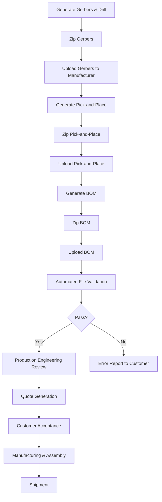

# 3D Model Configuration & Visualization  

## 1. Overview  

When a board is ordered for **fabrication only** the manufacturer receives only the Gerber and drill files.  
When an **assembly quote** is requested the manufacturer also needs the **pick‑and‑place (centroid) file** and a **Bill‑of‑Materials (BOM)**.  
Both data sets must be prepared, validated, and packaged correctly before they are uploaded to the PCB house. The workflow described below follows the proven process used by most turnkey PCB/SMT services (e.g., NextPCB) and incorporates best‑practice checks that minimise back‑and‑forth with the production engineers.

---

## 2. Gerber & Drill File Generation  

| Step | Action | Typical Tool | Remarks |
|------|--------|--------------|---------|
| 2.1 | Open the PCB editor and invoke the **Plot** (or **Export Gerbers**) command. | KiCad, Altium, Eagle, etc. | All copper, solder mask, silkscreen, and outline layers are selected automatically. |
| 2.2 | Choose an **output folder** (overwrites previous files is acceptable). | – | Keeping a single folder per revision simplifies archiving. |
| 2.3 | Run **DRC/ERC** checks before plotting to catch clearance or net‑rule violations. | – | Prevents costly re‑spins. |
| 2.4 | Generate **drill files** (NC format) using the same output folder. | – | Verify that the drill map matches the copper layers (e.g., through‑hole pads). |
| 2.5 | Zip the complete set of Gerbers and drill files. | OS zip utility or built‑in archive tool. | Most manufacturers require a single archive; the zip format is universally accepted. |

> **Why a zip?** The archive guarantees that the file set arrives intact and preserves the required directory structure for the manufacturer’s automated parser.  [Verified]

---

## 3. Assembly Data Preparation  

### 3.1 Pick‑and‑Place (Centroid) File  

1. **Export** the placement data from the PCB editor (often called **POS**, **Pick‑and‑Place**, or **Centroid** file).  
2. The file contains, for each component:  
   - Reference designator (e.g., `R17`)  
   - Part value (optional)  
   - Package footprint (e.g., `0603`)  
   - X/Y coordinates (board‑origin referenced)  
   - Rotation angle (degrees)  
   - Side indicator (top/bottom)  

   The format is typically a CSV or an extended Gerber‑like file that the assembly line can ingest directly.  

3. **Validate** the file:  
   - Ensure every component that appears on the board has an entry.  
   - Confirm that the side flag matches the actual placement (no stray entries for the bottom side if the board is single‑sided).  

4. **Compress** the file into a zip archive, even if it is a single file, to satisfy the upload UI.  

> **Tip:** If a component was removed from the schematic but its reference remains in the BOM, the centroid file will be missing that entry, which triggers a “component not found” query from the assembler. [Inference]

### 3.2 Bill‑of‑Materials (BOM)  

1. Export the BOM from the schematic editor (e.g., KiCad’s **Export → BOM**).  
2. The manufacturer’s template usually requires the following columns:  

   - **Row Designator** (reference list)  
   - **Quantity**  
   - **Manufacturer Part Number (MPN)**  
   - **Procurement Type** (e.g., `Buy`, `User‑Supply`)  
   - **Customer Note** (optional free‑text)  

3. Include **descriptive notes** such as the source of the part, verified in‑stock status, or any special handling instructions (e.g., “Sn‑Pb free”, “RoHS compliant”).  

4. Save the BOM as a CSV (or Excel) file and zip it for upload.  

> **Why the extra columns?** The assembly house uses the MPN to pull parts from its inventory; the procurement type tells them whether they must purchase the part or wait for the customer to supply it. [Verified]

---

## 4. Upload & Manufacturer Review  

*The diagram illustrates the sequential data‑submission steps and the decision point where the manufacturer’s automated validator either accepts the files or returns an error report.* [Verified]

### 4.1 Automated Validation  

- The backend parses the Gerbers, centroid file, and BOM.  
- It checks for **missing layers**, **inconsistent component counts**, and **unmatched part numbers**.  
- If any discrepancy is found, the system generates an **error report** (often with screenshots) and notifies the customer via email and the portal’s “Engineering Questions” page.  

### 4.2 Human Engineering Review  

Even after passing the automated checks, **production engineers** manually review the data to:  

- Verify that all parts listed in the BOM are **available in stock**.  
- Confirm that the **footprint‑to‑part mapping** is correct (e.g., correct polarity for diodes, capacitor anode/cathode markings).  
- Identify any **solderability concerns** (e.g., components with large thermal mass on fine‑pitch pads).  

If issues arise, the engineer opens a ticket in the portal, attaches supporting files (e.g., an Excel sheet highlighting problematic rows), and requests clarification.  

> **Common queries** include missing part numbers, ambiguous footprints, or components that cannot be soldered due to package‑to‑pad mismatches. [Inference]

### 4.3 Customer Interaction  

- The portal aggregates all messages; the customer replies using the provided form or by uploading revised files.  
- Iterations typically take **1–2 weeks** before the order is cleared for production, depending on the complexity of the issues.  

---

## 5. 3‑D Model Configuration & Visualization  

Most modern PCB editors generate a **3‑D representation** of the board that combines the copper stackup, component footprints, and mechanical features. This model is valuable for:

| Purpose | Benefit |
|---------|---------|
| **Mechanical clearance checks** | Detects interference with enclosures, connectors, or other PCBs. |
| **Component orientation verification** | Confirms that polarity‑sensitive parts (e.g., electrolytic capacitors, diodes) are placed correctly in the 3‑D view. |
| **Assembly simulation** | Allows the assembler to preview the pick‑and‑place sequence and identify potential head‑touch or nozzle‑collision problems. |
| **Documentation** | Generates realistic renderings for datasheets, user manuals, or marketing material. |

### 5.1 Enabling the 3‑D Viewer  

1. **Assign 3‑D models** to each footprint (usually via the library’s 3‑D model path).  
2. **Set the board thickness** and **layer stackup** (e.g., FR‑4 1.6 mm, copper weight 1 oz).  
3. **Refresh** the viewer; most tools will automatically align the models to the XY coordinates from the centroid file.  

> **Note:** The 3‑D viewer does **not** replace the need for a proper pick‑and‑place file; it merely visualises the same data. [Speculation]

### 5.2 Exporting for the Manufacturer  

Some manufacturers accept a **STEP** or **IGES** file of the assembled board to aid in mechanical DFM. If the service offers this option, export the 3‑D model after confirming that:  

- All component heights are accurate (including solder‑mask and stencil thickness).  
- The board outline matches the Gerber edge‑cut layer.  

---

## 6. Best Practices & Lessons Learned  

| Practice | Rationale |
|----------|-----------|
| **Regenerate Gerbers after any schematic/layout change** | Guarantees that the fabrication files reflect the latest design. |
| **Keep a single “release” folder** for each revision (Gerbers, drill, centroid, BOM) | Simplifies archiving and reduces the chance of uploading mismatched versions. |
| **Run DRC/ERC before export** | Catches clearance, un‑routed nets, and component‑to‑pad mismatches early. |
| **Validate the centroid file against the BOM** (e.g., script that cross‑checks reference designators) | Prevents “component not found” queries from the assembler. |
| **Provide explicit polarity markings** in silkscreen (dot for anode, bracket for cathode) and document them in the BOM notes | Avoids confusion on capacitor and diode orientation, a frequent source of assembly re‑work. |
| **Use descriptive customer notes** (source, stock status, special handling) in the BOM | Enables the assembly house to source parts without additional clarification. |
| **Leverage the 3‑D viewer for mechanical clearance** before finalizing the design | Detects enclosure interference that would otherwise require a costly redesign after fabrication. |
| **Monitor the “Engineering Questions” portal** and respond promptly | Reduces overall lead‑time; most delays stem from unanswered queries. |
| **Plan for component substitution** (alternative part numbers) in the BOM template | If a part is out of stock, the assembler can propose a drop‑in replacement without halting the build. |

> **Trade‑off insight:** Adding more detailed notes and polarity symbols slightly increases design time but dramatically reduces the risk of assembly errors and associated re‑work costs. [Inference]

---

## 7. Checklist for a Successful Assembly Submission  

1. **Gerbers & Drill** – all required layers present, zip archive ready.  
2. **Pick‑and‑Place (POS)** – complete, side‑correct, zipped.  
3. **BOM** – matches POS, includes MPN, procurement type, and clear notes; zipped.  
4. **3‑D Model (optional)** – exported as STEP/IGES if requested.  
5. **Run DRC/ERC** – no violations.  
6. **Upload** – verify that the manufacturer’s portal shows a successful parse.  
7. **Monitor** – respond to any engineering questions within 24 h.  

Following this structured approach ensures a smooth transition from design to a manufactured and assembled board, while the 3‑D visualization step adds confidence that the physical product will meet both electrical and mechanical expectations.   [Verified]