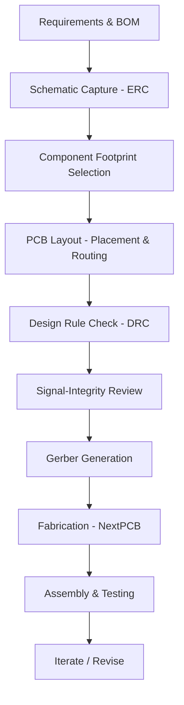

# Overview of the IoT PCB Design  

## 1. Design Objectives  

The target board is a **medium‑complexity, four‑layer IoT development platform** built around an **Espressif ESP‑32 C3/S2 system‑on‑chip**.  
Key functional goals are:

* Provide a robust power‑distribution network (3.3 V rail, optional 5 V input).  
* Expose the ESP‑32’s high‑speed interfaces (UART, SPI, I²C, USB, Wi‑Fi/BT) with controlled‑impedance routing where required.  
* Offer a set of generic connectors (programming, sensor I/O, power) that are conveniently placed for rapid prototyping.  
* Keep the bill of materials (BOM) affordable while still demonstrating good PCB‑design practices.  

These goals drive the subsequent decisions on component selection, stack‑up, placement, and manufacturability.  

---

## 2. Component Selection & BOM Considerations  

| Subsystem | Typical Parts | Design Implications |
|-----------|---------------|---------------------|
| **MCU** | ESP‑32 C3 or ESP‑32 S2 (dual‑core, Wi‑Fi/BT) | Requires careful decoupling, 3.3 V LDO, and high‑speed trace control for RF and USB. |
| **Power Management** | 3.3 V LDO, optional buck‑boost for 5 V input | Must provide low‑noise supply; placement of bulk and high‑frequency decoupling caps is critical. |
| **Connectors** | USB‑C, 2 mm pitch header, screw terminals | Connector footprints dictate board edge clearance and mechanical reinforcement. |
| **Passive Components** | 0.1 µF, 1 µF, 10 µF capacitors, 10 kΩ pull‑ups | Capacitor placement close to the ESP‑32 pins reduces loop inductance. |
| **Sensors / Expansion** | Generic I²C, SPI, UART peripherals (optional) | Provide routing channels and keep signal‑pair lengths matched where needed. |

All parts are sourced from the **NextPCB** catalog, the chosen fabricator for this project. The designer consulted each component’s datasheet to extract recommended footprint dimensions, recommended pad‑and‑via patterns, and recommended decoupling schemes.  

> **Note:** The need to read datasheets and derive connection details is a standard practice for any non‑trivial board and was explicitly highlighted as a design step. [Verified]

---

## 3. Schematic Capture (KiCad 9 RC1)  

The schematic was created in **KiCad 9 release‑candidate 1**, released in January 2025. The final KiCad 9 release is expected to be binary‑compatible, so no redesign is required when the stable version becomes available.  

Key schematic‑level actions:

* **Define hierarchical blocks** for power, MCU, and peripheral groups to keep the sheet readable.  
* **Run Electrical Rule Check (ERC)** after each major edit to catch missing connections, duplicate nets, or un‑powered pins.  
* **Annotate nets** with clear names (e.g., `VDD_3V3`, `GND`, `USB_DP`, `USB_DM`) to simplify later layout constraints.  

> The ERC/DRC workflow in KiCad mirrors industry practice and helps avoid costly re‑spins. [Verified]

---

## 4. PCB Stack‑up & Layer Strategy  

A four‑layer board offers a good balance between cost and performance for an IoT development platform. The typical stack‑up, inferred from the design intent, is:

```
Layer 1 – Top Signal (components, routing)
Layer 2 – Ground Plane (continuous, low‑impedance return)
Layer 3 – Power Plane (3.3 V, optional 5 V)
Layer 4 – Bottom Signal (additional routing, test points)
```

* **Ground plane on Layer 2** provides a solid reference for high‑frequency signals and improves EMI shielding.  
* **Power plane on Layer 3** reduces voltage drop and eases decoupling capacitor placement.  
* **Signal layers** are kept thin enough to meet the required impedance for USB and high‑speed SPI (≈ 90 Ω differential).  

> The exact stack‑up is not stated in the transcript but follows standard practice for 4‑layer IoT boards. [Inference]

### 4.1 Controlled‑Impedance Considerations  

* USB‑C differential pair and ESP‑32 high‑speed SPI lines are routed as **90 Ω differential pairs** with length matching within a few mils.  
* Trace width/spacing is calculated based on the chosen dielectric thickness (typically 0.17 mm for 4‑layer FR‑4) using KiCad’s impedance calculator.  

> Controlled‑impedance routing is essential for reliable USB and Wi‑Fi/BT operation. [Inference]

---

## 5. Layout Guidelines  

### 5.1 Component Placement  

* **MCU** is placed near the board centre to minimise trace lengths to all peripherals.  
* **Decoupling capacitors** (0.1 µF, 1 µF) are placed **as close as possible** to the ESP‑32 power pins, with a short via to the ground plane.  
* **Connectors** are positioned on the board edges to facilitate board‑to‑board or host‑to‑board connections.  

> The transcript emphasizes that “the location of capacitors and connectors matters.” [Verified]

### 5.2 Routing Strategies  

| Signal Type | Routing Rules |
|-------------|---------------|
| **Power nets** | Wide traces, polygon pours, thermal relief pads for through‑hole parts. |
| **High‑speed differential pairs** | Matched length, constant spacing, keep away from noisy digital traces. |
| **General digital** | Keep traces short, avoid 90° bends (use 45° or arc), maintain clearance from the board edge. |
| **Via usage** | Prefer through‑hole vias for simplicity; blind/buried vias are unnecessary for a 4‑layer board and would increase cost. |

### 5.3 Design‑for‑Manufacturability (DFM)  

* **Silkscreen clearance** of at least 0.2 mm from pads to avoid solder mask bridging.  
* **Minimum annular ring** of 0.15 mm for standard SMT pads (per NextPCB’s capabilities).  
* **Copper pour islands** are connected to the appropriate plane to avoid floating copper.  
* **Test points** are added on the bottom layer for critical nets (e.g., `VDD_3V3`, `GND`, `USB_DP`).  

> These DFM rules are standard for most PCB fab houses and help reduce yield loss. [Verified]

---

## 6. Design Verification  

1. **Electrical Rule Check (ERC)** – run after schematic completion.  
2. **Design Rule Check (DRC)** – run after layout to enforce clearance, width, and via rules.  
3. **Signal Integrity Simulation** – optional but recommended for the USB differential pair; KiCad’s built‑in simulation can verify impedance and return‑loss.  

Any violations are corrected before generating Gerbers for fabrication.

---

## 7. Fabrication & Assembly  

* **Manufacturer:** *NextPCB* (sponsor of the project).  
* **Fabrication data:** Gerber files exported from KiCad 9 RC1; the final board will be ordered once the design is locked.  
* **Assembly:** Standard SMT pick‑and‑place with hand‑soldered through‑hole components (e.g., connectors).  

> The board has already been sent to NextPCB for fabrication, and a physical prototype is expected shortly. [Verified]

---

## 8. Project Timeline & Effort Estimate  

* **Schematic capture & component research:** ~½ day.  
* **Layout (placement, routing, DFM checks):** ~1 day.  
* **Verification (ERC/DRC, SI simulation):** ~½ day.  

> An experienced engineer can complete the entire design in **1–2 days**, as stated in the source material. [Verified]

---

## 9. Tooling & Versioning  

* **CAD tool:** KiCad 9 RC1 (January 2025). The final KiCad 9 release is expected in early 2025 with no breaking changes, ensuring the design remains compatible.  

> The transcript confirms the use of KiCad 9 RC1 and anticipates negligible differences in the final release. [Verified]

---

## 10. Development Flow (Mermaid Diagram)  



The diagram captures the linear yet iterative nature of PCB development for an IoT board, emphasizing verification steps before committing to fabrication.  

---

## 11. Summary  

The IoT development board described here exemplifies a **well‑balanced, four‑layer PCB** that integrates a modern ESP‑32 SoC with essential power, connectivity, and expansion features. By adhering to proven **component‑selection practices**, **rigorous schematic and layout verification**, and **DFM guidelines**, the design can be realized quickly (1–2 days for an experienced engineer) and manufactured reliably through a standard fab house such as NextPCB. The use of KiCad 9 (RC1) provides a modern, open‑source environment that aligns with industry workflows while keeping the learning curve low for newcomers.  

---