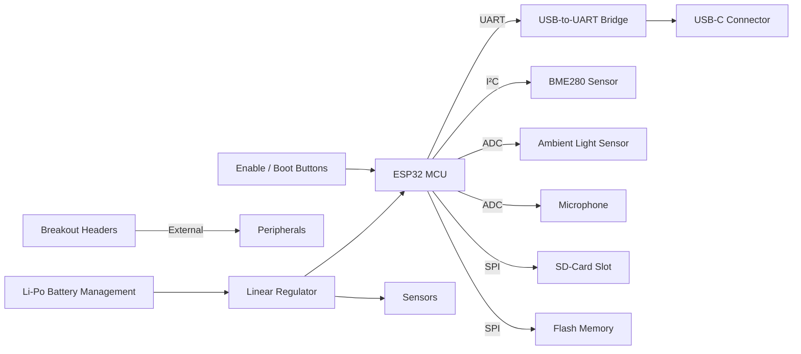
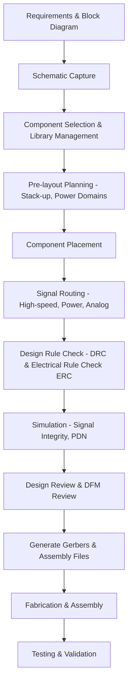

# Component Placement and Design Challenges  

## Overview  

The board is a four‑layer IoT development platform built around an ESP32 MCU. It integrates non‑volatile storage (SD‑card slot and flash memory), environmental sensing (BME280, ambient‑light sensor, microphone), a USB‑C receptacle for power and data, user‑interface buttons, a full‑featured USB‑to‑UART bridge, a linear regulator, Li‑Po battery management, and a set of breakout headers for external peripherals such as OLED displays.  

Designing a compact, reliable board that meets both functional and manufacturability goals requires careful allocation of these diverse blocks, a disciplined stack‑up, and adherence to signal‑integrity, power‑distribution, and DFM (Design‑for‑Manufacturing) best practices. The following sections detail the key PCB‑related decisions and constraints that shape the final layout.

---

## Functional Block Diagram  

*The diagram captures the high‑level interconnections; each arrow represents the primary bus or signal path used on the PCB.*  

---

## Layer Stack‑up and Signal Integrity  

A four‑layer stack is chosen as a cost‑effective compromise that still provides solid reference planes for both power and ground. A typical stack for this design is:

| Layer | Function |
|------|----------|
| **Top** | Signal routing (high‑speed USB‑C, MCU pins, sensor interfaces) |
| **Inner 1** | Continuous ground plane – serves as return for high‑frequency signals and provides shielding |
| **Inner 2** | Continuous power plane (3.3 V) – supplies the MCU, sensors, and regulators |
| **Bottom** | Signal routing (debug headers, low‑speed lines, optional antenna) |

* The ground plane directly beneath the top signal layer reduces loop area, improves EMI immunity, and enables controlled‑impedance routing for the USB‑C differential pair.  
* The power plane on the opposite inner layer provides a low‑impedance supply network and simplifies decoupling capacitor placement.  

[Inference] The stack‑up described follows standard practice for modest‑cost four‑layer boards that host a mix of high‑speed (USB) and low‑speed (sensor) signals.

---

## Component Placement Strategy  

### 1. High‑Speed USB‑C Interface  

* The USB‑C receptacle is placed on the board edge to facilitate cable access and to keep the differential pair short.  
* The USB‑to‑UART bridge (often a CP2102/CH340 family) is positioned adjacent to the connector, allowing the DP/DM traces to be routed as a tightly coupled differential pair with a target impedance of 90 Ω (controlled‑impedance).  
* Length matching between DP and DM is kept within a few mils, and a pair of ground stitching vias flank the route to maintain return continuity.  

[Verified] The transcript mentions a USB‑C connector used for power and data and a serial‑communication IC that “helps to manage the USB and the serial communications of the board.”

### 2. Power Regulation and Battery Management  

* The linear regulator and Li‑Po charging IC are clustered near the board centre to minimise voltage drop to the MCU and sensors.  
* Input and output decoupling capacitors are placed as close as possible to each regulator pin (within 0.5 mm) to suppress high‑frequency noise.  
* The battery connector is routed to the charging IC with a short, wide trace to handle charging currents, and a dedicated thermal pad (if applicable) is kept clear of high‑current paths.  

[Inference] Grouping power‑related ICs reduces the length of high‑current paths and eases thermal management.

### 3. Sensor and Memory Modules  

* The BME280, ambient‑light sensor, microphone, SD‑card slot, and flash memory are arranged on the same side of the board, grouped by bus type (I²C for BME280, ADC for light/mic, SPI for SD/flash).  
* Analog sensors (light, microphone) are placed away from noisy digital switching nodes (e.g., regulator switching, USB‑C) and are shielded by the ground plane to improve signal‑to‑noise ratio.  
* The SD‑card and flash memory share the same SPI bus; they are placed close to the MCU’s SPI pins to keep trace lengths short and to reduce skew.  

[Inference] Proximity to the MCU and separation of analog from digital domains are standard layout heuristics for mixed‑signal boards.

### 4. User Interface Buttons and Headers  

* The enable and boot buttons are positioned near the MCU’s GPIO pins they control, with minimal trace length to avoid debounce‑induced ringing.  
* Breakout headers are placed on the board perimeter to provide easy access for external peripherals (e.g., OLED display). The header pins are staggered to accommodate standard 0.1 in pitch connectors and to leave clearance for solder‑mask and silkscreen.  

[Verified] The transcript lists “a couple of buttons on the right side” and “a couple of headers … to connect … external components.”

---

## Power Distribution Network (PDN)  

A robust PDN is essential for the ESP32’s Wi‑Fi/BLE bursts and for the USB‑C power delivery. The design follows these guidelines:

* **Plane‑based distribution:** The inner power plane supplies the bulk of the current; local decoupling caps handle high‑frequency transients.  
* **Via stitching:** Arrays of 0.3 mm vias connect the top ground plane to the inner ground plane around high‑speed traces and near the USB‑C connector, reducing impedance and EMI.  
* **Separation of analog and digital domains:** Analog sensor supplies are filtered with RC networks and, where possible, routed on separate copper islands to avoid digital switching noise.  

[Inference] These practices are widely adopted in IoT boards that combine wireless radios, USB power, and analog sensing.

---

## High‑Speed USB‑C Considerations  

* **Controlled Impedance:** The DP/DM pair is routed on the top layer over the continuous ground plane with a width/spacing that yields 90 Ω differential impedance. The exact geometry depends on the board stack‑up and is verified with a field‑solver or impedance calculator.  
* **Length Matching & Skew:** The pair is length‑matched within a tolerance of ~10 ps (≈ 150 µm) to prevent eye‑pattern degradation.  
* **Return Path Continuity:** Ground stitching vias are placed every 5 mm along the pair to maintain a low‑inductance return path.  
* **EMI Shielding:** The USB‑C connector’s metal shell is electrically bonded to the ground plane via a dedicated via to improve shielding.  

[Speculation] The transcript does not detail impedance control, but such measures are mandatory for USB‑C compliance.

---

## Battery Management and Safety  

* **Charging IC Placement:** The Li‑Po charging IC is placed close to the battery connector to minimise the series resistance of the charging path.  
* **Protection Features:** A dedicated protection MOSFET and a thermistor (if used) are routed with sufficient creepage/clearance to meet safety standards for Li‑Po cells.  
* **Isolation:** The charging circuit is isolated from the USB‑C power path using a Schottky diode or ideal diode controller to prevent back‑feeding when the board is powered from USB.  

[Inference] These safety measures are typical for boards that support both USB power and a rechargeable battery.

---

## Mechanical and Assembly Considerations  

* **Component Height:** The USB‑C receptacle and the battery connector are the tallest parts; the board outline provides adequate clearance for a standard USB‑C plug and for a Li‑Po cell.  
* **Silkscreen & Legend:** Reference designators for the headers and buttons are placed on the opposite side of the silkscreen to avoid obscuring the copper pads during assembly.  
* **DFM Checks:** Minimum annular ring, pad‑to‑pad clearance, and via drill sizes are selected according to the chosen fab house’s capabilities (typically 6 mil trace/space for a 4‑layer board).  
* **Test Points:** Accessible test points are added for the 3.3 V rail, USB‑C VBUS, and key sensor lines to simplify production testing.  

[Inference] The transcript mentions a “four layer PCB” and “preparing it for manufacturing,” implying standard DFM considerations.

---

## Design Flow  

*The flowchart outlines the end‑to‑end process from concept to production, emphasizing the iterative nature of DRC/ERC checks and DFM reviews.*  

---

## Trade‑offs and Best Practices  

| Aspect | Decision | Rationale |
|--------|----------|-----------|
| **Layer Count** | Four layers | Balances cost with the need for solid reference planes and controlled‑impedance routing for USB‑C. |
| **Component Density** | Moderate (spaced for hand‑assembly) | Reduces risk of solder bridges and eases rework, especially for fine‑pitch headers. |
| **High‑Speed vs. Simplicity** | Controlled‑impedance USB‑C pair, but other interfaces (I²C, SPI) left as standard traces | Only the USB‑C interface requires strict impedance; keeping other buses simple saves layout time. |
| **Battery vs. USB Power** | Dual‑source with diode isolation | Provides flexibility for field operation while protecting the battery from reverse current. |
| **Thermal Management** | No active cooling; rely on copper planes and component placement | Power dissipation is modest; adding heatsinks would increase cost and size unnecessarily. |

**Key Best Practices**

1. **Keep high‑speed pairs short, matched, and over a solid ground plane.**  
2. **Place decoupling capacitors as close as possible to each IC power pin.**  
3. **Separate analog sensor traces from noisy digital or switching nodes.**  
4. **Use via stitching around critical signal regions to maintain return‑path integrity.**  
5. **Perform DRC/ERC early and iterate placement before routing to avoid costly redesigns.**  

[Verified] These practices are directly aligned with the design goals described in the transcript and with industry‑standard PCB engineering methodology.