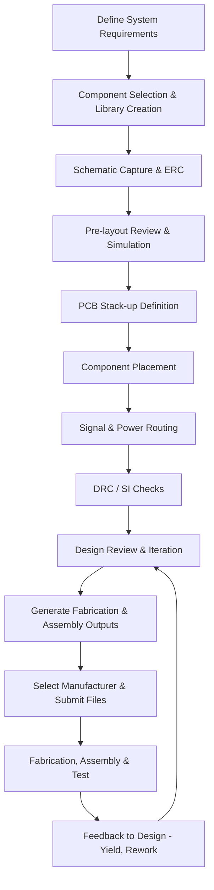

# Design Guidelines and Workflow Overview  

## 1. Introduction  

The design of an intermediate‑complexity PCB that incorporates an ESP‑32 C3 system‑on‑chip (SoC), assorted sensors, and power‑management circuitry demands a disciplined workflow that balances performance, cost, and manufacturability. By following a structured sequence—from high‑level requirements through schematic capture, layout, and finally hand‑off to a trusted fabricator/assembler—designers can reliably translate a concept into a functional board. This chapter outlines the essential stages of that workflow, highlights the key decisions that shape the final product, and records best‑practice considerations that keep the design DFM‑friendly and assembly‑ready.  

## 2. End‑to‑End PCB Development Flow  

The figure below captures the canonical flow used throughout the project. Each block represents a major activity; the arrows indicate the logical progression and feedback loops that occur when design reviews uncover issues.  

*The flowchart reflects a typical iterative loop where DRC/SI checks and post‑assembly testing feed back into the layout stage.*  

## 3. High‑Level Design Challenges  

Designing a board around the ESP‑32 C3 introduces several constraints that must be addressed early:

* **Signal Integrity for High‑Speed Interfaces** – The ESP‑32 C3 provides Wi‑Fi, Bluetooth, and multiple UART/SPI/I²C buses. These digital lines operate at frequencies where controlled‑impedance routing, proper return‑path planning, and length matching become important to avoid reflections and EMI.  
* **Power Distribution** – The SoC draws peak currents in the hundreds of milliamps during radio transmission. A low‑impedance power plane, adequate decoupling, and careful via placement are required to maintain voltage stability across the board.  
* **Component Density vs. Manufacturability** – Sensors and peripheral ICs often come in fine‑pitch packages. While a compact layout reduces board size, it can increase the risk of solder defects and raise assembly cost.  
* **Thermal Management** – Continuous radio operation can generate localized heating. Providing copper pours and thermal vias beneath the ESP‑32 C3 helps spread heat without adding a dedicated heatsink.  

These challenges drive the subsequent decisions on stack‑up, placement, and routing strategies.  

## 4. Component Selection and Library Management  

Choosing components that are readily available from the selected fabricator (BCB) simplifies the bill‑of‑materials (BOM) and reduces lead time. It is advisable to:

* Prefer parts with standard land patterns that KiCad libraries already support, or create verified custom footprints that respect the manufacturer’s panelization rules.  
* Verify that the selected sensors and power‑management ICs meet the required voltage, current, and environmental specifications, and that their datasheet‑recommended layout guidelines (e.g., recommended decoupling capacitor values and placement) are incorporated into the schematic.  

These practices minimize the risk of DFM violations later in the flow.  

## 5. Schematic Capture and Electrical Verification  

The schematic stage is where functional intent is encoded. After placing all symbols and wiring nets, run KiCad’s **Electrical Rule Check (ERC)** to catch:

* Unconnected pins, mismatched power domains, and missing pull‑up/down resistors.  
* Violations of the ESP‑32 C3’s recommended pin assignments (e.g., ensuring that the RF antenna trace is kept short and isolated from noisy digital lines).  

ERC results should be resolved before proceeding to layout, as they often reveal design‑level oversights that are far cheaper to fix than post‑fabrication re‑spins.  

## 6. PCB Stack‑up Definition  

For an intermediate‑complexity board a **two‑layer** stack‑up is often sufficient, but the decision hinges on cost versus performance trade‑offs:

* A **two‑layer** board with a solid ground plane on the bottom provides adequate shielding for most sensor‑centric designs and keeps fabrication inexpensive.  
* If the design includes high‑speed differential pairs (e.g., USB or high‑rate SPI), a **four‑layer** stack‑up may be justified to allocate dedicated signal and reference planes, thereby simplifying impedance control and reducing crosstalk.  

The chosen stack‑up must be communicated to the fabricator early, as it influences panelization, copper weight, and via specifications.  

## 7. Component Placement and Routing Strategies  

### 7.1 Placement  

Place the ESP‑32 C3 near the board’s mechanical centre to equalize trace lengths to peripheral connectors and to provide symmetric thermal dissipation. Sensors that interface directly with the MCU should be positioned close to the relevant I/O pins to minimize trace length and parasitic inductance.  

### 7.2 Power Routing  

Create a **continuous copper pour** for the 3.3 V rail, stitching it to the ground plane with multiple **via arrays** to lower impedance. Decoupling capacitors (0.1 µF and 10 µF) should be placed within a few millimetres of each power pin, with their leads oriented perpendicular to the current flow to reduce loop area.  

### 7.3 Signal Routing  

* **High‑speed digital lines** (e.g., SPI, UART) are routed on the outer layer with controlled width/spacing to achieve the target impedance (typically 50 Ω single‑ended).  
* **Differential pairs** (if present) are kept parallel, with matched lengths and a consistent spacing that satisfies the pair’s differential impedance requirement.  
* **Sensitive analog or RF traces** are isolated from noisy digital routes by maintaining a minimum clearance and, where possible, routing them over a solid ground plane.  

After routing, run KiCad’s **Design Rule Check (DRC)** with manufacturer‑provided tolerances to ensure that trace widths, clearances, and via sizes meet the fab house’s capabilities.  

## 8. Design for Manufacturability (DFM) and Design for Assembly (DFA)  

A DFM‑aware layout reduces the probability of assembly defects and lowers cost:

* **Avoid acute angles** (< 90°) and keep all trace ends rounded to facilitate solder flow.  
* **Maintain a minimum annular ring** around pads as specified by the assembler (typically ≥ 0.15 mm) to ensure reliable solder fillet formation.  
* **Provide adequate test points** for critical nets (e.g., VCC, GND, reset) to simplify post‑assembly verification.  
* **Standardize component orientation** (e.g., all resistors and capacitors facing the same direction) to speed up pick‑and‑place programming.  

These considerations are especially important when the board is produced by an external partner such as BCB, which offers both fabrication and assembly services.  

## 9. Generating Fabrication and Assembly Outputs  

Once the layout passes DRC and SI checks, generate the following files for hand‑off:

* **Gerber files** for each copper, solder mask, silkscreen, and drill layer.  
* **NC drill files** that list via and through‑hole locations.  
* **Pick‑and‑place (centroid) data** in CSV or IPC‑2581 format, containing component reference, footprint, and exact X/Y coordinates.  
* **Bill of Materials (BOM)** with manufacturer part numbers, preferred vendors, and any required substitutions.  

These deliverables constitute the complete package that the fabricator/assembler uses to produce the board.  

## 10. Partner Manufacturer Considerations  

Working with a dedicated partner such as **BCB** provides several advantages:

* **Panelization expertise** – BCB can optimize panel layout to maximize yield while respecting the board’s mechanical constraints.  
* **Assembly capabilities** – Their pick‑and‑place machines support a wide range of component sizes, and they offer optional conformal coating for added reliability.  
* **Feedback loop** – Post‑assembly test results and any observed yield issues are communicated back to the designer, enabling rapid iteration and design refinement.  

When submitting files, adhere to the manufacturer’s **design‑for‑manufacturing checklist** (e.g., minimum trace width, spacing, and via drill tolerances) to avoid costly revisions.  

## 11. Summary of Best Practices  

* Begin with a clear definition of system requirements and a realistic component list that aligns with the chosen fab house’s capabilities.  
* Leverage KiCad’s ERC and DRC tools early and often; resolve all warnings before moving to the next stage.  
* Choose a stack‑up that balances cost with the need for controlled impedance; document the decision for the fabricator.  
* Prioritize component placement that minimizes critical trace lengths and supports efficient thermal dissipation.  
* Apply DFM/DFA guidelines—rounded trace ends, adequate annular rings, consistent component orientation—to reduce assembly risk.  
* Produce a complete, well‑organized set of fabrication and assembly files, and maintain open communication with the manufacturer to incorporate yield feedback into future revisions.  

By adhering to this workflow and the associated design principles, engineers can confidently develop intermediate‑level PCBs that meet performance targets while remaining cost‑effective and manufacturable.