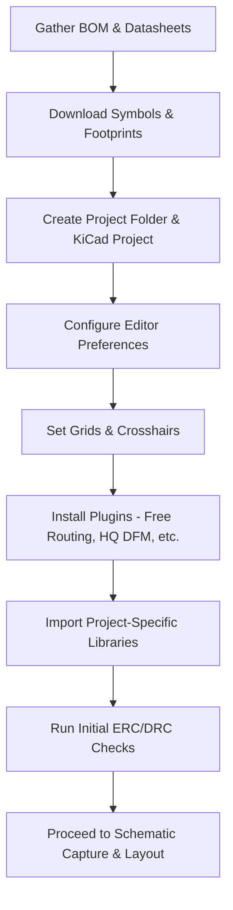

# Setting Up KiCad 9 for the Project  

This section documents the complete workflow for preparing a KiCad 9 project that targets an ESP‑32‑based board. It captures the decisions, constraints, and best‑practice recommendations that arise when moving from a raw bill‑of‑materials (BOM) to a fully‑configured KiCad environment ready for schematic capture and PCB layout.

---

## 1. Overview  

A clean, reproducible project layout begins with **two parallel activities**:

1. **Component research & library acquisition** – gathering datasheets, symbols, and footprints.  
2. **KiCad environment configuration** – creating the project folder, setting editor preferences, and loading the required libraries and plugins.  

Both activities are independent of the KiCad version you run; multiple KiCad installations can coexist on the same workstation without conflict. [Verified]

---

## 2. Preparing the Bill of Materials and Libraries  

| Activity | Typical effort | Tools / Sources |
|----------|----------------|-----------------|
| Identify every part (ICs, passive components, connectors) | ~5–6 h for a modest design | Manufacturer datasheets, online part‑search portals (e.g., SnapEDA, UltraLibrarian) |
| Download **symbol** (`.kicad_sym`) and **footprint** (`.kicad_mod`) files | Included in the above effort | Same portals; often provide both files in a single package |
| Verify footprints against mechanical drawings | Critical for fit & clearance | 3‑D viewer in KiCad, mechanical CAD reference models |

> **Why this matters** – A complete, verified library set eliminates later re‑work, prevents ERC/DRC violations, and ensures that the generated BOM matches the fabricated board. [Inference]

---

## 3. Creating the KiCad Project Structure  

1. **Select an existing project directory** – KiCad can store all project files (`.kicad_pro`, `.kicad_sch`, `.kicad_pcb`, etc.) directly in a pre‑created folder.  
2. **Disable “Create new folder”** – this avoids an extra level of nesting and keeps the directory layout tidy.  
3. **Name the project** – e.g., `kicad9_esp32_demo_project`.  

> Storing the project alongside the library folder simplifies relative path handling for project‑specific libraries. [Inference]

---

## 4. Configuring Global and Project‑Specific Settings  

### 4.1 Schematic Editor Preferences  

| Setting | Recommended value | Rationale |
|---------|-------------------|-----------|
| **High‑quality anti‑aliasing** | Enabled | Improves readability of symbols and nets, especially on high‑resolution displays. [Verified] |
| **Display options** | Defaults (grid, net names, pin numbers) | Adequate for most designs; can be tweaked later. |
| **Grid list** | 150 mil, 25 mil, 10 mil (plus fast‑switching 50 mil, 25 mil) | Provides coarse placement for large blocks and fine placement for dense components. [Verified] |
| **Annotation** | Automatic, sequential | Guarantees unique reference designators across the schematic. |

### 4.2 PCB Editor Preferences  

| Setting | Recommended value | Rationale |
|---------|-------------------|-----------|
| **Crosshair mode** | Four‑window crosshairs | Facilitates precise alignment of components and tracks across the full canvas. [Verified] |
| **Grid overrides** | Same list as schematic (plus any custom grids) | Keeps placement consistency between schematic and layout. |
| **Origin access & editing options** | Defaults (unless a custom origin is required for mechanical alignment) | Simpler for a single‑board design. |

> Keeping schematic and PCB grid settings synchronized reduces accidental mis‑alignment when transferring components from schematic to layout. [Inference]

---

## 5. Managing Grids and Crosshairs for Precise Placement  

- **Grid selection**: Use the coarse grid (150 mil) for block‑level placement (e.g., MCU, power module) and switch to finer grids (25 mil, 10 mil) when routing high‑density nets or placing fine‑pitch components.  
- **Fast‑switching grids**: The 50 mil / 25 mil shortcuts allow rapid toggling without opening the grid dialog, speeding up iterative placement.  
- **Crosshair visibility**: Enabling the four‑window crosshair draws a full‑screen guide that snaps to the active grid, making it trivial to line up pads, vias, and keep‑out zones.  

> These visual aids are especially valuable when working with ESP‑32 footprints that have many pins and when routing differential pairs for Wi‑Fi/BT signals. [Inference]

---

## 6. Installing and Leveraging Useful Plugins  

| Plugin | Core functionality | Recommendation |
|--------|--------------------|----------------|
| **Interactive HTML BOM** | Generates a web‑viewable BOM with part links and 3‑D models. | Useful for design reviews and procurement. |
| **PCB Action Tools** | Batch operations (e.g., renumbering, netlist manipulation). | Saves time on large designs. |
| **Round Tracks** | Converts straight tracks to rounded‑corner traces for better manufacturability. | Improves DFM scores. |
| **Free Routing** | Automatic routing engine that respects design rules. | Ideal for initial placement of power nets and bulk routing. |
| **HQ DFM** | Performs high‑quality Design‑for‑Manufacturability checks (clearance, drill‑hole tolerances, etc.). | Must be run before generating Gerbers. |

> **Minimum required set** – *Free Routing* (to accelerate early routing) and *HQ DFM* (to catch manufacturability issues before release). [Verified]

---

## 7. Importing Symbol and Footprint Libraries  

1. **Open Preferences → Manage Symbol Libraries** (or **Footprint Libraries**).  
2. **Select “Project Specific”** rather than “Global” unless the library will be reused across many projects. This keeps the project self‑contained and simplifies version control. [Inference]  
3. **Add a library**:  
   - Click the folder icon, navigate to the project’s `libraries/footprints` (or `symbols`) directory.  
   - Choose the desired `.kicad_mod` (or `.kicad_sym`) files.  
   - Assign a **nickname** (e.g., `esp32_project_footprints`) for quick lookup in the library picker.  
4. **Repeat for symbols** – KiCad requires individual selection or multi‑select; bulk‑selecting the entire folder is not supported.  

> Using a **nickname** avoids path‑related errors when the project is moved between machines or shared via version‑control systems. [Inference]

---

## 8. Best‑Practice Checklist  

| ✅ Item | Why it matters |
|--------|----------------|
| BOM and library files are stored **inside the project folder**. | Guarantees reproducibility and simplifies repository commits. |
| **Project‑specific libraries** are used for all parts unique to the design. | Prevents accidental library updates that could break the layout. |
| Grid and crosshair settings are aligned between schematic and PCB editors. | Reduces placement errors when transferring components. |
| **Free Routing** and **HQ DFM** plugins are installed and enabled. | Accelerates early routing and catches manufacturability problems early. |
| All footprints are verified against the component datasheet before placement. | Avoids clearance violations and ensures correct pad dimensions. |
| High‑quality anti‑aliasing is enabled for both editors. | Improves visual inspection, especially on high‑resolution monitors. |

---

## 9. Visual Summary of the Setup Flow  

*The flowchart illustrates the logical progression from component research to a ready‑to‑use KiCad environment.* [Verified]

---

### Closing Remarks  

By adhering to the configuration steps and best‑practice guidelines outlined above, the KiCad 9 environment becomes a **deterministic, reproducible platform** for the ESP‑32 demo board. This foundation minimizes downstream errors, accelerates the design cycle, and ensures that the final Gerber set passes both **ERC/DRC** and **HQ DFM** validation before shipment to the fabricator. [Inference]