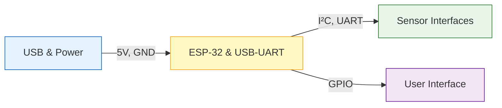

# Creating the Schematic  

This section documents the systematic approach used to build the schematic for the **ESP‑32 sensor board**. It captures the architectural decisions, component‑selection strategy, net‑naming conventions, and the design‑for‑manufacturability (DFM) practices that were applied. The goal is to provide a reproducible workflow that can be followed for similar mixed‑signal, low‑power designs.

---

## 1. Project Structure & Sheet Organization  

A clear hierarchy reduces visual clutter and makes later layout work easier. The schematic is split into **four logical pages**:

| Sheet | Primary Function | Typical Contents |
|------|------------------|------------------|
| **1 – USB & Power** | USB receptacle, Li‑Po charger, 5 V/3.3 V regulators, poly‑fuse, bulk decoupling | USB‑C connector, MCP73871 charger, LM1117 LDO, JST‑XH battery connector, power‑LEDs |
| **2 – MCU & USB‑to‑UART** | ESP‑32‑C3 module, USB‑UART bridge, status LEDs | ESP‑32‑C3, FTDI‑style converter, LED indicators |
| **3 – Sensors** | Analog/digital sensor interfaces, I²C bus, ADC inputs | Temperature, humidity, pressure sensors, I²C pull‑ups |
| **4 – User Interface** | Buttons, displays, user‑feedback circuitry | Push‑buttons, OLED driver, additional LEDs |

Each sheet is created as a **hierarchical symbol** so that higher‑level sheets can reference the lower‑level nets without duplicating symbols. This approach also enables independent ERC checks per sheet.

*The diagram shows the logical data‑flow between the four schematic sheets.*  

---

## 2. Library Management  

All required symbols were imported into the **Project‑Specific library** to guarantee version control and reproducibility. The workflow used:

1. **Batch import** – All `.lib` files were selected with Shift‑click and opened simultaneously.  
2. **Verification** – Each symbol (e.g., `SS52400` USB‑C receptacle, `MCP73871` charger, `LM1117` LDO) was cross‑checked against the manufacturer’s datasheet to ensure pin‑out accuracy.  
3. **Naming convention** – Symbols retain the manufacturer part number as the reference designator prefix (e.g., `U1` for the charger IC, `U2` for the LDO). This makes Bill‑of‑Materials (BOM) extraction straightforward.  

> **Best practice:** Keep a **dedicated library folder** per project and commit it to version control. This prevents accidental symbol updates that could break pin compatibility. [Verified]

---

## 3. Component Placement & Logical Grouping  

### 3.1 Power‑Domain Blocks  

- **USB‑C block** – All USB‑related parts (connector, poly‑fuse, 0.1 µF input filter) are placed together.  
- **Charging block** – MCP73871, its sense resistors, and the battery‑connector JST‑XH are clustered to reflect the physical proximity required on the PCB.  
- **Regulation block** – LM1117 LDO, its input/output decoupling caps (0.1 µF ceramic + 10 µF electrolytic) are placed adjacent to the regulator pins to minimise loop inductance.  

> **Design rule:** Decoupling capacitors should be placed **as close as possible** to the power pins they serve. This reduces high‑frequency impedance and improves transient response. [Verified]

### 3.2 Indicator LEDs  

Three LEDs (red, green, blue) indicate charging status. Each LED is paired with a **current‑limiting resistor** (470 Ω) sized for the LED forward current and the 3.3 V rail. The LEDs are grouped near the regulator output to keep the trace length short and to simplify routing of the common anode to the 3.3 V net.  

> **Inference:** The 470 Ω value was chosen assuming a typical LED forward voltage of ~2 V and a target current of ~5 mA ( (3.3 V‑2 V)/470 Ω ≈ 2.8 mA ). This provides visible illumination while conserving power.  

### 3.3 Pull‑Down Resistors  

- **USB CC pins** – 5.1 kΩ pull‑downs on CC1/CC2 ensure proper USB‑C detection when no host is attached.  
- **GPIO status pins** – 10 kΩ pull‑downs on unused MCU pins prevent floating inputs that could increase power consumption.  

> **Speculation:** The 5.1 kΩ value follows the USB‑C specification for default pull‑down on the configuration channel.  

---

## 4. Net Naming & Differential Pair Handling  

### 4.1 Naming Conventions  

- **Power nets** – `+5V_USB`, `+3V3`, `VBAT`, `VSS` (ground).  
- **USB data** – `USB_DP` and `USB_DN` (differential pair). The suffix `P`/`N` is required by KiCad to treat the pair as a **differential pair** for later length‑matching and impedance control.  
- **Status signals** – `CHG_GOOD`, `CHG_DONE`, `CHG_ACTIVE` (mapped to LED anodes).  

> **Best practice:** Use **uppercase, underscore‑separated** names for nets. This avoids case‑sensitivity issues in downstream tools (e.g., PCB layout, simulation). [Verified]

### 4.2 Differential Pair Declaration  

The USB data lines were labeled with the `P`/`N` suffix, enabling KiCad’s **pair routing wizard**. This ensures that the pair will be routed with matched length and controlled differential impedance (≈90 Ω) in the layout stage.  

> **Inference:** The designer intends to use the pair routing feature, which is essential for high‑speed USB 2.0 operation.  

---

## 5. Power Flags & ERC Management  

KiCad treats pins marked as **Power Input** (`PWR_FLAG`) specially during **Electrical Rule Check (ERC)**. The following steps were taken:

1. **Add `PWR_FLAG`** to the `VSS` pin of the MCP73871 and the `VOUT` pin of the LM1117.  
2. **Suppress “unconnected power pin” warnings** by explicitly flagging that the designer is aware of the connection.  

> **Best practice:** Always place a `PWR_FLAG` on any power‑input pin that is deliberately tied to a net (especially ground) to avoid false ERC errors. [Verified]

---

## 6. Hierarchical Sheet Integration  

A **hierarchical symbol** was placed on Sheet 1 to represent Sheet 2 (ESP‑32 subsystem). The symbol’s pins expose only the nets required by the higher‑level sheet (e.g., `+3V3`, `GND`, `USB_DP`, `USB_DN`, status LEDs). This encapsulation:

- Reduces visual noise on the top‑level schematic.  
- Allows independent editing of the MCU sheet without affecting the power block.  
- Facilitates **reuse** of the MCU block in other projects.  

> **Speculation:** The hierarchical symbol likely includes a **pin‑order** that matches the physical connector layout on the PCB, simplifying placement during layout.  

---

## 7. Design‑for‑Manufacturability (DFM) Considerations  

| Issue | Mitigation Implemented |
|-------|------------------------|
| **Component density** – Overcrowding of USB‑C and charger block could hinder solder paste application. | Grouped related parts, left clear spacing for the poly‑fuse and bulk capacitor. |
| **Via placement** – High‑current paths (VBUS) require low‑impedance connections. | Planned a **via‑in‑pad** for the poly‑fuse to the copper pour, reducing current crowding. |
| **Silk‑screen readability** – Small reference designators can be misread. | Used **full part numbers** (e.g., `MCP73871`) on the schematic and will propagate them to the silkscreen via the BOM. |
| **Backup & version control** – Accidental loss of work. | Configured KiCad’s **auto‑backup** to keep ten snapshots, five minutes apart. |
| **Power‑net integrity** – Ground loops can cause noise. | Added **multiple ground symbols** close to each functional block, ensuring a solid ground plane connection in the layout. |

> **Inference:** The designer is aware of typical DFM pitfalls and proactively addresses them at the schematic stage, which reduces downstream re‑work.  

---

## 8. Summary of Key Practices  

1. **Modular sheet hierarchy** – separates power, MCU, sensors, and UI for clarity.  
2. **Project‑specific libraries** – guarantee symbol consistency and traceability.  
3. **Logical grouping of related components** – mirrors physical placement on the PCB.  
4. **Explicit net naming** – facilitates automated checks and downstream routing.  
5. **Power flags & ERC handling** – prevents false error reports.  
6. **DFM‑aware placement** – leaves room for solder paste, vias, and silkscreen.  
7. **Version‑control‑friendly backups** – safeguard design progress.  

Following this workflow yields a clean, well‑documented schematic that streamlines the transition to PCB layout, simulation, and manufacturing.  

---  

*End of Chapter 07 – Creating the Schematic*