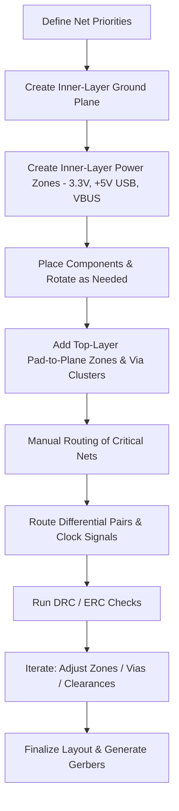

# Routing and Copper Zones  

## 1. Overview  

The layout workflow is organized around **net priority**:  

1. **Reference planes** (ground, power) – created as copper zones on inner layers.  
2. **Differential pairs** – routed after the planes are in place.  
3. **Clock and other high‑speed signals** (e.g., SBI, I²C) – routed with controlled impedance.  
4. **Power traces** that are not covered by a plane.  
5. **Remaining signal nets**.  

Manual routing is preferred over an autorouter because the latter often yields *DRC‑clean* but **electrically sub‑optimal** results that can degrade signal integrity or require extensive post‑processing. [Verified]

---

## 2. Layer Strategy and Copper‑Zone Allocation  

| Layer | Purpose | Net(s) | Fill style |
|------|----------|--------|------------|
| **Inner 2** | Ground reference plane | GND | Solid fill (better shielding & lower impedance) [Inference] |
| **Inner 1** | Primary power planes | 3.3 V, +5 V USB, VBUS | Solid fill for each net; separate zones to isolate voltage domains [Verified] |
| **Top (Component) layer** | Pad‑to‑plane connections, local power zones | 3.3 V, +5 V USB, GND, VBAT | Solid fill for local zones; thermal reliefs used only where needed [Inference] |

The **ground zone** is placed on the *second inner copper layer* because it provides a continuous reference for all signal layers while leaving the first inner layer free for multiple power domains. [Verified]

---

## 3. Creating a Copper Zone – Step‑by‑Step  

1. **Select the target layer** from the Appearance → Layers palette.  
2. **Choose the “Zone” tool** (draw field zones).  
3. **Draw an outline** that encloses the desired copper area. The board outline automatically clips the zone to the board shape.  
4. **Configure zone properties**:  
   * **Net name** (e.g., `GND`, `3V3`, `VBUS`).  
   * **Fill style** – *Solid* is recommended for power/ground; *Hatch* may be used for non‑critical nets. [Inference]  
   * **Clearance** – set according to the design rules; adjust if pads are unintentionally excluded.  
5. **Finalize** with a right‑click → *Zone → Fill* (or press **B**) to pour copper.  
6. **Lock** the zone (or the entire group) to prevent accidental edits while routing other layers.  

Naming zones clearly (e.g., `3V3_TOP1`, `GND_INNER2`) simplifies later verification and DRC reporting. [Verified]

---

## 4. Power Distribution Network (PDN) Design  

### 4.1 Large Power Zones  

- **3.3 V zone** on Inner 1 encloses the MCU, sensors, regulator, and associated connectors.  
- **+5 V USB zone** covers the USB power entry, poly‑fuse, and downstream circuitry.  
- **VBUS zone** supplies the USB VBUS pins (A9, A4, B4) and is kept separate from the main 5 V rail to avoid cross‑talk.  

These zones are **solid‑filled** to minimise voltage drop and provide a low‑impedance return path. [Inference]

### 4.2 Via Stitching for High Current  

To connect top‑layer pads (e.g., battery input, USB power pins) to the inner‑layer power zones, a **cluster of vias** is placed:

- Via drill **≈ 0.5 mm**, pad **≈ 0.3 mm** (typical for moderate current). [Speculation]  
- Multiple vias are distributed evenly across the pad area to share current and reduce localized heating.  

The via cluster is created with the **via‑stamp (VS) tool**, then the corresponding zone is drawn around the cluster and assigned to the appropriate net. [Verified]

### 4.3 Ground Connections  

Ground pads on connectors (e.g., J2) and regulator pins are linked to the inner‑layer ground plane using **solid‑filled zones** on the top layer that contain the pads and a set of vias. Thermal reliefs are avoided for high‑current ground connections to keep the resistance low. [Inference]

---

## 5. Manual Routing vs. Autorouting  

| Aspect | Autorouter | Manual Routing |
|--------|------------|----------------|
| **Speed of placement** | Minutes | Hours (but deterministic) |
| **Resulting trace geometry** | Often non‑optimal (excessive length, unnecessary vias) | Optimised for impedance, length matching, current capacity |
| **Signal‑integrity impact** | Higher risk of reflections, crosstalk | Controlled impedance, matched differential pairs |
| **Post‑routing cleanup** | Frequently required (DRC fixes, re‑routing) | Minimal, as design intent is enforced from the start |  

Because the board contains **high‑speed differential pairs** and **significant power currents**, manual routing ensures that **critical nets** meet their electrical requirements without costly redesign cycles. [Verified]

---

## 6. Best Practices Highlighted  

- **Lock groups** after zone creation to keep the layout readable and prevent accidental edits.  
- **Name every zone** (including the net and layer) for easy identification in the *Zones* panel.  
- **Adjust clearance** if a pad is omitted from a zone; a smaller clearance (e.g., 0.2 mm) can resolve the issue. [Verified]  
- **Use the “B” key** to refill zones after any geometry change.  
- **Prefer solid fill** for power and ground planes; hatch patterns are reserved for non‑critical nets.  
- **Distribute via clusters** evenly across pad areas to minimise inductance and improve current sharing.  
- **Verify net assignments** after moving or rotating components (e.g., rotating C1 to align pin 1 with net A9).  
- **Run DRC/ERC** after each major step (zone creation, via insertion, routing) to catch clearance violations early.  

---

## 7. Common Pitfalls and Mitigations  

| Pitfall | Symptom | Remedy |
|---------|---------|--------|
| **Autorouter‑generated routes** | Valid DRC but poor signal integrity | Disable autorouter; perform manual routing for critical nets. |
| **Pads excluded from zones** | Unconnected nets, DRC errors | Reduce clearance or enlarge zone outline; re‑fill zone. |
| **Incorrect net assignment after component rotation** | Unexpected net errors | Re‑assign the pad’s net via the properties dialog. |
| **Insufficient copper for high‑current paths** | Voltage drop, overheating | Add more vias, increase zone size, or use thicker copper (if allowed by stack‑up). |
| **Missing thermal reliefs where needed** | Difficulty in soldering, component stress | Apply thermal reliefs on low‑current nets; keep solid pads for high‑current connections. |

---

## 8. Design Flow Diagram  

The flow emphasizes **zone creation before routing**, ensuring that the PDN is solidified early and that subsequent trace routing can rely on stable reference planes. [Inference]

---

## 9. Summary  

- **Ground** on the second inner layer and **multiple power planes** on the first inner layer provide a robust PDN.  
- **Solid‑filled copper zones** are used for all power and ground nets to minimise impedance and improve EMI performance.  
- **Via clusters** connect top‑layer pads to inner‑layer zones, delivering low‑inductance paths for high current.  
- **Manual routing** is essential for high‑speed and high‑current designs, avoiding the pitfalls of generic autorouter solutions.  
- Consistent **naming, locking, and clearance management** streamline verification and reduce rework.  

Following these practices yields a layout that is **electrically sound**, **manufacturable**, and **ready for high‑speed operation**.