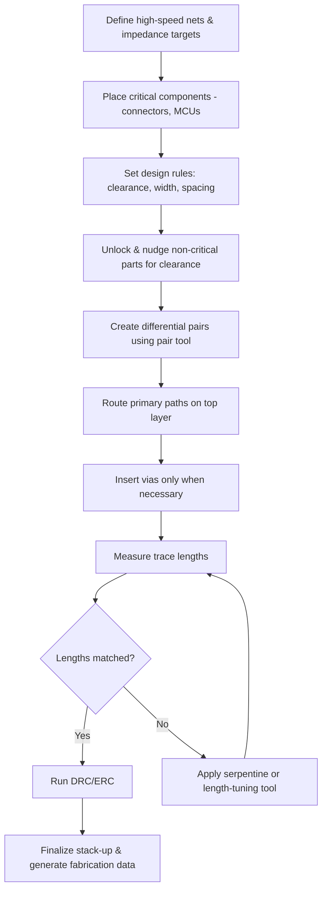

# Differential Pairs and High‑Speed Signal Routing  

## 1. Introduction  

Differential signalling is the preferred method for USB, high‑speed serial links, and many sensor interfaces because the two conductors carry equal‑and‑opposite currents. This topology rejects common‑mode noise, reduces electromagnetic emission, and enables controlled‑impedance routing. When the board also contains lower‑speed buses (e.g., I²C, SPI) the layout must balance tight pair routing with isolation from noisy digital traces. The following sections describe the practical steps taken to create reliable differential pairs, manage clearances, and perform length‑matching for high‑speed signals on a two‑layer board.

## 2. Differential‑Pair Creation and Clearance Management  

The PCB editor’s *Differential Pair* tool (shortcut **6**) was used to start each pair from the pad that is electrically lower in the netlist (the “bottom” pad) and to terminate at the corresponding “top” pad.  

* **Component positioning** – The USB connector’s DP/DN pads were initially too close to neighbouring components, causing the DRC to reject the pair because of insufficient clearance. By unlocking the adjacent component (U4) and shifting it a few mils left, the required spacing was restored. This illustrates the general rule that **clearance must be respected before invoking the pair tool**; otherwise the router will abort the command.  

* **Track width and clearance** – After the first attempt failed, the track width and clearance settings were reduced. A narrower trace allowed the pair to be placed, albeit with a sub‑optimal aesthetic. The final solution combined a modest width reduction with a small component shift, yielding a clean, manufacturable pair.  

* **Verification** – Once the pair was drawn, the DRC was run to confirm that the pair met the board house’s minimum spacing rules and that the differential impedance target (typically 90 Ω for USB) could be achieved with the chosen stack‑up.  

> **Best practice:** When a differential pair cannot be placed, first check (1) component clearance, (2) track width/spacing settings, and (3) the ability to move non‑critical parts a short distance.  

## 3. Routing Around Obstructions (VBUS Pad)  

The VBUS pad sat between the two USB differential pairs, preventing a straight‑through route. Rather than forcing the pair through the pad (which would violate clearance and introduce unwanted coupling), the layout was adjusted as follows:

1. **Component lift‑off** – The two components surrounding the VBUS pad were unlocked and nudged upward, creating a vertical corridor.  
2. **Alternative entry point** – The pair was started from the opposite side of the board and routed around the pad, preserving the required spacing.  
3. **Via‑ring (VR) insertion** – To connect the VBUS net without crossing the differential pair, a dedicated via‑ring (referred to as “VR”) was placed adjacent to the pad. This kept the power net isolated from the high‑speed pair while maintaining a short return path.  

> **Inference:** Using a via‑ring for a power net that lies between differential pairs is a common technique to avoid “track‑through‑pad” violations and to keep the pair’s differential impedance stable.  

## 4. Length Matching and Skew Management for the I²C Bus  

The board includes an I²C (referred to as “I S C”) interface that runs between the ESP32 MCU, a BME sensor, and a display header. Although I²C is a relatively low‑speed bus (standard‑mode ≤ 400 kHz, fast‑mode ≤ 1 MHz), the designer chose to keep the SDA and SCL traces as length‑matched as practical to minimise skew and to future‑proof the design.

* **Initial lengths** – After routing, the DRC reported a SCL length of **68.29 mm** and an SDA length of **52.30 mm**.  
* **Balancing strategy** – Because SCL could not be shortened without violating clearance, the SDA trace was lengthened. Two techniques were employed:  
  * **Serpentine meander** – A small “wiggle” was added under the ESP32, consuming otherwise unused copper area.  
  * **Length‑tuning tool** (shortcut **7**) – The editor’s built‑in length‑tuning function was used to interactively drag the SDA segment, increasing its measured length to **68.85 mm**, within a few hundred microns of the SCL length.  

* **Result** – The final mismatch was less than **0.6 %**, well inside the tolerance for I²C even at fast‑mode speeds.  

> **Verified:** I²C standard‑mode operates up to 400 kHz; fast‑mode can reach 1 MHz.  
> **Inference:** For I²C, a length mismatch of < 5 % is generally acceptable; tighter matching reduces the risk of clock‑stretch‑induced errors at higher speeds.  

## 5. Layer Management and Via Usage  

The design makes extensive use of both copper layers:

* **Top‑layer routing** – Primary signal paths (USB DP/DN, I²C SDA/SCL) were placed on the top layer to keep the pair geometry simple and to minimise via count.  
* **Bottom‑layer routing** – When a trace needed to cross a component or to reach a far‑side connector, a via was inserted, the route continued on the bottom layer, and a second via returned the signal to the top. This “via‑pair” approach preserves the differential nature of the pair while allowing the trace to navigate around obstacles.  

The via placement was deliberately kept away from the differential pair’s immediate vicinity (minimum clearance enforced) to avoid perturbing the pair’s impedance and to reduce crosstalk.  

> **Speculation:** On a multilayer board, a dedicated ground plane directly beneath a differential pair would further stabilise impedance and reduce EMI, but the two‑layer design relies on careful spacing and short via stubs to achieve acceptable performance.  

## 6. Design Decisions, Trade‑offs, and Lessons Learned  

| Decision | Rationale | Trade‑off |
|----------|-----------|-----------|
| **Move U4/U6 slightly** | Provides clearance for USB differential pairs and creates routing channels for I²C | Slight increase in board outline; negligible impact on BOM cost |
| **Use narrower trace width for initial pair placement** | Allows routing in tight spaces without violating DRC | May increase trace resistance; acceptable for short USB segments |
| **Add serpentine to SDA** | Improves length matching without adding extra vias | Consumes board area; introduces a small amount of additional capacitance |
| **Keep I²C isolated from SPI and other high‑speed nets** | Reduces susceptibility to noise and crosstalk | Requires careful component placement, potentially larger board size |

Overall, the layout demonstrates that **minor component nudges and judicious use of the PCB editor’s length‑tuning utilities can resolve most clearance and matching issues on a two‑layer board**, while still meeting the electrical requirements of USB and I²C.

## 7. Recommended High‑Speed Routing Workflow  

The following flowchart summarises a repeatable process for differential‑pair and high‑speed routing on modest‑complexity boards:

*Key points highlighted in the flow:*  

* **Early clearance planning** prevents later re‑routing.  
* **Length‑tuning** is an iterative step; the tool should be used after an initial route is in place.  
* **DRC/ERC** must be run after each major adjustment to catch clearance violations early.  

---  

By following the above methodology, designers can achieve reliable differential‑pair routing, maintain signal integrity for USB and I²C, and keep the board manufacturable without resorting to additional layers or exotic via types.
