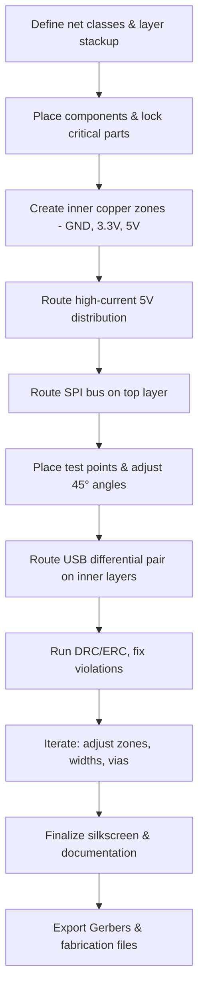

# Power Traces and Signal Routing  

*This section documents the routing methodology, power‑net implementation, and verification workflow used for the board. It captures the key decisions, constraints, and best‑practice guidelines that emerged during layout.*

---

## 15.1 Overview  

The board contains a mixed‑signal environment: an ESP32 MCU, an SD‑card interface, external flash, several 5 V and 3.3 V power domains, and a full‑speed USB connector. The primary goals were:

* **Signal integrity** for the SPI bus (MISO, MOSI, SCK, CS) and USB differential pair.  
* **Robust power distribution** with low voltage drop and adequate current capability.  
* **Manufacturability** – clearances, via sizes, and DRC compliance that satisfy typical fab house rules.  

The layout was performed in a top‑layer‑first style, resorting to inner layers only when necessary (e.g., for USB differential routing or to avoid congested zones).  

---

## 15.2 SPI Bus Routing Strategy  

### 15.2.1 Top‑layer routing and test‑point placement  

All SPI signals were routed on the **front copper layer** to keep trace lengths short and to simplify debugging. Test points (TP2‑TP5) were placed **directly on the signal tracks** to avoid extra bends and to provide easy probe access.  

* 45° trace angles were used instead of 90° corners to reduce impedance discontinuities and to improve manufacturability.  
* Vias were inserted only when a layer change was unavoidable; otherwise, the bus stayed on a single layer.  

> **Why top‑layer only?**  
> The SPI clock operates at the highest frequency among the digital interfaces, so keeping it on the outer layer minimizes dielectric loss and eases length‑matching.  

### 15.2.2 Bus vs. radial topology  

Initially a **radial connection** (multiple devices tied together at a common node) was used for the flash’s MOSI line. This was replaced by a **bus topology** where each peripheral connects directly to the MCU pin.  

* Bus topology reduces stub length, limits reflections, and eases signal‑integrity analysis.  
* The change required deleting the radial trace and re‑routing MOSI through a **bridge** created by moving resistor R16, allowing the trace to pass between the resistor pads without a layer change.  

> **Best practice:** For high‑speed serial buses, avoid star or radial wiring; use a true point‑to‑point bus with controlled impedance. [Verified]

### 15.2.3 Length matching and critical timing  

Length measurements after routing:

| Signal | Approx. length |
|--------|----------------|
| SCK (clock) | 26 mm |
| MISO | 63.3 mm |
| MOSI | 51 mm |

The **clock line** is the most timing‑critical; its length is the shortest, which is desirable. The mismatch between MISO and MOSI is modest relative to the operating frequency of the SPI bus, so no additional length‑matching was required.  

> **Guideline:** Keep the clock trace the shortest and most direct path; keep data‑line lengths within a few percent of each other to limit skew. [Inference]

---

## 15.3 Power Net Implementation  

### 15.3.1 Copper zones and inner layers  

Three dedicated **inner copper planes** were defined:

| Plane | Voltage | Layer |
|-------|---------|-------|
| Ground (GND) | 0 V | IN1 |
| 3.3 V | 3.3 V | IN2 |
| 5 V (USB) | 5 V | IN2 (separate zone) |

Each plane was created as a **filled copper zone** (polygon) covering the entire board area, with appropriate thermal reliefs for through‑hole pads. Mis‑assignment of zones (e.g., 3.3 V placed on the same layer as GND) was discovered via rat‑nest visualization and corrected by moving the zone to its intended inner layer.  

> **Lesson:** Always verify the layer assignment of each power plane before routing; a single misplaced zone can generate a cascade of DRC errors. [Verified]

### 15.3.2 Trace width and via sizing per net class  

A **net‑class** strategy was employed:

| Net class | Typical trace width | Via drill / pad |
|-----------|--------------------|-----------------|
| 5 V (high current) | 0.8 mm (≈ 31 mil) | 0.8 mm pad / 0.5 mm drill |
| 3.3 V | 0.5 mm (≈ 20 mil) | 0.5 mm pad / 0.3 mm drill |
| GND (general) | 0.5 mm | 0.5 mm pad / 0.3 mm drill |
| Signal (SPI, USB) | 0.24 mm (≈ 9.5 mil) | 0.5 mm pad / 0.3 mm drill |

The **large 5 V distribution trace** (≈ 1 mm wide) was routed first, passing beside the poly‑fuse to guarantee sufficient current capacity. When the trace collided with other components, the component was nudged slightly to preserve clearance.  

> **Best practice:** Define net classes early and apply them globally; this prevents later manual width adjustments and ensures consistent current handling. [Verified]

### 15.3.3 High‑current 5 V distribution  

The 5 V rail supplies the entire board, so a **single wide trace** was drawn from the USB 5 V pads to the main power entry point. The trace width was set to 1 mm to meet a 1 A design current with a comfortable margin for voltage drop.  

* The trace was routed **outside of dense component areas** to avoid congestion.  
* A **via‑stitch** grid was added around the poly‑fuse to improve current sharing and thermal dissipation.  

> **Design note:** For boards that may draw > 1 A from USB, consider a dedicated copper pour on an inner layer rather than a single surface trace. [Inference]

---

## 15.4 Differential Pair Routing for USB  

The USB D+ / D‑ signals were routed as a **differential pair** using the two inner layers:

1. **D+** placed on **IN2** (bottom inner layer).  
2. **D‑** placed on **IN1** (top inner layer).  

Each trace used a **via‑transition** to the outer layer only where necessary to avoid crossing other nets. The pair was kept **parallel with matched length** and **minimal separation variance** to preserve differential impedance (≈ 90 Ω).  

* The pair was routed around a dense component area by **splitting the pair across layers**, which avoided excessive via count while maintaining symmetry.  
* After routing, the geometry was tweaked to eliminate any 90° bends and to keep the spacing constant.  

> **Why split across layers?**  
> The outer layers were heavily populated; moving one leg to an inner plane provided a clear corridor without adding extra vias, preserving signal integrity. [Verified]

---

## 15.5 Design Rule Checking and Common Violations  

A systematic **DRC/ERC** pass was performed after each major routing stage. The most frequent violations and their resolutions are summarized below.

| Violation | Cause | Resolution |
|-----------|-------|------------|
| **Zero annular ring** (via hole = pad diameter) | Default via size inherited from a generic footprint. | Updated via size to 0.5 mm pad / 0.3 mm drill via the *Edit → Track & Via Properties* dialog; applied to all affected nets using a filter. |
| **Insufficient clearance between USB connector pins (B1/B2)** | Fixed footprint geometry leaves pins too close for the chosen clearance rule. | Marked as *ignored* after confirming the fab house tolerates the spacing; documented as a deliberate exception. |
| **Single‑spoke thermal relief** for pads connected to copper zones | Limited copper area prevented a second spoke. | Accepted as *ignored* because the pad current is low; noted for future footprint revision. |
| **Silkscreen overlapping solder mask** | Text placed directly over mask‑expanded pad. | Shifted silkscreen objects away from mask expansion; edited footprint where necessary. |
| **Text size below fab minimum** | Designer used 0.12 mm line width for reference designators. | Updated all silkscreen text to 0.8 mm height and ≥ 0.12 mm line width per manufacturer spec. |
| **Unconnected copper zones (ground / 3.3 V)** | Zones were placed on the wrong inner layer or lacked a via tie‑in. | Re‑assigned zones to correct layers, added missing vias, and refreshed zones (B‑key). |
| **Differential pair length mismatch** | Minor routing detours introduced skew. | Adjusted trace lengths by adding small serpentine sections to the shorter leg; verified with the length‑measurement tool. |

### 15.5.1 Handling “Ignore” Decisions  

Some violations could not be resolved without redesigning footprints (e.g., USB connector pin spacing). In these cases:

* The violation was **explicitly excluded** in the DRC settings.  
* A **design note** was added to the bill of materials (BOM) and assembly instructions, informing the manufacturer of the intentional deviation.  

> **Rule of thumb:** Only ignore DRC errors when the impact on reliability, electrical performance, or manufacturability is demonstrably negligible. Document every ignored rule. [Verified]

---

## 15.6 Lessons Learned and Best‑Practice Checklist  

| Area | Key Takeaway |
|------|--------------|
| **Topology** | Use a **bus topology** for high‑speed serial lines; avoid radial or star connections that create stubs. |
| **Angle Management** | Replace 90° corners with **45° or 30°** angles to reduce impedance discontinuities. |
| **Length Matching** | Prioritize the **clock line** for shortest path; keep data‑line lengths within a few percent of each other. |
| **Power Plane Assignment** | Verify **inner‑layer plane assignments** before routing; a misplaced zone triggers many DRC errors. |
| **Net‑Class Discipline** | Define **net classes** (trace width, via size) early and apply them globally. |
| **Via Sizing** | Ensure **annular ring** > 0.1 mm (or fab‑specified) for all vias; batch‑update via sizes via filters. |
| **Differential Pair Routing** | Keep **pair spacing constant**, avoid layer changes unless necessary, and use inner layers to bypass congested areas. |
| **DRC Workflow** | Run **DRC after each routing block**, fix violations immediately, and only ignore when justified with documentation. |
| **Silkscreen & Mask** | Keep silkscreen clear of solder mask expansions; verify with a **silkscreen‑mask clearance check**. |
| **Documentation** | Record every **design deviation** (ignored DRC, footprint edits) in the design notes for the fab house. |

---

## 15.7 Routing Flow Summary  

*The flowchart captures the logical progression from net‑class definition to final data‑output, emphasizing the iterative DRC‑driven refinement.*  

---

**End of Chapter 15** – This documentation should serve as a reference for future revisions and for other designs that share similar mixed‑signal, high‑speed requirements.