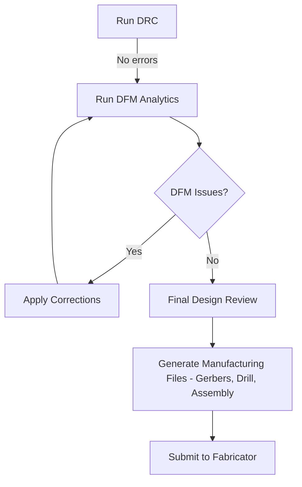

# Design Rule Check and Final Refinements  

*This section documents the final verification and optimisation steps that bridge a clean layout to a manufacturable board. It assumes that all schematic‑to‑layout work is complete and that a standard **Design Rule Check (DRC)** has already passed without errors.*

---

## 1. Design Rule Check (DRC) – The Baseline Guardrail  

The DRC is the first line of defence against **electrical** and **geometrical** violations. Typical rule sets include:

| Category | Typical Checks | Why It Matters |
|----------|----------------|----------------|
| **Clearance / Creepage** | Minimum spacing between copper, pads, and planes | Prevents shorts, satisfies voltage‑stand‑off and safety standards |
| **Trace Width / Current Capacity** | Minimum width per copper thickness and expected current | Guarantees reliable current handling and avoids overheating |
| **Via / Hole Sizes** | Minimum drill diameter, annular ring, and pad‑to‑pad clearance | Ensures drillability and reliable plating |
| **Component Footprint Envelopes** | Pad‑to‑pad spacing, solder mask clearance | Avoids solder bridges and assembly defects |
| **Layer‑to‑Layer Overlap** | No unintended copper‑to‑copper contact across layers | Prevents hidden shorts that only appear after lamination |

When the DRC reports **no issues**, the board is electrically sound **and** conforms to the basic manufacturing constraints defined in the rule file. This state is a **verified** prerequisite before proceeding to higher‑level manufacturability analysis.  

> **Note:** DRC does **not** guarantee that the board can be fabricated cost‑effectively; it only checks that the layout respects the *minimum* constraints supplied by the rule set.  

---

## 2. Design‑for‑Manufacturability (DFM) – Going Beyond Minimum Rules  

DFM analysis uses specialised analytics tools (often bundled with the PCB CAD suite) to flag **non‑optimal** features that increase production cost, lower yield, or complicate assembly. The most common DFM warnings, and the corresponding corrective actions, are listed below.

### 2.1 Acute Angles (≤ 45°)  

- **Problem:** Sharp interior angles concentrate etchant stress, can cause copper “necking,” and are difficult for the fab’s laser‑drill or milling processes.  
- **Remedy:** Replace acute angles with **45° fillets** or **90° corners**. This can be done by redrawing the affected trace segment with a larger radius or by using the CAD tool’s “fillet” command.  

> **Inference:** The transcript mentions “90° angles” as an obvious fix; this aligns with standard DFM practice.  

### 2.2 Redundant Track Segments & Unnecessary Jogging  

- **Problem:** Extra bends or overlapping segments increase trace length, add unnecessary copper, and raise the risk of **copper delamination** or **signal integrity** degradation.  
- **Remedy:** Collapse collinear segments into a single straight line, and remove any “stair‑step” jogs that do not serve a routing purpose.  

> **Verified:** Redundant tracks are a classic DFM issue flagged by most analytics tools.  

### 2.3 Excessive Trace Length on Non‑Critical Nets  

- **Problem:** Long traces increase resistance and inductance, consume board real‑estate, and may cause **signal skew** on matched‑length pairs if left unchecked.  
- **Remedy:** Where the net does not carry high‑speed or high‑current signals, shorten the path by routing more directly or by merging parallel runs.  

> **Inference:** The transcript’s intent to “reduce the length of some of the longer tracks” reflects this practice.  

### 2.4 Undersized Trace Width for Manufacturability  

- **Problem:** Very thin traces are harder for the fab to etch cleanly, especially on high‑density boards, leading to open circuits or excessive copper loss.  
- **Remedy:** Increase the width of marginal traces (often by one or two mils) while still meeting current‑carrying requirements. This also improves solderability and reduces the chance of **copper lift‑off** during assembly.  

> **Speculation:** The speaker’s decision to “draw it with a much thicker track” is a typical DFM optimisation, though the exact width increase depends on the fab’s capabilities.  

### 2.5 Via Optimization  

- **Problem:** Over‑use of vias adds drilling steps, raises cost, and can introduce reliability concerns (via barrel plating defects).  
- **Remedy:** Consolidate multiple vias on the same net into a **via stitch** where possible, and avoid placing vias too close to pads or copper edges.  

> **Inference:** While not explicitly mentioned, this is a standard DFM consideration that would be caught by the same analytics tools.  

---

## 3. Final Refinement Workflow  

The following flowchart summarises the iterative process that takes a DRC‑clean board to a DFM‑optimised design ready for fabrication.

*The loop between **DFM Analytics** and **Apply Corrections** continues until the tool reports **no remaining issues**.*

---

## 4. Best‑Practice Recommendations for the Final Pass  

1. **Maintain Consistent Design Intent** – Any geometry change (e.g., widening a trace) should be reflected in the design documentation and, if needed, in the bill of materials (e.g., updated current rating).  
2. **Document All DFM Fixes** – Keep a change‑log that records which nets were altered, why the change was made, and the impact on electrical performance. This aids downstream verification and future design revisions.  
3. **Validate Critical Nets After Modification** – For high‑speed or high‑current signals, re‑run **Signal Integrity (SI)** simulations or **Current Carrying Capacity** checks after any geometry change to ensure that performance margins are still met.  
4. **Perform a “Design Freeze” Review** – Once DFM passes, lock the layout files, generate the final Gerber set, and perform a **Design for Assembly (DFA)** visual inspection (component clearances, solder‑mask bridges, polarity checks).  
5. **Engage the Fabricator Early** – Share the DFM report and any special requirements (e.g., controlled impedance, specific copper thickness) with the chosen fab to confirm that the board can be produced within the target cost and lead‑time.  

---

## 5. Summary  

After a clean DRC, the **Design‑for‑Manufacturability** stage is essential to eliminate subtle layout features—such as acute angles, redundant track segments, and overly thin traces—that can increase fabrication cost, lower yield, or compromise reliability. By systematically applying the refinements outlined above and iterating through the DFM analytics loop, the design reaches a state where **all electrical rules are satisfied** and **manufacturing risks are minimised**, enabling a smooth transition to production.