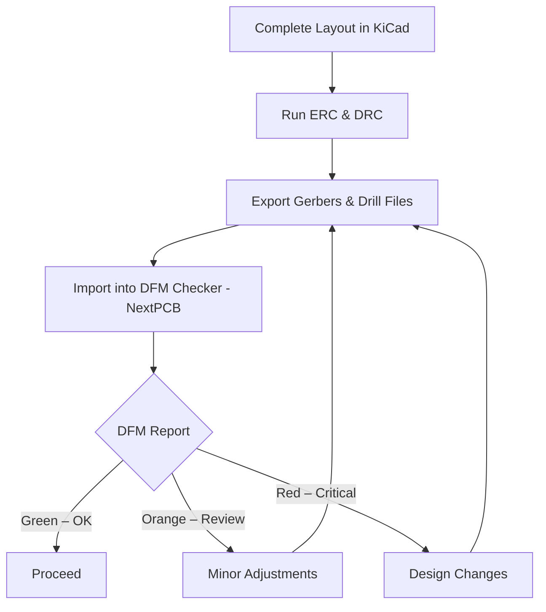

# Design for Manufacturing (DFM) Checks  

Design‑for‑manufacturing is the final gate that guarantees a PCB layout can be fabricated without costly re‑work or delays. Even when a schematic passes all electrical rule checks (ERC) and the layout satisfies the design‑rule check (DRC), hidden manufacturing problems can still exist. The workflow below shows how to use a dedicated DFM analysis tool, interpret its results, and apply practical fixes before releasing the design to the fab.

---

## 1. DFM Analysis Workflow  

*The loop continues until the DFM report contains only green (no‑issues) entries.*  

---

## 2. Preparing the Design for DFM  

| Step | Action | Rationale |
|------|--------|-----------|
| **Export Gerbers** | Use KiCad’s *Plot* dialog (or *Fabrication Outputs → Gerber*) to generate all copper, solder‑mask, and silkscreen layers. | Guarantees the exact data the fab will receive. |
| **Export Drill Files** | Generate the NC drill file from the same dialog. | Drill data is required for annular‑ring and spacing checks. |
| **Folder Structure** | Place all generated files in a dedicated directory (e.g., `ESP32_Project_GERs`). | Keeps the DFM run reproducible and avoids stray files. |
| **DFM Tool Selection** | Use the free **NextPCB DFM Checker** (Windows application) – more capable than the current KiCad plug‑in. | Provides a comprehensive set of manufacturability checks and a 3‑D preview. |

> The KiCad plug‑in was unavailable for the KiCad 9 release candidate, so the Windows version was used instead. [Verified]

---

## 3. Interpreting the DFM Report  

The DFM checker colour‑codes each finding:

| Colour | Meaning | Typical Action |
|--------|---------|----------------|
| **Green** | No issue – complies with the fab’s design rules. | No action required. |
| **Orange** | Warning – may be marginal; review for risk. | Verify with the fab or adjust clearance. |
| **Red** | Critical – violates a rule; must be fixed. | Modify the layout (move traces, enlarge pads, etc.). |

### 3.1 Common DFM Findings  

| Issue | Description | Example from the ESP32 board | Fix Strategy |
|-------|-------------|------------------------------|--------------|
| **Annular Ring Size** | Minimum copper around a drilled hole. The fab required ≥ 5 mil (0.127 mm). | ESP32 ground pins showed a 0.2 mm ring (≈ 8 mil) – already acceptable. | No change needed if the ring meets the minimum. |
| **PTH (Plated‑Through‑Hole) Annular Rings** | Similar to above, but for through‑hole components. | USB connector pads flagged; geometry dictated by the component. | Acceptable if the fab confirms; otherwise redesign the connector footprint. |
| **Copper‑to‑Trace Clearance** | Minimum spacing between copper features (e.g., via‑to‑track). | Several vias were too close to adjacent tracks. | Move the offending vias or tracks by a few mils to meet the required clearance. |
| **Copper‑to‑Board‑Edge Clearance** | Copper should not be too close to the board outline, especially on inner layers. | Inner copper zones touched the edge. | Increase zone clearance (e.g., to 0.2 mm) and re‑fill the zones. |
| **Drill‑to‑Drill Spacing** | Minimum distance between adjacent holes. | USB connector drill spacing was marginal. | Confirm with the fab that the spacing is acceptable; otherwise increase spacing or use a different connector. |
| **Silkscreen Overlap** | Silkscreen should not cover pads, vias, or mounting holes. | Mounting holes were removed to make room for informative text. | Relocate or delete non‑essential silkscreen elements; keep clearance from copper features. |

> All red items that could be corrected (e.g., copper‑to‑trace and edge clearances) were fixed directly in the layout before re‑running the DFM check. [Verified]

---

## 4. Practical DFM Fixes Applied to the ESP32 Board  

1. **VIA‑to‑TRACE Clearance** – Shifted offending vias a few mils away from nearby tracks.  
2. **Copper‑to‑EDGE Clearance** – Adjusted the clearance rule for inner copper zones to **0.2 mm** and re‑filled the zones.  
3. **Silkscreen Optimization** –  
   * Removed two mounting holes on the top side to free space for functional labels.  
   * Added block borders (1 mm line width) around logical groups (e.g., “Charger”, “Sound Sensor”).  
   * Inserted descriptive text for LEDs and power indicators, rotating text boxes where needed for compactness.  

These changes eliminated all red entries; the final DFM report contained only green items and a few orange warnings that were deemed acceptable after a fab confirmation. [Verified]

---

## 5. Silkscreen Design Guidelines  

Silkscreen is the last visual communication layer before assembly. Good silkscreen practice improves assembly speed, reduces errors, and adds value for end‑users.

| Guideline | Reason |
|-----------|--------|
| **Avoid covering pads, vias, or mounting holes** | Prevents solder mask mis‑registration and mechanical interference. |
| **Maintain a minimum line width and clearance** (typically ≥ 4 mil) | Ensures the screen can be printed reliably. |
| **Use legible fonts and adequate contrast** | Facilitates visual inspection and manual assembly. |
| **Reserve space for critical information** (e.g., version, URLs, component legends) | Provides long‑term documentation on the board itself. |
| **Consider both sides** – If the top side is crowded, shift non‑essential text to the bottom silkscreen. | Balances readability with component density. |
| **Remove non‑essential graphics** (e.g., unused mounting holes) when they compete with important text. | Maximizes usable area for functional markings. |

> The ESP32 board’s silkscreen was deliberately simplified: mounting holes were removed, functional blocks were boxed, and LED functions were labelled. [Verified]

---

## 6. Lessons Learned & Best‑Practice Checklist  

1. **Run DFM early** – Export Gerbers and perform a DFM check as soon as the first layout iteration is complete. This catches clearance problems before they become entrenched. [Inference]  
2. **Keep a clean folder** – Store Gerbers, drill files, and DFM reports together; version‑control the folder to track changes. [Speculation]  
3. **Validate critical dimensions with the fab** – If a rule is flagged but the component geometry (e.g., USB connector) cannot be altered, confirm acceptability with the manufacturer. [Verified]  
4. **Iterate quickly** – Minor moves (a few mils) often resolve clearance violations without impacting electrical performance. [Inference]  
5. **Document silkscreen decisions** – Record why certain graphics were removed or added; this aids future revisions and hand‑off to assembly houses. [Inference]  
6. **Leverage the 3‑D view** – Visualizing the board in 3‑D helps locate the exact geometry causing a violation, speeding up the fix. [Verified]  

---

## 7. Summary  

A systematic DFM check bridges the gap between a electrically sound layout and a manufacturable product. By exporting accurate Gerbers, using a robust DFM tool (e.g., NextPCB’s Windows application), interpreting colour‑coded findings, and applying targeted layout adjustments—especially to clearances, annular rings, and silkscreen—designers can eliminate critical manufacturing risks. The ESP32 example demonstrates that most issues are minor (spacing adjustments, silkscreen re‑organisation) and can be resolved quickly, resulting in a clean DFM report ready for fabrication.  

---
