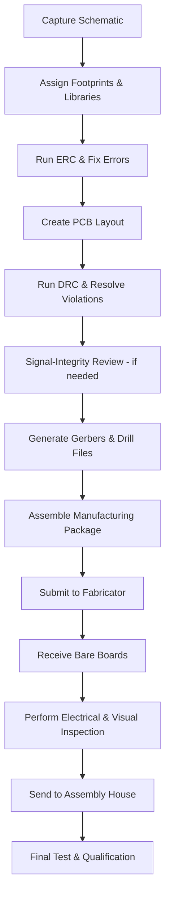

# Preparing Files for Manufacturing  

Preparing a PCB for fabrication and assembly is the final, safety‑critical phase of the design process. After the schematic is complete, the component libraries are verified, and the layout has been routed, a systematic set of checks and file generations must be performed. The goal is to guarantee that the manufacturer receives a complete, unambiguous data package that will yield a board that behaves exactly as simulated and that can be assembled reliably.

---

## 1. Design Verification Checklist  

| Verification Step | Purpose | Typical Tool | Remarks |
|-------------------|---------|--------------|---------|
| **Electrical Rule Check (ERC)** | Detect net‑level errors (un‑connected pins, mismatched I/O standards, power‑rail violations) | KiCad’s ERC engine | Run **after** every schematic edit; resolve all warnings before proceeding. |
| **Design Rule Check (DRC)** | Enforce geometric constraints (trace clearance, via size, copper‑to‑edge, drill‑to‑copper) | KiCad’s DRC engine | Use the manufacturer’s design‑rule file when available; otherwise start from a conservative rule set. |
| **Cross‑checking component footprints** | Ensure that every schematic symbol matches the physical footprint used in the layout | KiCad’s footprint association dialog | Mis‑matched footprints are a common source of assembly failures. |
| **Bill of Materials (BOM) audit** | Verify part numbers, footprints, and supply chain availability | KiCad’s BOM generator or external spreadsheet | Include manufacturer part numbers, package codes, and preferred suppliers. |
| **Netlist consistency** | Confirm that the netlist exported from the schematic matches the layout netlist | KiCad’s “Update PCB from Schematic” function | Perform a **forward‑annotate** and a **back‑annotate** to catch any drift. |
| **Signal‑integrity review** (if high‑speed) | Check controlled‑impedance traces, differential pair matching, length matching, and via stubs | KiCad’s impedance calculator, external SI tools | Required for USB, Ethernet, or RF paths. |
| **Thermal analysis (optional)** | Identify hotspots and verify copper‑area adequacy for power dissipation | KiCad’s thermal map or external simulation | Helpful for power‑dense IoT boards. |

> **Note:** The original design workflow emphasized “cross‑checking and verifying the design” before release, reflecting a high confidence level in the final board. [Verified]

---

## 2. Generating the Manufacturing Data Set  

A complete manufacturing package typically consists of the following files:

1. **Gerber files** – Photoplot data for each copper layer, solder mask, silkscreen, and board outline.  
2. **Drill files (NC‑format)** – Locations and sizes of all plated and non‑plated holes.  
3. **Assembly drawing** – Visual guide showing component placement, orientation, and polarity.  
4. **Pick‑and‑place (centroid) file** – X/Y coordinates, rotation, and reference designators for automated assembly.  
5. **Bill of Materials (BOM)** – Detailed component list with part numbers, footprints, and quantities.  
6. **Stack‑up description** – Layer order, dielectric thicknesses, copper weights, and any controlled‑impedance specifications.  
7. **Fabrication notes** – Special instructions (e.g., “no solder mask on thermal reliefs”, “gold plating on edge pads”).  

All files should be exported using the **same version of the PCB tool** that was used for layout (KiCad 9 RC1/RC2 in this case) to avoid version‑specific discrepancies. Export settings must match the manufacturer’s requirements (e.g., 2‑ or 3‑digit trailing zeros, metric vs. imperial units).

---

## 3. Design‑for‑Manufacturability (DFM) Considerations  

### 3.1 Layer Count vs. Cost  

The project uses a **four‑layer stack‑up** to separate power, ground, and signal planes, which improves signal integrity and reduces EMI. Four‑layer boards are more expensive than two‑layer alternatives, but the trade‑off yields a compact IoT form factor and reliable high‑speed routing. [Inference]

### 3.2 Copper‑to‑Edge Clearance & Creepage  

For safety‑critical or high‑voltage sections, maintain sufficient **creepage** (air gap) and **clearance** (conductor‑to‑conductor) per the relevant standards (e.g., IEC 60950‑1). KiCad’s DRC can enforce these rules automatically.

### 3.3 Via Types  

- **Through‑hole vias** are the default and cheapest.  
- **Blind/buried vias** reduce routing congestion on outer layers but increase cost and fabrication complexity.  
- **Microvias** (≤ 150 µm) are required for very fine pitch or high‑density interconnect (HDI) designs; they demand a specialized fab.  

Select the via type based on the required density and the target cost envelope. [Inference]

### 3.4 Component Density & Assembly  

Fine‑pitch QFN, BGA, or CSP packages improve board density but demand **accurate centroid data** and **tight solder‑mask clearance**. Verify that the chosen assembly house can handle the smallest pitch on the board.

### 3.5 Controlled Impedance  

If the IoT board includes USB 2.0, Ethernet, or RF transceivers, define the **characteristic impedance** (e.g., 90 Ω differential) in the stack‑up and route the corresponding traces with the appropriate width/spacing. KiCad’s impedance calculator can generate the required geometry given the dielectric stack‑up. [Speculation]

---

## 4. Documentation for the Manufacturer  

A well‑structured **fabrication drawing** (PDF) should accompany the Gerbers. It typically contains:

- Board outline with dimensions and mounting hole locations.  
- Layer stack‑up table (e.g., L1 – Signal, L2 – Ground, L3 – Power, L4 – Signal).  
- Material specifications (e.g., FR‑4, Tg = 170 °C, copper weight 1 oz).  
- Impedance targets for controlled‑impedance nets.  
- Any special processes (e.g., ENIG finish, solder‑mask color).  

Providing this information reduces the need for clarification emails and speeds up the quoting process.

---

## 5. Post‑Fabrication Verification  

Once the fab returns the bare boards:

1. **Visual inspection** – Check for missing layers, mis‑aligned drill holes, and solder‑mask defects.  
2. **Electrical test** – Perform a **continuity test** and **short‑to‑ground test** using a fixture or a multimeter.  
3. **Flying probe or ICT** – Verify that all nets are correctly connected according to the design netlist.  

These steps catch manufacturing defects before the costly assembly stage.

---

## 6. End‑to‑End Flow Overview  

The following flowchart captures the typical sequence from schematic capture to board delivery, reflecting the process described in the project overview.

---

## 7. Key Takeaways  

- **Rigorous verification** (ERC, DRC, footprint checks) is essential before any file export.  
- **Manufacturing data** must be complete, consistent, and aligned with the fab’s specifications.  
- **DFM trade‑offs** (layer count, via type, component density) directly impact cost, yield, and performance; they should be decided early and documented.  
- Providing **clear documentation** (stack‑up, fabrication notes, assembly drawings) minimizes miscommunication and accelerates production.  
- Even with high confidence in the design, **post‑fabrication testing** remains mandatory to guarantee functional boards. [Verified]