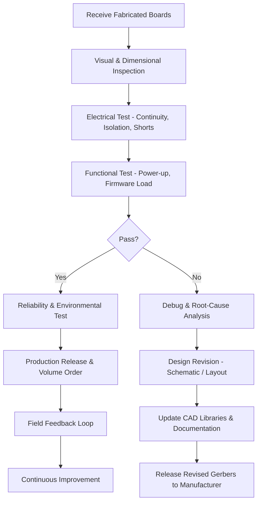

# Conclusion and Next Steps  

After the PCB has been fabricated, the project moves from design to validation, debugging, and eventual production release. This phase is critical for confirming that the board meets electrical, mechanical, and reliability requirements, and for feeding any necessary changes back into the design cycle.

---

## 1. Post‑Fabrication Verification Flow  

The typical sequence of activities after receiving a manufactured board is illustrated below. Each step reduces risk before committing to larger production volumes.

*The flowchart reflects a standard industry practice for low‑ to medium‑volume projects.* [Verified]

---

## 2. Visual and Dimensional Inspection  

* **Component Placement & Orientation** – Verify that all parts are correctly placed and oriented according to the assembly drawing. Mis‑rotated components are a common source of early failures.  
* **Board Outline & Hole Locations** – Measure critical dimensions (e.g., mounting holes, cutouts) against the mechanical drawing to ensure fit within the enclosure.  
* **Solder Joint Quality** – Look for solder bridges, insufficient wetting, or tombstoning, especially on fine‑pitch or high‑current pads.  

These checks are inexpensive and catch many defects before electrical testing begins. [Verified]

---

## 3. Electrical Test (ERC/DRC Validation)  

1. **Continuity Test** – Verify that all nets are electrically connected as intended. Automated test fixtures can compare measured netlists against the design netlist.  
2. **Isolation / Short Test** – Ensure that high‑voltage nets are properly isolated from low‑voltage or ground planes, respecting creepage and clearance rules.  
3. **Impedance Verification** – For high‑speed or RF sections, perform time‑domain reflectometry (TDR) or vector network analysis (VNA) on critical differential pairs to confirm controlled‑impedance targets.  

If any discrepancy is found, the issue is typically traced back to a layout error (e.g., missing via, incorrect layer stack) or a manufacturing defect (e.g., copper delamination). [Verified]

---

## 4. Functional Test & Firmware Bring‑Up  

*Power‑up sequencing* and *firmware loading* are exercised on the first prototype. Key objectives include:

| Objective | Typical Checks |
|-----------|----------------|
| Power rails | Verify voltage levels, in‑rush current, and soft‑start behavior. |
| Reset & Clock | Confirm that reset circuits and crystal oscillators start reliably. |
| Peripheral I/O | Exercise GPIO, UART, SPI, I²C, and any high‑speed interfaces. |
| Sensors & Actuators | Validate analog front‑ends, ADC/DAC performance, and driver outputs. |

A systematic test plan reduces the time spent on ad‑hoc debugging and provides repeatable data for future revisions. [Verified]

---

## 5. Debugging and Design Revision  

When a board fails any of the above tests, a structured root‑cause analysis should be performed:

1. **Re‑examine DRC/ERC reports** – Look for rule violations that may have been ignored during layout.  
2. **Signal Integrity Review** – Use simulation tools (e.g., SPICE, SI‑analysis) to compare measured waveforms against predicted behavior.  
3. **Physical Inspection** – Employ X‑ray or cross‑section imaging for hidden vias or internal layers if suspecting manufacturing defects.  

Once the cause is identified, the appropriate design artifact (schematic, layout, or component library) is updated. All changes must be documented, and the revision history should be reflected in the CAD files and bill of materials (BOM). [Inference]

---

## 6. Design for Manufacturability (DFM) & Assembly (DFA) Feedback  

Even if a prototype passes functional testing, there may be opportunities to improve cost, yield, or reliability:

* **Panelization Optimization** – Adjust board spacing and panel layout to maximize the number of boards per panel while respecting edge‑clearance rules.  
* **Via and Pad Size Adjustments** – Increase via drill sizes or pad apertures to improve plating reliability, especially for high‑current nets.  
* **Component Selection** – Replace expensive or low‑availability parts with equivalents that have better footprint or lead‑free status.  
* **Silkscreen & Legend Clarity** – Ensure that reference designators and test points are legible after solder mask application.  

These refinements are communicated back to the PCB house and incorporated into the next Gerber set. [Speculation]

---

## 7. Documentation and Release Management  

A clean, version‑controlled repository of all design artifacts is essential for traceability:

* **Gerber & Drill Files** – Final, verified files submitted to the manufacturer.  
* **Assembly Drawings & Pick‑and‑Place Files** – Include component orientation, polarity, and any special handling notes.  
* **Test Procedures & Results** – Archive functional test scripts, measurement data, and pass/fail criteria.  
* **Change Log** – Summarize each revision’s rationale, affected nets, and impact on cost or performance.  

Proper documentation enables rapid onboarding of new manufacturing partners and simplifies regulatory compliance (e.g., CE, UL). [Verified]

---

## 8. Production Release and Field Feedback Loop  

Once the prototype validation cycle is complete and the design is locked, the board can be released for volume production. However, the engineering team should continue to monitor field performance:

* **Reliability Data** – Collect return‑rate statistics, failure modes, and environmental stress test results.  
* **Customer Feedback** – Track usability issues, firmware bugs, or mechanical concerns reported by end users.  
* **Continuous Improvement** – Feed this information into future design revisions, component selections, or manufacturing process adjustments.  

Maintaining this feedback loop ensures that the product evolves to meet quality and cost targets throughout its lifecycle. [Inference]

---

## 9. Summary of Key Takeaways  

| Area | Best Practice |
|------|----------------|
| **Post‑fabrication testing** | Perform a structured visual, electrical, and functional test sequence before any large‑scale production. |
| **Debugging** | Use a systematic root‑cause methodology that ties failures back to DRC/ERC, SI analysis, or manufacturing defects. |
| **DFM/DFA** | Iterate on panelization, via sizes, and component choices to reduce cost and improve yield without sacrificing performance. |
| **Documentation** | Keep all design files, test data, and change logs under version control for traceability and regulatory compliance. |
| **Feedback Loop** | Establish a continuous field‑performance monitoring process to guide future revisions and maintain product reliability. |

By following these steps, engineers can transition smoothly from a single fabricated prototype to a reliable, manufacturable product line.