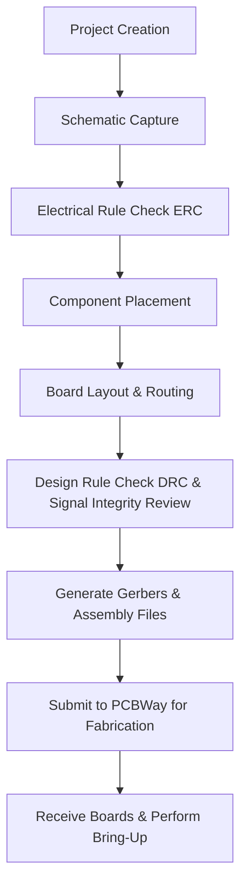

# 01 Introduction – Overview of the Bluetooth‑Enabled STM32 PCB Design  

This chapter establishes the high‑level context for the reference board that will be created in KiCad 7. It outlines the functional blocks, the design‑flow milestones, and the primary engineering trade‑offs that shape the schematic and layout decisions.  

---  

## 1. Design Scope and Target Platform  

The reference hardware is built around the **STM32WB55** system‑on‑chip, a dual‑core MCU that integrates a Bluetooth 5.2 radio, a Cortex‑M4 application core, and a Cortex‑M0+ network core. The board is intended to demonstrate a complete end‑to‑end workflow—from project creation in KiCad to final fabrication with **PCBWay**—while remaining small enough for rapid prototyping.  

Key functional elements that will be included:

| Subsystem | Component | Role |
|-----------|-----------|------|
| **Microcontroller** | STM32WB55 | Core processing and Bluetooth radio |
| **Power & Data Interface** | USB‑Type‑C receptacle | 5 V supply, USB 2.0 data, optional PD negotiation |
| **Programming / Debug** | Tag‑Connect 6‑pin header | In‑circuit programming without a dedicated socket |
| **Antenna** | UFL connector (generic) | External 2.4 GHz antenna (replaces on‑board chip antenna) |

> The original reference board uses a chip antenna; for this design a **UFL** connector is chosen to simplify RF layout and to avoid the need for a custom matching network on a tight schedule. [Verified]

The design deliberately **omits routing of many peripheral pins** (e.g., additional UARTs, SPI buses) to keep the schematic and layout manageable within the allotted development time. [Verified]

---  

## 2. Core Subsystems and PCB‑Level Considerations  

### 2.1 Power Delivery via USB‑C  

* **Voltage regulation** – A low‑dropout regulator (LDO) or buck‑boost stage will step the 5 V from the USB‑C connector down to the 3.3 V rail required by the STM32WB55.  
* **Decoupling strategy** – Place a 0.1 µF ceramic capacitor within 1 mm of each power pin on the MCU and a bulk 10 µF capacitor near the regulator output to suppress transients.  
* **EMI control** – Keep the USB differential pair (D+ / D–) as a **controlled‑impedance 90 Ω differential** trace pair, routed on the outer layer with a solid ground plane underneath. This improves signal integrity for USB 2.0 high‑speed (12 Mbps) operation. [Inference]

### 2.2 Antenna Interface  

* The **UFL connector** provides a mechanical interface for an external 2.4 GHz PCB‑mount antenna.  
* Because the STM32WB55’s RF front‑end expects a 50 Ω source, a **matching network** (typically a series inductor and shunt capacitor) is required between the MCU RF pin and the UFL jack. The exact values depend on the chosen antenna and are determined from the antenna’s datasheet or by a vector‑network‑analyzer measurement. [Inference]  
* Using an external antenna simplifies the RF layout compared with a chip antenna, which would demand precise placement relative to the ground plane and a dedicated antenna pad.  

### 2.3 Programming Header (Tag‑Connect)  

* Tag‑Connect eliminates the need for a dedicated programming socket, reducing board height and BOM cost.  
* The six‑pin footprint is placed on the **top layer** near the MCU to keep the programming traces short, which improves signal quality for SWD (Serial Wire Debug).  
* Ensure that the **SWDIO** and **SWCLK** pins are routed with **no stubs** and maintain a minimum clearance from high‑speed or noisy traces.  

---  

## 3. Design Flow Overview  

The following flowchart captures the end‑to‑end process that will be followed in KiCad 7, from initial project setup to board ordering.  

*Each block represents a mandatory checkpoint where design intent is verified before proceeding to the next stage.* [Verified]

---  

## 4. Manufacturing Considerations (PCBWay)  

### 4.1 Layer Count & Stack‑up  

* A **two‑layer** stack‑up is sufficient for this low‑frequency design (USB 2.0, Bluetooth 5.2) and keeps the cost low.  
* The typical stack‑up: **Top copper – FR‑4 dielectric – Bottom copper** with a solid ground plane on the bottom layer to provide a return path for the USB differential pair and to improve overall EMI shielding.  

### 4.2 Design‑for‑Manufacturability (DFM)  

| DFM Aspect | Recommendation |
|------------|----------------|
| **Trace width / spacing** | Follow PCBWay’s minimum trace/space rules (commonly 6 mil / 6 mil for standard FR‑4) to avoid panel‑level rework. |
| **Via size** | Use standard through‑hole vias (≥ 0.3 mm drill) for power and ground nets; avoid micro‑vias on a 2‑layer board. |
| **Silk‑screen readability** | Keep reference designators > 1 mm tall and avoid overlapping with copper pours. |
| **Panelization** | Request a **single‑board panel** with a 0.5 mm mouse‑bite for easy depaneling. |
| **Solder mask clearance** | Provide at least 0.2 mm clearance around pads to accommodate solder paste spread. |

Adhering to these guidelines reduces the risk of fabrication defects and lowers the overall cost per board. [Inference]

---  

## 5. Key Trade‑offs and Best Practices  

| Decision | Trade‑off | Best‑Practice |
|----------|-----------|---------------|
| **External UFL antenna vs. chip antenna** | External antenna adds a connector and matching network but simplifies RF placement and allows antenna swapping. Chip antenna saves board space but requires precise pad geometry and may limit performance. | Choose external antenna for prototypes where flexibility and RF performance are priorities. |
| **Two‑layer board vs. multi‑layer** | Two layers keep cost low but limit controlled‑impedance routing and isolation. Multi‑layer enables dedicated power/ground planes and better signal integrity at higher cost. | For Bluetooth 5.2 and USB 2.0, a well‑designed two‑layer board is adequate if trace geometry is controlled. |
| **Full peripheral routing vs. minimal routing** | Routing all MCU pins provides a complete development platform but increases layout time and risk of DRC violations. Minimal routing speeds up development and reduces errors. | Start with a minimal set of essential signals (power, USB, SWD, antenna) and add peripherals later as needed. |
| **PCBWay vs. higher‑end fab** | PCBWay offers low‑cost prototyping with quick turnaround; higher‑end fabs provide tighter tolerances and advanced stack‑ups but at higher expense. | For early‑stage prototypes, PCBWay is a pragmatic choice; migrate to a premium fab for production runs requiring tighter impedance control. |

---  

## 6. Summary  

This introductory chapter defines the scope of a Bluetooth‑enabled STM32 reference board, highlights the principal PCB subsystems, and presents a disciplined design flow that culminates in fabrication with PCBWay. By consciously selecting an external UFL antenna, a USB‑C power interface, and a Tag‑Connect programming header, the design balances **performance**, **cost**, and **time‑to‑market** while remaining fully compliant with standard DFM guidelines. The subsequent chapters will expand on each subsystem, detailing schematic capture, component selection, layout strategies, and verification procedures.