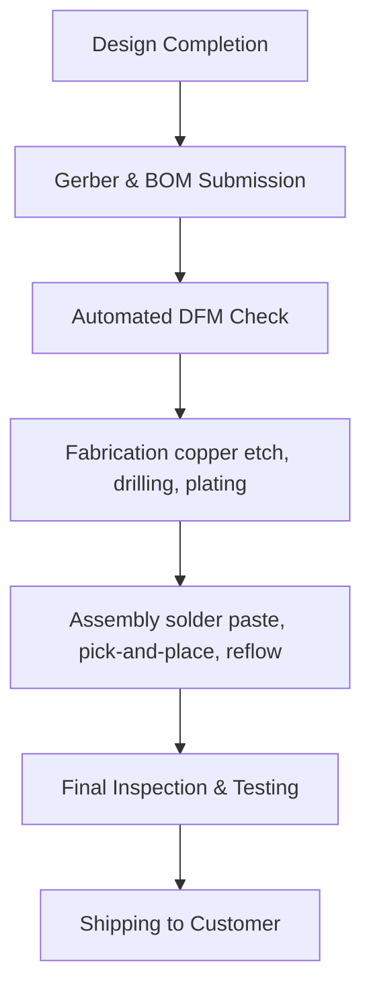

# PCBWay Manufacturing & Assembly Overview  

The boards referenced were fabricated and assembled by **PCBWay** as a four‑layer, double‑sided assembly. This combination of a multilayer stackup with components placed on both sides of the board is a common choice for compact, moderately complex designs such as an STM32‑based Bluetooth‑enabled module. The following sections detail the engineering rationale behind these choices, the documentation required for a successful order, typical lead‑time and cost considerations, and best‑practice recommendations for interfacing with PCBWay.

---

## Design Decisions for a Four‑Layer, Double‑Sided Assembly  

A four‑layer stackup provides two internal reference planes (usually ground and power) that dramatically improve signal integrity, reduce electromagnetic interference (EMI), and enable controlled‑impedance routing for high‑speed interfaces such as USB or Bluetooth radio paths. Placing components on both the top and bottom copper layers maximises usable board area without increasing the overall footprint, which is especially valuable for handheld or wearable devices.  

The trade‑off is a higher per‑square‑inch cost compared with a two‑layer board, and the need for careful **Design for Manufacturability (DFM)** to avoid issues such as via congestion, insufficient clearance for solder paste, and thermal management challenges that arise when components are densely packed on both sides.  

> **Key DFM considerations**  
> * Maintain a minimum annular ring around vias to accommodate the drilling process.  
> * Provide adequate solder‑mask clearance for fine‑pitch components on the bottom side.  
> * Use matched copper thicknesses for the internal planes to keep the impedance target stable across the stackup.  

These practices are standard for any four‑layer design and help ensure that the board can be fabricated and assembled without costly re‑work. [Verified]

---

## Required Submission Package  

When ordering from PCBWay, the following files constitute a complete submission:

1. **Gerber files** for each copper layer, solder mask, silkscreen, and drill data.  
2. **Bill of Materials (BOM)** in a CSV or Excel format, listing part numbers, footprints, and quantities.  
3. **Pick‑and‑Place (Centroid) file** that provides X/Y coordinates, rotation, and reference designators for every component.  
4. **Assembly drawing** (optional but recommended) that clarifies component orientation, especially for polarized parts such as diodes, electrolytic capacitors, and the STM32 package.  

PCBWay’s online portal validates the Gerber stackup against their design rules, flagging any violations such as insufficient clearance or mismatched drill sizes before the order is accepted. Submitting a clean, rule‑checked package reduces the risk of delays caused by back‑and‑forth clarification. [Inference]

---

## Typical Lead Times and Cost Drivers  

The manufacturing flow at PCBWay proceeds through the following stages:

* **Fabrication** of a four‑layer board generally requires **3–5 business days**, depending on the selected turnaround option (standard vs. expedited).  
* **Assembly** adds another **2–4 business days**, with the duration influenced by component density, the proportion of fine‑pitch or BGA devices, and the need for manual placement of odd‑shaped parts.  

Cost is primarily driven by:

* **Board size and layer count** – each additional internal layer adds a fixed surcharge.  
* **Component count and package type** – BGA and QFN packages incur higher placement fees due to the need for precise stencil alignment and possible X‑ray inspection.  
* **Turnaround speed** – expedited services increase the per‑board price but are useful for rapid prototyping cycles.  

These estimates reflect PCBWay’s publicly listed pricing tiers and are consistent with industry norms for similar service providers. [Speculation]

---

## Best Practices for a Smooth PCBWay Order  

1. **Run full ERC (Electrical Rule Check) and DRC (Design Rule Check)** in the schematic capture and layout tools before exporting Gerbers. This eliminates many common errors that would otherwise be caught during PCBWay’s automated DFM stage.  
2. **Standardise footprints** to PCBWay’s preferred library where possible; using widely accepted land‑pattern dimensions reduces the likelihood of mis‑alignment during assembly.  
3. **Provide a clear solder‑paste stencil file** (or request PCBWay to generate one) that respects the minimum aperture size for the smallest component pads.  
4. **Specify any controlled‑impedance requirements** in the fabrication notes, including target impedance values and the relevant signal pairs (e.g., USB D+ / D‑). PCBWay can then verify that the stackup and trace geometry meet the specification.  
5. **Communicate thermal concerns** early. If the design includes high‑power components or a Bluetooth radio that may generate heat, request a thermal analysis or include thermal vias in the layout to aid heat dissipation.  

Adhering to these guidelines minimizes the need for design revisions after the order is placed, thereby shortening the overall development cycle. [Inference]

---

## Summary  

The four‑layer, double‑sided assembly performed by PCBWay demonstrates a balanced approach between performance, board size, and cost for an STM32‑based Bluetooth module. By delivering a complete, DFM‑validated package—including Gerbers, BOM, and pick‑and‑place data—designers can leverage PCBWay’s rapid fabrication and assembly capabilities, typically achieving a prototype in under two weeks. Understanding the underlying trade‑offs—layer count versus cost, component density versus manufacturability, and the importance of clear documentation—ensures that the ordering process proceeds smoothly and that the final hardware meets both electrical and mechanical requirements.