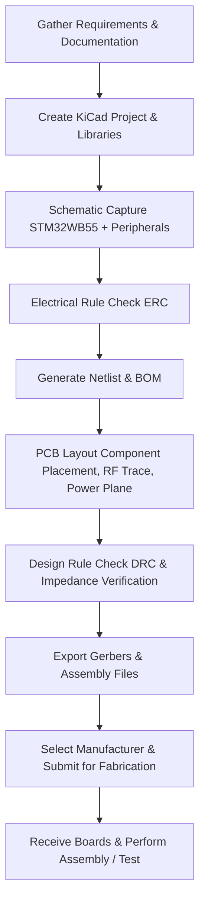

# 03 Pre‑Requisites & Overview  

This section gathers everything you need before starting the PCB project that uses the **STM32WB55** Bluetooth‑capable microcontroller. It outlines the software toolchain, reference documentation, component‑level decisions, and the high‑level PCB development flow. The goal is to give you a solid foundation so that the schematic capture, layout, and hand‑off to a fabricator can proceed without interruptions.

---

## 1. Required Software Stack  

| Tool | Purpose | Acquisition |
|------|---------|--------------|
| **KiCad 7** | Open‑source schematic capture, PCB layout, DRC/ERC, and BOM generation. | Download the latest installer from **[kicad.org](https://kicad.org)**. |
| **STM32CubeIDE** | Free Eclipse‑based IDE for writing, compiling, and flashing firmware on the STM32WB55. | Obtain from **STMicroelectronics** (st.com) – the “CubeIDE” download page. |
| **STM32CubeMX (optional)** | Generates peripheral initialization code and can export pin‑out files that are useful when creating the schematic symbol. | Bundled with CubeIDE or downloadable separately from ST. |

> **Tip:** Keep both tools up‑to‑date before you begin; KiCad 7 introduces a new library manager and improved 3‑D viewer that simplify component placement and clearance checks. [Verified]

---

## 2. Core Component – STM32WB55  

The design is centred on the **STM32WB55** (often referenced as “WB‑55C” in the video). Key characteristics that drive PCB decisions are:

* **Dual‑core ARM Cortex‑M4 (up to 64 MHz) + Cortex‑M0+ (up to 32 MHz).**  
* **Integrated Bluetooth 5.0 Low Energy radio** (2.4 GHz ISM band).  
* **Flash memory, USB, and a range of power‑management features.**  
* **Typical low‑volume cost ≈ US $6** per device. [Verified]

Because the radio operates at 2.4 GHz, the layout must respect **controlled‑impedance** for the RF trace and provide a clean ground plane to minimise loss and spurious emissions. [Inference]

---

## 3. Reference Documentation  

Before any schematic capture, collect the following documents (all freely available from ST’s website):

| Document | Why it matters |
|----------|----------------|
| **STM32WB55 Datasheet** | Pin‑out, electrical limits, package dimensions, recommended layout guidelines. |
| **Application Note – “Bluetooth Low Energy on STM32WB”** | RF front‑end recommendations, antenna matching, and typical component values. |
| **Hardware Development Guide (AN4879)** | Detailed PCB stack‑up, trace width/spacing tables, and EMI mitigation strategies. |
| **Component Datasheets** (e.g., crystal, voltage regulator, antenna connector) | Mechanical footprints, recommended decoupling, and tolerance specifications. |

Having these PDFs on hand allows you to cross‑reference every schematic symbol and PCB footprint with the manufacturer’s intent, reducing the risk of ERC/DRC violations later. [Verified]

---

## 4. Antenna Strategy  

Two approaches are mentioned:

| Approach | Description | Trade‑offs |
|----------|-------------|------------|
| **Chip (PCB) antenna** | A tiny copper pattern etched on the board; no external parts. | Requires precise 50 Ω trace, careful keep‑out zones, and often a tuned matching network. |
| **U.FL or SMA connector + external antenna** | A standard RF connector is placed on the board; the user attaches any compatible antenna. | Simpler layout (no on‑board radiator), but adds a mechanical component and a small amount of extra board area. |

For this tutorial the **connector‑based antenna** is chosen to keep the design straightforward. This decision reduces the need for on‑board RF tuning and makes the prototype easier to test with different antennas. The downside is a slightly larger footprint and the need to maintain a clear keep‑out area around the connector to avoid detuning. [Inference]

---

## 5. PCB Stack‑up & Impedance Considerations  

Even though the design is low‑cost, the Bluetooth radio imposes a few non‑negotiable constraints:

1. **Ground Plane Continuity** – A solid reference plane directly beneath the RF trace is essential for a stable 50 Ω characteristic impedance and for suppressing EMI.  
2. **Controlled‑Impedance Trace** – The 2.4 GHz trace from the MCU’s RF pin to the antenna connector should be routed as a microstrip (or stripline if a multilayer board is used) with width/spacing calculated from the chosen dielectric thickness. KiCad’s *Impedance Calculator* can be used with the stack‑up parameters.  
3. **Via Usage** – Avoid placing vias on the RF trace; if a layer change is unavoidable, use a **via‑in‑pad** with a stitched ground via nearby to maintain impedance continuity.  
4. **Clearance from Copper Pour** – Keep a minimum clearance (typically 3–5 mm) between the antenna connector and any copper pours or large ground fills to prevent detuning.  

These guidelines are standard practice for 2.4 GHz PCB antennas and are implied by the decision to use an external connector. [Inference]

---

## 6. Design Flow Overview  

The following flowchart captures the end‑to‑end process from project inception to fabrication. Each block corresponds to a KiCad or ST tool activity.

> **Note:** Steps **D** and **G** are iterative; fixing ERC errors often leads to schematic changes, while DRC failures may require component repositioning or trace re‑routing. [Verified]

---

## 7. Design‑for‑Manufacturability (DFM) & Design‑for‑Assembly (DFA) Tips  

| Aspect | Recommendation | Rationale |
|--------|----------------|-----------|
| **Component Footprint Accuracy** | Use KiCad’s official libraries or create footprints that match the exact mechanical drawing from the datasheet (including solder mask expansion). | Prevents tombstoning and ensures reliable solder joints. |
| **Silkscreen Clarity** | Keep reference designators at least 0.5 mm away from pads; avoid silkscreen over copper. | Improves visual inspection and reduces the chance of solder mask bridges. |
| **Via Size** | Minimum drill ≤ 0.3 mm for standard 2‑layer boards; larger for blind/buried vias if using a 4‑layer stack‑up. | Guarantees manufacturability with most low‑cost fab houses. |
| **Test Points** | Add at least one test point on the MCU’s reset pin, VDD, and the RF output (if accessible). | Facilitates in‑circuit testing and firmware debugging. |
| **Panelisation** | If ordering in bulk, request a standard panel layout (e.g., 2 × 2 array) with a common ground rail. | Reduces per‑board cost and simplifies handling. |

These practices are generic DFM/DFA guidelines that align with the low‑volume, cost‑sensitive nature of the project. [Inference]

---

## 8. Manufacturing Preparation  

1. **Gerber Generation** – Export all layers (copper, solder mask, silkscreen, drill) using KiCad’s *Plot* dialog. Verify the stack‑up matches the manufacturer’s capabilities (e.g., 1.6 mm FR‑4, 2‑layer).  
2. **Assembly Drawings** – Produce a pick‑and‑place file (CSV) and a Bill of Materials (BOM) with part numbers, footprints, and preferred manufacturers.  
3. **Design Review** – Run a final **DRC** with the fab house’s tolerances (track width, clearance) and request a **fabrication review** if the fab offers it.  
4. **Quote & Lead‑time** – Provide the Gerbers and BOM to several PCB vendors to compare cost, turnaround, and available stack‑up options (especially if you later decide to move to a 4‑layer board for better RF performance).  

Following these steps minimizes the risk of costly revisions after the boards have been fabricated. [Verified]

---

## 9. Summary  

Before diving into the schematic and layout, ensure you have:

* **KiCad 7** and **STM32CubeIDE** installed.  
* All **STM32WB55** and peripheral datasheets, plus the relevant ST application notes.  
* A clear decision on the **antenna implementation** (connector‑based for this tutorial).  
* An understanding of the **RF‑specific PCB constraints** (controlled‑impedance trace, ground plane, keep‑outs).  

With the documentation, tools, and design‑flow diagram in place, you can proceed confidently to the schematic capture, component placement, and routing phases, knowing that the foundational requirements for a reliable Bluetooth‑enabled board have been satisfied.