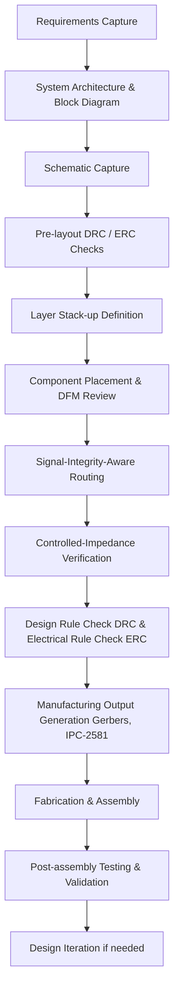
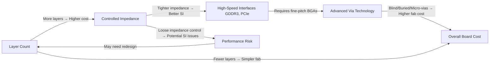

# 04 – Advanced PCB Design Courses Overview  

This section summarizes the learning pathways offered for modern PCB engineering, highlighting the PCB‑centric concepts, design decisions, constraints, and best‑practice guidelines that are covered. The material is organized to help engineers understand **why** each topic matters for robust board development, not merely **what** is taught.

---

## 1. Course Scope and Target Skills  

| Course | Primary Focus | Typical Applications |
|--------|---------------|----------------------|
| **Mixed‑Signal Hardware Design with KiCad 6** | Integration of analog, digital, and power domains in a single schematic and layout. Emphasis on signal‑integrity‑aware routing, power‑plane partitioning, and mixed‑signal verification. | Sensor front‑ends, power‑management ICs, audio‑codec boards. |
| **Advanced Digital Design (BGA, High‑Speed)** | Design of high‑density interconnects (BGAs) and high‑speed serial/parallel buses such as GDDR3, FPGA I/O, and System‑on‑Chip (SoC) interfaces. Includes controlled‑impedance stack‑up, length‑matching, and advanced via technologies. | Graphics cards, AI accelerators, high‑performance compute modules. |
| **KiCad 7 Overview (Supplemental)** | New features in KiCad 7 that streamline multi‑sheet schematics, 3‑D visualization, and rule‑based DRC/ERC. | All KiCad‑based projects seeking the latest workflow improvements. |

*All courses are tool‑agnostic in principle; KiCad is used for demonstration, but the methodologies translate to any major ECAD suite.*  [Verified]

---

## 2. Core PCB Concepts Reinforced by the Curriculum  

### 2.1 Layer Stack‑up and Reference Planes  
A well‑defined stack‑up is the foundation for signal integrity (SI) and electromagnetic compatibility (EMC). The courses teach how to:

* Allocate dedicated **ground** and **power** planes to provide low‑impedance return paths.  
* Insert **dielectric** layers of appropriate thickness to achieve target differential impedances (e.g., 100 Ω for DDR).  
* Use **symmetrical** stack‑ups to minimize warpage and thermal gradients.  

These practices reduce crosstalk, improve SI, and simplify DFM checks. [Inference]

### 2.2 Controlled‑Impedance Routing  
High‑speed interfaces (GDDR3, PCIe, SerDes) require tight control of trace geometry:

* **Microstrip** vs. **stripline** selection based on layer placement and shielding needs.  
* Use of **trace width/spacing calculators** integrated in KiCad 6/7 to meet target impedance.  
* Implementation of **via stitching** and **ground pours** to maintain consistent reference planes.  

The curriculum demonstrates how to verify impedance with field‑solver simulations and how to incorporate those results into the design rule set. [Inference]

### 2.3 DFM / DFA Considerations  
Design for Manufacturability (DFM) and Design for Assembly (DFA) are woven throughout the courses:

* **Component placement** strategies that respect pick‑and‑place head reach and minimize placement errors for fine‑pitch BGAs.  
* **Via selection** (through‑hole, blind, buried, micro‑via) based on cost, reliability, and manufacturability.  
* **Clearance and creepage** rules for high‑voltage sections, ensuring compliance with safety standards.  

By applying these rules early, redesign cycles are reduced and yield is improved. [Inference]

### 2.4 Signal Integrity for High‑Speed Interfaces  
Key SI topics covered include:

* **Differential pair routing** with length matching and skew control.  
* **Termination schemes** (series, parallel, AC) appropriate for the target driver/receiver.  
* **Power‑rail decoupling** using multi‑layer capacitor placement to suppress simultaneous switching noise (SSN).  

Practical lab exercises use real‑world memory modules and FPGA evaluation boards to illustrate the impact of SI violations. [Verified]

### 2.5 BGA Land Pattern and Via Strategies  
BGAs present unique challenges:

* **Staggered vs. regular grid** pad layouts to accommodate routing density.  
* **Via‑in‑pad** with anti‑pad (copper clearance) to reduce inductance while respecting manufacturability limits.  
* **Thermal relief** for high‑power BGAs to aid solder reflow and prevent warpage.  

The courses provide KiCad library templates that embed these best‑practice parameters, ensuring consistency across projects. [Inference]

---

## 3. Design Workflow Emphasized in the Courses  

The following flowchart captures the end‑to‑end PCB development process that the curriculum reinforces. Each block represents a stage where specific PCB decisions are made and validated.

*The flow emphasizes early SI and DFM analysis to avoid costly downstream fixes.* [Inference]

---

## 4. Decision Matrix for High‑Speed PCB Choices  

A concise graph illustrates the trade‑offs between **cost**, **performance**, and **manufacturability** when selecting high‑speed features.

*Understanding these interdependencies helps engineers make informed decisions that balance budget constraints with performance goals.* [Inference]

---

## 5. Trade‑offs and Best‑Practice Guidelines  

| Aspect | Typical Trade‑off | Recommended Practice |
|--------|-------------------|----------------------|
| **Layer Count** | More layers enable dedicated planes and controlled impedance but increase fab cost and stack‑up complexity. | Use the minimum number of layers that still provides a solid ground plane for each high‑speed signal layer. |
| **Via Type** | Blind/buried/micro‑vias reduce routing congestion but raise fab cost and may introduce reliability concerns. | Reserve micro‑vias for dense BGA fan‑outs; use through‑hole vias for power and ground nets where possible. |
| **Component Density** | High density improves board size but can hinder pick‑and‑place accuracy and thermal relief. | Maintain a **minimum 0.5 mm** clearance around fine‑pitch BGAs for placement tolerances; add thermal vias under high‑power devices. |
| **Impedance Control** | Tight tolerances improve SI but require precise stack‑up and tighter DRC rules, increasing design effort. | Apply impedance control only to nets that operate above **1 Gbps** or are highly sensitive (e.g., DDR data lines). |
| **Design Tool Version** | Newer ECAD releases (KiCad 7) provide advanced rule checks but may have a learning curve. | Adopt the latest stable release for new projects; maintain legacy KiCad 6 files for long‑term maintenance only if required. |

These guidelines stem from the curriculum’s emphasis on **risk mitigation** and **cost‑effective performance**. [Inference]

---

## 6. Recommended Toolchain and Resources  

* **KiCad 6** – Primary teaching platform; offers mature schematic capture, PCB layout, and built‑in DRC/ERC.  
* **KiCad 7** – Supplemental module covering new features such as hierarchical sheets, improved 3‑D viewer, and rule‑based design checks.  
* **Signal‑Integrity Simulators** – Integrated field‑solver plugins (e.g., **Saturn PCB Toolkit**, **Siemens HyperLynx**) for impedance and crosstalk analysis.  
* **Manufacturing Design Guides** – Vendor‑specific DFM/DFA PDFs (e.g., **JLCPCB**, **PCBWay**) to align library footprints with fab capabilities.  

By combining KiCad’s open‑source flexibility with industry‑standard SI tools, engineers can prototype rapidly while still meeting production‑grade requirements. [Verified]

---  

*End of Chapter 04 – Advanced PCB Design Courses Overview.*