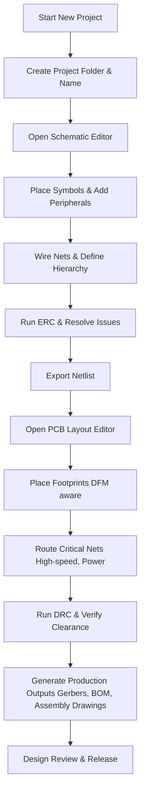

# 05 – Project Creation  

## 1. Introduction  

Creating a PCB design begins with a well‑structured project in the CAD environment. The workflow is deliberately linear: **project definition → schematic capture → netlist export → PCB layout**. This sequence isolates electrical design decisions from physical implementation, reduces iteration cycles, and makes the design amenable to version control and collaborative review.  

---

## 2. Project Initialization  

1. **Create a new project file** in the desired directory and assign a concise, descriptive name (e.g., `sensor_node_v1`).  
2. The CAD system automatically generates a project container that holds all subsequent design artefacts: schematic sheets, PCB layout files, component libraries, and output data (Gerbers, assembly drawings, BOMs).  

> **Best practice:** Keep the project folder hierarchy flat but logical (e.g., `schematics/`, `layout/`, `libraries/`, `output/`). This simplifies backup, archiving, and integration with source‑control systems such as Git.  [Verified]  

---

## 3. Schematic Capture (The “Drawing” Stage)  

### 3.1. Component Placement & Symbol Selection  

- **Select appropriate symbols** from a vetted library. Prefer libraries that already contain **footprint‑to‑symbol links** to avoid mismatches later.  
- **Group related functions** (power supply, MCU, peripherals) on separate schematic sheets or hierarchical blocks. This improves readability and eases reuse.  

### 3.2. Wiring & Net Definition  

- Connect pins using net lines; the CAD tool automatically creates **net names**.  
- For high‑speed or differential signals, explicitly label nets (e.g., `USB_D+`, `USB_D-`) and set **pair attributes** (impedance, length matching).  

### 3.3. Electrical Rule Check (ERC)  

- Run ERC before leaving the schematic stage. ERC flags **unconnected pins, multiple drivers on a net, and mismatched voltage domains**.  
- Resolve all ERC violations; they are the most common source of downstream PCB errors.  

> **Inference:** The transcript’s mention of “adding peripherals” implies the need for ERC to verify connectivity and correct power domains. [Inference]  

---

## 4. Transition to PCB Layout  

### 4.1. Netlist Export  

- Export the schematic netlist (or use the CAD’s live link) and import it into the PCB editor.  
- Verify that **all nets** appear correctly and that **no orphan components** remain.  

### 4.2. Footprint Placement  

- Place physical footprints on the board outline respecting **design‑for‑manufacturability (DFM)** rules:  
  - Keep **component density** within the fab house’s capability (e.g., minimum 0.2 mm pitch for standard SMT).  
  - Position high‑current devices near power planes and provide adequate **thermal relief**.  
- Use **grid‑snapping** and **component alignment tools** to maintain a tidy layout that eases assembly.  

### 4.3. Routing Strategy  

- Begin with **critical nets** (high‑speed, differential pairs, power distribution) before routing less critical signals.  
- Apply **design‑rule checks (DRC)** continuously: clearance, trace width, via size, and copper‑to‑edge distances.  

> **Speculation:** While the transcript does not detail routing, the standard practice is to prioritize critical nets after schematic completion. [Speculation]  

---

## 5. Design Flow Diagram  

The following Mermaid diagram summarises the canonical project‑creation workflow:

> **Inference:** The diagram reflects the logical sequence implied by the transcript and standard PCB development practice. [Inference]  

---

## 6. Key Considerations & Trade‑offs  

| Aspect | Decision Point | Typical Trade‑off | Recommended Approach |
|--------|----------------|-------------------|-----------------------|
| **Layer Count** | 2‑layer vs. multi‑layer | Cost ↑ with more layers vs. routing flexibility & controlled impedance | Start with 2‑layer for simple designs; move to 4‑layer when high‑speed or dense power distribution is required. |
| **Stackup & Planes** | Presence of dedicated ground/power planes | Better signal integrity & EMI control vs. increased fab cost | Use a solid ground plane on an internal layer for most designs; add a dedicated power plane if current demand is high. |
| **Component Density** | Fine‑pitch packages vs. standard‑pitch | Higher functionality per area vs. tighter DFM tolerances | Choose fine‑pitch only when board size is a hard constraint and the fab can guarantee yield. |
| **Routing Strategy** | Manual vs. auto‑router | Manual gives optimal control; auto‑router speeds up layout but may ignore critical constraints | Use auto‑router for bulk routing, then manually refine critical nets. |
| **Design for Assembly (DFA)** | Footprint orientation, polarity marking | Simplifies pick‑and‑place vs. may increase board area | Align components to a common direction where possible; keep polarity‑sensitive parts clearly marked. |

> **Inference:** These considerations are standard in PCB projects and align with the workflow described in the transcript. [Inference]  

---

## 7. Checklist for a Healthy Project Start  

1. **Project Naming & Folder Structure** – clear, version‑controlled.  
2. **Library Management** – use verified symbol/footprint libraries with proper links.  
3. **Schematic Completeness** – all peripherals placed, nets named, ERC clean.  
4. **Netlist Integrity** – export/import without loss of connectivity.  
5. **Footprint Placement** – respects DFM, thermal, and mechanical constraints.  
6. **Early DRC Runs** – catch clearance and width violations before routing is locked.  

Following this disciplined approach reduces re‑work, shortens time‑to‑fabrication, and yields a design that is both manufacturable and reliable.  

---  

*End of Chapter 05 – Project Creation*