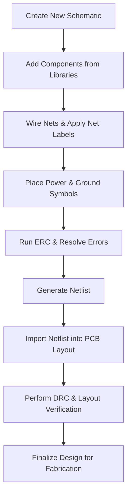

# 06 – Schematic Editor Basics  

*This section documents the essential workflow and best‑practice considerations when building a schematic in KiCad (or any comparable ECAD tool). The guidance is written for engineers who are already familiar with basic electronics concepts but need a clear, production‑oriented methodology for creating reliable, manufacturable designs.*

---

## 1. Overview  

A clean, well‑structured schematic is the foundation of a successful PCB. It drives the netlist, informs the layout engine, and is the primary source for electrical rule checking (ERC) and design‑rule checking (DRC). The editor in KiCad provides a rich set of navigation, placement, and annotation tools that, once mastered, enable rapid iteration while preserving design intent.

---

## 2. Navigating the Schematic Editor  

| Action | Mouse / Keyboard | Effect |
|--------|------------------|--------|
| Pan the view | Hold **middle‑mouse button** and drag | Moves the viewport without altering objects. |
| Zoom | Scroll **middle‑mouse wheel** (or `Ctrl + mouse wheel`) | Zooms in/out centered on the cursor. |
| Select objects | **Left‑click** and drag a rectangle | Highlights components, wires, or labels. |
| Open properties | **Right‑click** on an object | Brings up the *Properties* dialog for editing attributes. |
| Undo/Redo | `Ctrl+Z` / `Ctrl+Y` | Reverts or reapplies the last action. |

> **Tip:** Frequent use of the mouse wheel for zoom combined with middle‑button panning provides a fluid “canvas‑like” experience, reducing the need to constantly scroll the schematic sheet. [Verified]

---

## 3. Adding and Managing Components  

### 3.1 Library Access  

- The **right‑hand toolbar** hosts the *Add Symbol* button. Clicking it opens KiCad’s extensive component library (resistors, capacitors, diodes, ADCs, connectors, etc.).  
- A **filter box** at the top of the library dialog allows quick search; typing `R` instantly narrows the list to resistors, `C` to capacitors, etc.  

> **Best practice:** Use the *official* manufacturer part libraries (or verified third‑party libraries) to ensure that footprint, pin‑mapping, and electrical parameters are accurate. This reduces downstream ERC failures. [Inference]

### 3.2 Keyboard Shortcuts  

| Shortcut | Action |
|----------|--------|
| `A` | Open *Add Symbol* dialog (same as toolbar button). |
| `C` | Directly place a capacitor (after typing the part name). |
| `W` | Activate the *Wire* tool. |
| `P` | Open the *Power Symbol* palette (ground, VCC, etc.). |
| `L` | Activate the *Net Label* tool. |
| `Ctrl+C` / `Ctrl+V` | Copy and paste selected components. |
| `Delete` | Remove selected objects. |

> **Note:** Shortcuts dramatically speed up schematic capture, especially when populating repetitive structures such as filter networks or sensor arrays. [Inference]

### 3.3 Placement Workflow  

1. **Select** the desired symbol via toolbar or shortcut.  
2. **Zoom** to an appropriate level for precise placement.  
3. **Click** to drop the component; use `Esc` to cancel if needed.  
4. **Rotate** (`R` key) or **mirror** (`M` key) the part to match the intended board orientation.  

> **Design tip:** Align components roughly according to their physical location on the PCB (e.g., place the MCU near the board centre, connectors at board edges). This visual correlation eases later placement and routing. [Inference]

---

## 4. Wiring and Net Management  

### 4.1 Drawing Wires  

- Unconnected pins are indicated by a **small open circle**. Hovering over this node shows a “wand” cursor, signalling that a wire can be started.  
- Click to start a wire, then click additional points to create bends; **double‑click** or press `Esc` to finish.  

> **ERC implication:** Leaving a pin with an open circle after wiring will trigger an *unconnected pin* warning during ERC. Always verify that every required pin is connected. [Verified]

### 4.2 Net Labels  

Net labels replace the default autogenerated names (e.g., `net C1 pad 1`) with meaningful identifiers such as `VDD_3V3`, `GND`, `USB_DP`.  

- Activate the *Net Label* tool (`L`), type the desired name, and place the label on any segment of the net.  
- The label propagates across the entire schematic, ensuring consistent naming on the PCB layout.  

> **Why it matters:** Consistent net naming is essential for automatic netlist generation, cross‑sheet hierarchy, and for the layout tool to correctly associate power planes, differential pairs, and signal groups. [Verified]

---

## 5. Power and Ground Symbol Usage  

Press `P` (or click the *Power Symbol* button) to access a palette of predefined power symbols:

- **Ground symbols** (`GND`, `AGND`, `DGND`, etc.) – choose the appropriate type based on analog/digital segregation.  
- **Power nets** (`+3.3V`, `+5V`, `VDD`, `VSS`) – attach these to the corresponding pins of components.  

> **Design rule:** Connect all ground pins of a component to a single ground net unless a split‑ground architecture is required (e.g., analog vs. digital ground). This avoids ground loops and simplifies EMI control. [Inference]

---

## 6. Preparing the Central MCU Component  

The design’s core is the **NXP S32WB55CE6** microcontroller, a 48‑pin QFN package.  

1. **Add the MCU symbol** from the library (search for `S32WB55CE6`).  
2. **Verify pin mapping** against the datasheet, especially for high‑speed interfaces (USB, BLE, CAN).  
3. **Place the MCU near the schematic centre** to reflect its physical location on the board.  

> **DFM consideration:** QFN packages typically require a **thermal pad** and may use **via‑in‑pad** or **copper‑pour** under the pad for heat dissipation. Ensure the footprint library includes the correct pad dimensions and thermal relief specifications. [Inference]

---

## 7. Best‑Practice Checklist  

| Area | Recommendation |
|------|----------------|
| **Component Libraries** | Use verified libraries; keep them version‑controlled. |
| **Net Naming** | Adopt a clear naming convention (`VDD_3V3`, `GND`, `USB_DP`). |
| **Power Distribution** | Create explicit power nets early; add decoupling capacitors close to each supply pin. |
| **ERC/DRC** | Run ERC after each major edit; resolve all *unconnected pin* and *multiple driver* warnings before proceeding to layout. |
| **Hierarchy** | For large designs, split functional blocks into separate schematic sheets and use hierarchical pins. |
| **Documentation** | Add notes (via the *Properties* window) to critical nets/components (e.g., “high‑speed USB D+”). |
| **Version Control** | Store schematic files (`.sch`) in a Git repository; tag releases before netlist export. |

> **Trade‑off note:** Adding many hierarchical sheets improves readability but can increase netlist complexity and may require careful management of hierarchical labels. Balance clarity against tool overhead based on project size. [Inference]

---

## 8. From Schematic to Layout – High‑Level Flow  

> The schematic stage must be **complete and error‑free** before netlist export; otherwise, layout will inherit the same issues, leading to costly re‑iterations. [Verified]

---

## 9. Concluding Remarks  

Mastering the schematic editor’s navigation, component placement, wiring, and net‑labeling features is essential for producing a clean, manufacturable PCB. By adhering to the conventions and DFM insights outlined above—particularly when handling complex packages such as the 48‑pin QFN MCU—engineers can streamline the transition from concept to silicon‑ready hardware.  

*End of Chapter 06 – Schematic Editor Basics.*