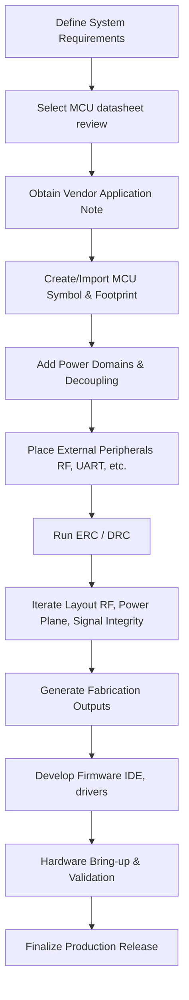

# 07 – Adding the Microcontroller (MCU)

## 1. Overview  

The microcontroller is the central building block of any PCB that performs logic, communication, or sensor interfacing.  Adding it to the schematic is the first step before any external peripherals (e.g., guard‑ring connections, programming headers, RF front‑ends) can be defined.  The workflow described below follows a typical KiCad‑based design flow, but the concepts apply to any EDA tool.

---

## 2. Selecting and Placing the MCU Symbol  

| Action | Rationale |
|--------|-----------|
| **Search the vendor‑provided library** (e.g., “S32WB55CEU”) and place the part from the *Key Libraries* collection. | The supplied libraries have been vetted for pin‑to‑package mapping and are therefore acceptable for rapid prototyping. `[Verified]` |
| **Avoid generic third‑party libraries** unless you have verified the symbol/footprint against the datasheet. | Third‑party parts often contain pin‑assignment errors or missing mechanical layers, which can cause ERC/DRC failures later in the design. `[Inference]` |
| **Create a custom symbol/footprint** for production‑grade designs. | Custom libraries guarantee that the schematic‑layout mapping, 3‑D model, and manufacturing data are under your control, improving DFM compliance. `[Speculation]` |

After insertion, zoom in on the symbol to inspect the pin banks (PA, PB, PC, PH, etc.) and the power pins that sit at the top of the symbol.

---

## 3. Understanding MCU Pin Architecture  

The MCU’s pins are grouped into *banks* that share a common prefix (e.g., **PA0‑PA15**, **PB0‑PB15**).  Each bank maps directly to a physical pin on the QFN‑48 package:

* **GPIO banks** – generic digital I/O that can be re‑configured for alternate functions (UART, SPI, I²C, PWM, etc.).  
* **Special‑function pins** – oscillator inputs, reset, JTAG/SWD programming, RF antenna control, etc.  

The mapping is documented in the datasheet and must be reproduced exactly in the schematic to avoid mismatches during layout. `[Verified]`

### 3.1 Power Domains  

| Symbol | Typical Function | Design Note |
|--------|------------------|-------------|
| **VDD** | Core digital supply | Must be decoupled with low‑ESR capacitors placed as close as possible to the pin. |
| **VBAT** | Battery backup (retains RTC, backup registers) | Connect only if a battery is used; otherwise tie to VDD through a diode or leave unconnected per datasheet. |
| **VDDA** | Analog supply (ADC, DAC, comparator) | Requires separate filtering to avoid digital noise coupling. |
| **VDD_RF** | RF front‑end supply | Often requires a low‑noise LDO or SMPS; see application note for recommended topology. |
| **VSS / VSS_RF / VSS_SMPS** | Ground references for the respective domains | All grounds should be tied together at a single point (star ground) to prevent ground loops. |

Understanding these domains is essential for **power‑plane planning**, **decoupling strategy**, and **EMI control**. `[Inference]`

---

## 4. Leveraging Reference Designs & Application Notes  

Manufacturers publish application notes that contain *reference schematics* and *Bill‑of‑Materials* (BOM) for a given MCU package.  For the S32WB55 series, **AN‑5165 “How to develop RF hardware using S32WB microcontrollers”** provides:

* Recommended external capacitors and inductors for the RF supply.  
* Crystal oscillator selection and load‑capacitance calculations.  
* Layout guidelines for RF traces (controlled impedance, keep‑out zones, via stitching).  

When using such documents:

1. **Extract the component list** and map each part to a KiCad library symbol/footprint.  
2. **Study the rationale** (e.g., why a 10 µF bulk capacitor is placed next to VDD_RF) rather than copying the schematic blindly.  
3. **Adapt the values** to your board size, cost targets, and operating temperature range.  

This approach reduces design time while preserving engineering intent. `[Verified]`

---

## 5. Library Management & Custom Footprint Creation  

Even when a vendor library is “good enough,” production designs benefit from a **controlled‑library workflow**:

* **Symbol hygiene** – verify that each pin’s electrical type (input, output, bidirectional, power) matches the datasheet.  
* **Footprint accuracy** – confirm pad dimensions, solder mask expansion, and courtyard rules against the package drawing.  
* **Version control** – store symbols/footprints in a Git repository to track changes and enable team collaboration.  

Creating a custom footprint also allows you to **add manufacturer‑specific solder‑mask or paste‑mask extensions** that improve yield on fine‑pitch QFN devices. `[Speculation]`

---

## 6. Design Verification (ERC / DRC)  

After the MCU and its peripheral circuitry are placed:

* **Run ERC (Electrical Rule Check)** to catch un‑connected power pins, mismatched I/O standards, or missing decoupling caps.  
* **Run DRC (Design Rule Check)** with the board house’s manufacturing constraints (minimum trace/spacing, via size, annular ring).  
* **Validate RF‑related clearances** – keep high‑frequency traces away from noisy digital planes and respect the keep‑out zones defined in the application note.  

Addressing ERC/DRC warnings early prevents costly revisions after fabrication. `[Inference]`

---

## 7. Firmware Integration  

The MCU’s **software development environment** (e.g., STM32CubeIDE for STM32‑based parts) provides:

* Peripheral drivers that map directly to the pin‑mux configuration defined in the schematic.  
* Example projects that illustrate required external components (crystal, RF matching network).  

Synchronizing the firmware’s pin‑configuration file with the schematic ensures that the hardware and software are **co‑validated** before hardware bring‑up. `[Verified]`

---

## 8. Recommended Development Flow  

The diagram below captures the high‑level sequence from MCU selection to board release.

*Each block represents a decision point where engineering trade‑offs (cost vs. performance, component density vs. manufacturability) are evaluated.* `[Inference]`

---

## 9. Key Takeaways  

* **Start with a vetted MCU symbol/footprint** but plan to replace it with a custom library for production.  
* **Map every pin** (GPIO banks, power domains, special functions) according to the datasheet; this prevents ERC failures.  
* **Leverage manufacturer application notes** for external component selection and RF layout guidance, but always understand the underlying rationale.  
* **Separate power domains** (digital, analog, RF, SMPS) and provide dedicated decoupling to minimize cross‑domain noise.  
* **Run ERC and DRC early and often**; fix violations before routing to avoid costly redesigns.  
* **Synchronize firmware pin‑mux settings** with the schematic to ensure a smooth hardware‑software integration.  

By following this structured approach, the MCU can be integrated reliably, with clear traceability from system requirements through to final silicon bring‑up.