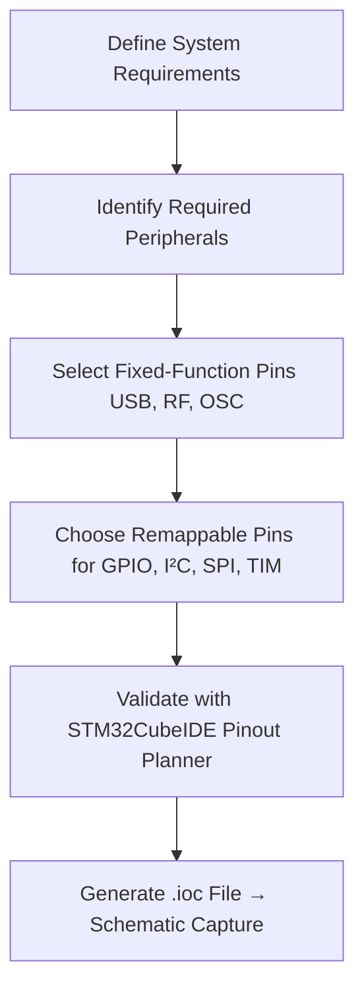

# STM32CubeIDE for MCU Pinout Planning and PCB Design  

*Chapter 08 – `08_stm32cubeide.md`*  

---  

## 1. Overview  

STM32CubeIDE is the primary entry point for defining the microcontroller (MCU) pinout before any schematic capture or PCB layout work begins. By selecting the exact device (e.g., **STM32WB55CE6**) the IDE presents a top‑down view of the physical package, highlights power pins, fixed‑function pins, and all multiplexed I/O options. This early‑stage planning directly influences component placement, routing topology, and manufacturability of the final board.  

---  

## 2. MCU Package Visualization  

The **IOC (IO Configuration) window** displays every pin of the selected package in its true mechanical order (counter‑clockwise around the perimeter). Hovering over a pin reveals its default function (e.g., VDD, VSS, VBAT) and its logical name (e.g., `PA0`, `PB8`).  

* **Power pins** (VDD, VSS, VBAT, VDDIO) are shown in a distinct beige colour and are **non‑remappable** – they must be connected to the appropriate supply rails.  
* **Special‑function pins** such as **NRST**, **OSC_IN/OSC_OUT**, and **RF1** are highlighted with unique colours to draw attention to their critical roles.  
* **General‑purpose pins** appear in light‑gray and can be assigned any of the multiplexed functions supported by the silicon.  

This visual cue system helps the designer quickly identify pins that require special handling on the PCB (e.g., decoupling, impedance control, antenna feed).  

---  

## 3. Power and Fixed Pins  

| Pin Type | Typical PCB Considerations | Design Note |
|----------|---------------------------|-------------|
| **VDD / VDDIO** | Place decoupling capacitors as close as possible (≤ 1 mm) to the pin; use solid ground plane beneath for low‑impedance return. | **[Verified]** |
| **VBAT** | Connect to a low‑leakage battery source; keep trace short to avoid unnecessary voltage drop. | **[Verified]** |
| **NRST** | Provide a pull‑up resistor (≈10 kΩ) and optionally a reset‑button; keep the trace away from high‑speed lines to reduce noise coupling. | **[Inference]** |
| **OSC_IN / OSC_OUT** | Route as a differential pair with controlled impedance (typically 50 Ω single‑ended) and keep away from noisy digital traces. | **[Inference]** |
| **RF1 (Bluetooth antenna feed)** | Must be a 50 Ω matched trace, length‑matched to the antenna, and isolated from ground‑plane discontinuities. | **[Verified]** |
| **USB_DP / USB_DM** | Fixed to `PA11`/`PA12` on this device; require controlled‑impedance routing and minimal stub length. | **[Verified]** |

---  

## 4. Multiplexed GPIO and Peripheral Remapping  

Each pin can serve many functions, but only one at a time. STM32CubeIDE lets the designer **assign a peripheral function** (e.g., I²C SCL, SPI MOSI, TIM CH1) to a chosen pin and instantly visualizes the impact:

* Selecting **I²C1** automatically maps `PB8` → **SCL** and `PB9` → **SDA**.  
* By **Ctrl‑clicking** a pin, alternative functions flash, indicating that the pin can be remapped (e.g., `PB6` can become **I²C1 SCL**).  

Remapping is valuable when the physical layout demands that a peripheral be placed near a connector or sensor. However, **high‑speed or RF peripherals** (USB, Bluetooth) are often **fixed** to specific pins and cannot be moved.  

### 4.1. Decision Flow for Pin Assignment  

*The flow emphasizes that fixed‑function pins must be accommodated first, followed by flexible assignments.*  

---  

## 5. High‑Speed and RF Peripheral Constraints  

| Peripheral | Pin Constraints | PCB Implications |
|------------|----------------|------------------|
| **USB Device** | Fixed to `PA11` (DM) / `PA12` (DP) | Route as a 90 Ω differential pair; keep pair length matched and maintain at least 3 × trace width spacing from other signals. |
| **Bluetooth RF (RF1)** | Fixed to dedicated RF pin (exposed pad underneath the package) | Use a 50 Ω microstrip or coplanar waveguide; keep the trace short (< 5 mm) and terminate with the antenna matching network. |
| **Oscillator** | Fixed to `OSC_IN` / `OSC_OUT` pins | Provide a low‑loss crystal or MEMS resonator; keep the loop area minimal to reduce jitter. |
| **High‑Speed SPI** (e.g., for external flash) | Remappable but often kept near the MCU to minimise skew | Prefer pins on the same side of the package to simplify routing and maintain consistent trace lengths. |

When a peripheral cannot be remapped, the PCB layout must be **planned around the physical location** of those pins. This may dictate the placement of connectors, antennas, or crystal oscillators early in the mechanical design stage.  

---  

## 6. Impact on Schematic Capture and PCB Layout  

1. **Component Placement** – By fixing the MCU pinout first, the designer can place connectors, sensors, and the antenna in positions that minimize trace length to their assigned pins.  
2. **Routing Strategy** –  
   * **Power nets** (VDD, VSS) are routed with wide traces and solid planes for low impedance.  
   * **High‑speed differential pairs** (USB, RF) are routed on a dedicated layer with controlled impedance and kept away from noisy digital sections.  
   * **GPIO and low‑speed signals** can share the same layer but should respect clearance rules to avoid crosstalk.  
3. **Design Rule Checks (DRC/ERC)** – The generated `.ioc` file can be imported into the schematic editor, enabling automatic **Electrical Rule Checks** that flag illegal pin assignments (e.g., trying to use a fixed USB pin for GPIO).  

---  

## 7. Recommended PCB Design Practices  

| Practice | Rationale |
|----------|-----------|
| **Place decoupling capacitors (0.1 µF + 1 µF) within 1 mm of each VDD/VDDIO pin** | Reduces supply noise and improves transient response. |
| **Group power pins together and route them to a common power plane** | Provides a low‑impedance return path and simplifies thermal management. |
| **Keep the RF feed line as a 50 Ω microstrip with a controlled width/spacing** | Ensures antenna matching and minimizes reflection loss. |
| **Route USB DP/DM as a tightly coupled differential pair with matched length** | Preserves signal integrity and complies with USB spec. |
| **Use the CubeIDE pin‑remapping feature to move peripheral pins closer to related connectors** | Shortens critical traces, reduces EMI, and eases assembly. |
| **Perform an early ERC after pin assignment to catch conflicts before schematic capture** | Saves redesign effort and prevents costly PCB revisions. |
| **Maintain a minimum clearance of 3× trace width between high‑speed lines and noisy digital nets** | Mitigates crosstalk and EMI. |
| **Document the final pin‑to‑function mapping in the schematic legend** | Improves readability for downstream layout and manufacturing teams. |

---  

## 8. Summary  

Using STM32CubeIDE’s pin‑out planner establishes a **single source of truth** for MCU pin assignments, which directly informs power distribution, component placement, and high‑speed routing strategies on the PCB. Fixed‑function pins (USB, RF, oscillator) dictate non‑negotiable layout constraints, while the flexible multiplexed pins enable optimization of trace lengths and board density. Integrating this planning step early in the design flow reduces the risk of ERC/DRC violations, improves signal integrity, and streamlines the transition from schematic to layout.  

---  

*End of Chapter 08 – `08_stm32cubeide.md`*