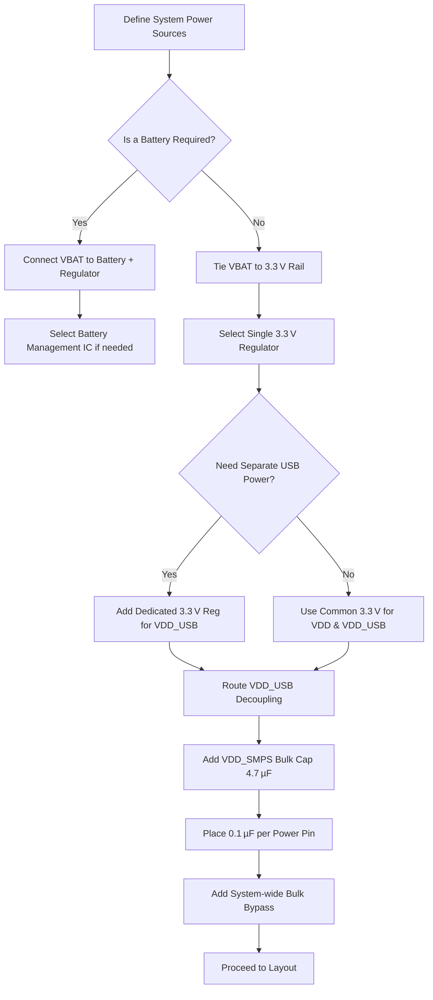

# 09 — MCU Power Supplies & Decoupling Strategy  

This section documents the recommended approach for powering a modern MCU (e.g., an NXP S32 WB family part) and for placing the associated decoupling/bypass capacitors on the PCB. It captures the essential decisions, constraints, and best‑practice guidelines that should be reflected in both the schematic and the layout.

---

## 1. Power‑Pin Overview  

| Pin (example) | Function | Typical Voltage Range* | Recommended Connection |
|---------------|----------|------------------------|------------------------|
| **VDD** | Core digital supply (logic level) | 1.71 V – 3.6 V | Tie to the main 3.3 V rail for most designs |
| **VDDA** | Analog supply (ADC, DAC, analog peripherals) | Same as VDD unless analog performance requires a cleaner source | Often tied to the same 3.3 V rail, but may be filtered separately |
| **VDD\_USB** | USB transceiver supply | 3.0 V – 3.6 V | Can be a dedicated 3.3 V rail or a separate regulator if USB must be disabled in low‑power modes |
| **VDD\_SMPS** | Internal switch‑mode power‑supply node (input to on‑chip regulator) | 3.0 V – 5.5 V (typ.) | Connect to the same 3.3 V rail in a “USB‑only” design; otherwise feed from a higher‑voltage source |
| **VDD\_RF** | RF front‑end supply (Bluetooth, Wi‑Fi, etc.) | 1.8 V – 3.3 V (depends on RF block) | Usually tied to 3.3 V; may require separate filtering for RF noise immunity |
| **VBAT** | Battery input (optional external cell) | 2.0 V – 3.6 V | Connect to the same 3.3 V rail when no battery is used, or to a dedicated Li‑ion cell otherwise |
| **VSS / GND** | Ground reference for all supplies | – | All ground pins must be tied together and to the PCB ground plane |

\*Ranges are taken from typical MCU datasheets (e.g., Section 3.7 “Supply Management”).  

**Key takeaway:** For a simple USB‑powered board, the safest baseline is to connect **all** power pins to a single 3.3 V rail, except where the datasheet explicitly mandates a separate voltage (e.g., VDD\_USB may need 3.3 V ± 0.1 V). This reduces BOM complexity and eliminates the need for multiple regulators.  

> **Design rule:** Always verify the voltage limits in the device’s datasheet and follow the reference design when in doubt. [Verified]

---

## 2. Decoupling & Bypass Capacitor Philosophy  

### 2.1 Why Decoupling Matters  

When the MCU switches states or drives high‑speed peripherals, it draws fast current transients (tens of milliamps in sub‑nanosecond intervals). A decoupling capacitor placed **as close as possible** to the power pin provides a low‑impedance source that supplies this burst, preventing voltage droop and reducing noise on the supply rails.  

> **Principle:** One 0.1 µF (100 nF) ceramic capacitor per power pin is the minimum requirement for modern MCUs. [Verified]

### 2.2 Recommended Capacitor Types & Values  

| Pin Group | Recommended Capacitor(s) | Placement |
|-----------|--------------------------|-----------|
| **All digital pins (VDD, VDD\_USB, VDD\_RF, VBAT, VSS)** | 0.1 µF X5R/X7R 0402/0603 ceramic | Directly adjacent (≤ 1 mm) to each pin |
| **VDDA** | 0.1 µF + optional 1 µF low‑ESR ceramic (if analog performance is critical) | 0.1 µF next to pin, 1 µF within the same power domain but not necessarily right on the pin |
| **VDD\_SMPS** | 4.7 µF (X5R/X7R) + 0.1 µF | 4.7 µF placed close to the SMPS node (pin 34) to satisfy the on‑chip regulator’s bulk‑cap requirement; 0.1 µF for high‑frequency decoupling |
| **Bulk Bypass (system‑wide)** | 4.7 µF – 10 µF (MLCC) | Near the MCU footprint, but not tied to a specific pin; serves as a local energy reservoir for the entire device |

> **Note:** Parallel combinations of very different package sizes (e.g., 100 nF + 100 pF) are only justified when the larger part cannot be placed close enough to the pin due to mechanical constraints. For typical fine‑pitch MCUs, a single 0.1 µF is sufficient. [Inference]

### 2.3 Layout Guidelines  

1. **Shortest possible loop** – Connect the capacitor’s leads to the power pin and the ground plane with the minimal trace length (ideally a via‑back‑drilled pad or a 0‑ohm “stitch” via).  
2. **Via placement** – If the capacitor is on a different layer than the MCU, use a via directly under the capacitor pad to the ground plane; keep the via diameter small to reduce inductance.  
3. **Ground plane continuity** – Ensure an uninterrupted ground plane beneath the MCU and decoupling network to provide a low‑impedance return path.  
4. **Thermal considerations** – High‑current bulk caps (e.g., 4.7 µF) may dissipate noticeable power; keep them away from heat‑sensitive components and provide adequate copper pour for heat spreading.  

> **Best practice:** Group decoupling components in the schematic by power domain (e.g., VDD group, VDDA group, VDD\_SMPS group). This visual segmentation helps layout engineers quickly identify which nets require which capacitors. [Verified]

---

## 3. Schematic Organization for Power & Decoupling  

A clean schematic reduces the risk of mis‑routing and eases hand‑off between schematic and layout engineers. The recommended workflow:

1. **Place power symbols** (e.g., `+3.3V`, `GND`) near the MCU block.  
2. **Label each power net** with a unique reference (e.g., `VDD_3V3`, `VDDA_3V3`).  
3. **Insert decoupling capacitors** directly adjacent to each power pin in the schematic, using the same reference designators (`C1`, `C2`, …) and annotate the value (e.g., `0.1µF`).  
4. **Add a bulk capacitor** symbol connected to the same net but placed away from the pin cluster to indicate its “global” nature.  
5. **Hide redundant net labels** (e.g., ground symbols) if the CAD tool permits, to keep the schematic uncluttered while preserving ERC connectivity.  

> **Rationale:** By mirroring the physical grouping of capacitors in the schematic, the layout engineer can directly translate net‑to‑component relationships without guessing intent. [Verified]

---

## 4. Decision Flow for Power‑Domain Selection  

The following flowchart captures the high‑level decision process for choosing the MCU’s power architecture in a typical low‑to‑moderate‑complexity board.

*The flow assumes a typical USB‑powered design; adjust branches for high‑power or RF‑intensive applications.*  

> **Note:** The decision to separate VDD\_USB is often driven by low‑power sleep modes where the USB transceiver must be disabled while the core remains active. [Inference]

---

## 5. Trade‑offs & Constraints  

| Aspect | Option | Impact | Typical Use‑Case |
|--------|--------|--------|------------------|
| **Single 3.3 V rail vs. multiple rails** | Single rail (simpler BOM) | Lower component count, easier routing, but less flexibility for power‑down of specific blocks | USB‑only, low‑power devices |
| | Separate VDD\_USB regulator | Enables independent enable/disable of USB transceiver, reduces leakage in deep‑sleep | Battery‑operated, ultra‑low‑power |
| **Decoupling capacitor size** | 0.1 µF only | Minimal board area, sufficient for most digital toggles | General‑purpose MCU |
| | 0.1 µF + 1 µF on analog rail | Improves analog noise performance, slight area increase | High‑precision ADC/DAC |
| **Bulk capacitor placement** | Near MCU | Improves transient response, may compete for space | High‑current transients (e.g., motor control) |
| | Distributed across board | Reduces local heating, spreads current | Large boards with multiple power domains |
| **Component package** | 0402/0603 | Saves board space, higher placement density | Compact wearables |
| | 0805 or larger | Easier to hand‑solder, lower cost for large volumes | Prototyping, low‑density boards |

> **Design recommendation:** For a first‑pass design, adopt the single 3.3 V rail with per‑pin 0.1 µF decoupling and a single 4.7 µF bulk capacitor for the SMPS node. Refine later if power‑budget analysis shows excessive leakage or noise. [Inference]

---

## 6. Checklist for Power & Decoupling Review  

| Item | Verification |
|------|---------------|
| All MCU power pins are connected to the correct net (VDD, VDDA, VDD\_USB, VDD\_SMPS, VDD\_RF, VBAT) | ERC/DRC |
| Each power pin has a 0.1 µF ceramic placed within 1 mm (or ≤ 2 mm for fine‑pitch packages) | Layout inspection |
| VDD\_SMPS node includes a ≥ 4.7 µF bulk capacitor on the same net | Schematic & layout |
| Ground connections of all decoupling caps tie directly to the solid ground plane (no split‑ground islands) | DRC |
| No overlapping or dangling nets for power symbols | ERC |
| Bulk bypass capacitor is placed close to the MCU footprint but not obstructing other components | Layout review |
| Power‑rail voltage levels match the regulator outputs and the MCU’s allowed ranges | Power‑budget simulation |

> **Note:** This checklist should be run after schematic capture and again after layout placement, before final DRC. [Verified]

---

## 7. Summary  

- **Power‑pin mapping**: Tie all MCU supplies to a common 3.3 V rail for simplicity unless the application demands separate rails (e.g., USB‑only power).  
- **Decoupling strategy**: One 0.1 µF ceramic per power pin, a 4.7 µF bulk capacitor for the SMPS node, and an optional system‑wide bulk bypass.  
- **Schematic organization**: Group capacitors by power domain, hide redundant labels, and keep net names explicit.  
- **Layout focus**: Minimize loop inductance, maintain a continuous ground plane, and place caps as close as physically possible to their associated pins.  
- **Decision flow**: Use the provided flowchart to decide on regulator architecture and whether to isolate VDD\_USB.  

Following these guidelines will yield a robust power distribution network that supports reliable MCU operation, minimizes noise coupling, and simplifies both design verification and manufacturing.