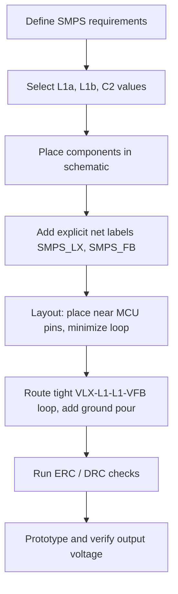

# 10 – MCU Integrated Switch‑Mode Power Supply (SMPS)

## 1. Overview  

The microcontroller integrates a buck‑type switch‑mode power supply (SMPS) that can be enabled to step the 3.3 V supply down to a lower voltage for low‑power operation. The SMPS is accessed through the **VLX** (switch node) and **VFB** (feedback) pins, which reside on the right‑hand side of the MCU symbol. Properly wiring these pins, selecting the correct passive components, and applying disciplined PCB practices are essential for reliable regulation, low EMI, and good RF performance.

---

## 2. Functional Description of the Integrated SMPS  

| Symbol | Function | Typical Connection |
|--------|----------|--------------------|
| **VLX** | Switch node – the point where the inductor connects to the MOSFET inside the MCU | Connected to the series inductors L1a/L1b |
| **VFB** | Feedback node – senses the output voltage to close the regulation loop | Connected to the output capacitor C2 |
| **VDD_SMPS** | Primary supply input for the SMPS (usually 3.3 V) | Bypass‑decoupled with a bulk capacitor (≈100 nF) |
| **VSSS** | SMPS ground reference | Tied directly to the PCB ground plane |

The SMPS operates at a programmable switching frequency (typically 4 MHz or 8 MHz). The inductor value is chosen to match this frequency, and a small series inductor is added to improve RF receiver performance.

---

## 3. Component Selection  

| Component | Recommended Value | Reasoning |
|-----------|-------------------|-----------|
| **C2** (output capacitor) | 4.7 µF, X5R or X7R ceramic, low ESR | Provides the required output charge storage and stabilises the feedback loop. The value is taken from the MCU data‑sheet table. |
| **L1a** (bulk inductor) | 10 µH for 4 MHz operation; 2.2 µH for 8 MHz operation | Determines the energy transfer per switching cycle. The larger value for 4 MHz reduces ripple and improves efficiency at lower frequencies. |
| **L1b** (series “RF‑tuning” inductor) | 10 nH | Placed in series with L1a to break high‑frequency current loops that can couple into the RF front‑end. |
| **Cbulk (VDD_SMPS bypass)** | 100 nF ceramic, placed as close as possible to the VDD_SMPS pin | Suppresses high‑frequency switching noise before it reaches the rest of the system. |

> **Note:** Part numbers are supplied in the MCU application note (e.g., Morata series inductors). Selecting the exact manufacturer’s part is optional as long as the electrical specifications match. `[Verified]`

### 3.1. Why Two Inductors?  

The bulk inductor (L1a) stores the bulk of the magnetic energy required for voltage conversion. The small series inductor (L1b) introduces a high‑frequency impedance that attenuates switching noise that would otherwise radiate into the RF section of the device. This topology is a common EMI‑mitigation technique in mixed‑signal MCUs. `[Inference]`

---

## 4. Schematic Implementation  

1. **Place the passive components**  
   - Insert two inductors (L1a, L1b) in series between VLX and VFB.  
   - Add C2 from VFB to ground.  
   - Add the bulk bypass capacitor from VDD_SMPS to ground.  

2. **Create clear net labels**  
   - **SMPS_LX** – the VLX net (switch node).  
   - **SMPS_FB** – the VFB net (feedback node).  

   Using explicit net names simplifies PCB layout, ERC, and later debugging. `[Verified]`

3. **Ground connections**  
   - Tie VSSS directly to the ground plane.  
   - Ensure the ground side of C2 and the bulk capacitor are connected to the same solid ground plane to minimise loop area.  

4. **Routing intent**  
   - The feedback node (SMPS_FB) is typically taken **after** the output capacitor to provide a stable voltage sample. In practice the node can be routed either before or after the capacitor; taking it after the capacitor reduces the effect of capacitor ESR on the feedback loop. `[Inference]`

---

## 5. PCB Layout Guidelines  

### 5.1. General Placement  

| Guideline | Rationale |
|-----------|-----------|
| **Place L1a and L1b as close as possible to VLX and VFB pins** | Minimises the high‑frequency current loop and reduces EMI. |
| **Locate C2 adjacent to VFB** | Provides a low‑impedance path for the feedback loop, improving regulation stability. |
| **Keep the bulk bypass capacitor right on the VDD_SMPS pin** | Suppresses switching transients before they propagate into the rest of the board. |
| **Maintain a solid ground plane under the SMPS section** | Provides a low‑impedance return path and helps with thermal dissipation. |  

### 5.2. Trace Routing  

* **Width & Clearance** – Use a trace width that satisfies the current requirement of the SMPS (typically a few hundred milliamps). Standard 1 oz copper with a width of 0.2 mm is usually sufficient for low‑power MCUs. `[Speculation]`  
* **Loop Area** – Route the VLX‑L1a‑L1b‑VFB loop tightly, keeping the loop area as small as possible to limit radiated emissions.  
* **Via Usage** – Prefer a single via for each connection to the ground plane to avoid unnecessary inductance. If a via is required for the feedback node, place it close to the capacitor.  
* **Shielding** – If the board contains a sensitive RF front‑end, consider placing a copper pour or a grounded guard trace around the SMPS loop.  

### 5.3. Decoupling & Bypass  

* **Bulk Decoupling (100 nF)** – Place directly on the VDD_SMPS pin, with the capacitor’s leads oriented perpendicular to the power trace to reduce parasitic inductance.  
* **Additional High‑Frequency Bypass** – For very low‑noise designs, a 1 µF X5R capacitor can be added in parallel with the 100 nF part.  

### 5.4. Thermal Considerations  

The SMPS dissipates only a few tens of milliwatts in low‑power mode, so a standard 2‑layer board with a solid ground plane is adequate. For higher current applications, a thermal via array beneath the bulk inductor can be used to spread heat. `[Speculation]`

### 5.5. Design‑for‑Manufacturability (DFM)  

* **Component Footprints** – Use standard 0805 or 1206 footprints for the inductors and capacitors unless the chosen part requires a larger package.  
* **Silkscreen Labels** – Include the net names (SMPS_LX, SMPS_FB) on the silkscreen to aid assembly and debugging.  
* **Clearance** – Observe the manufacturer’s minimum clearance rules (typically 0.15 mm for 1 oz copper) between the SMPS loop and high‑speed signal traces.  

---

## 6. Net Naming Conventions  

| Net | Recommended Name | Benefits |
|-----|------------------|----------|
| VLX (switch node) | **SMPS_LX** | Immediate identification of the SMPS switch node in the layout. |
| VFB (feedback) | **SMPS_FB** | Distinguishes the feedback path from other analog or digital nets. |
| VDD_SMPS | **VDD_SMPS** (or **VDD**) | Consistent with MCU power‑rail naming. |
| VSSS | **GND** (or **VSS**) | Standard ground reference. |

Consistent net naming reduces ERC warnings, speeds up layout verification, and simplifies cross‑functional communication. `[Verified]`

---

## 7. Design Verification  

1. **ERC Check** – Verify that the SMPS nets are correctly connected (no floating VLX or VFB).  
2. **DRC Check** – Ensure clearance between the SMPS loop and high‑frequency traces meets the board house’s specifications.  
3. **Simulation (Optional)** – Perform a SPICE simulation of the buck converter using the selected L and C values to confirm stability margins.  
4. **Power‑up Test** – Measure the output voltage at the VFB node under load to confirm the regulator reaches the intended voltage.  

---

## 8. Summary Flowchart  

---

## 9. References & Further Reading  

* MCU data‑sheet – Power Supply Distribution section (Section 3.7).  
* Application Note – SMPS design guidelines (includes typical component values and part numbers).  
* “High‑Speed Digital Design” – Chapter on EMI mitigation with series inductors.  

--- 

*All design recommendations are based on the MCU’s documented SMPS architecture and standard PCB engineering practice.* `[Verified]`