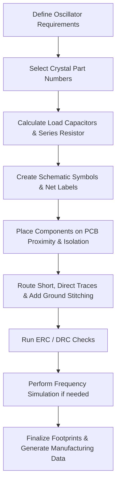

# 11 – MCU HSE & LSE Crystals  

*This section documents the PCB‑level decisions, constraints, and best‑practice guidelines for integrating the high‑speed external (HSE) and low‑speed external (LSE) crystal oscillators required by the MCU.*  

---  

## 1. Overview  

The MCU relies on two independent crystal resonators to meet its timing and low‑power requirements:

| Oscillator | Target Frequency | Typical Use | MCU Pins |
|------------|------------------|-------------|----------|
| **HSE** (High‑Speed External) | 32 MHz (recommended; 4 – 48 MHz allowed) | Core clock, PLL generation, high‑speed peripherals | OSC_IN = Pin 24, OSC_OUT = Pin 25 |
| **LSE** (Low‑Speed External) | 32.768 kHz (fixed) | Real‑time clock, low‑power sleep modes | PC14 = Pin 2, PC15 = Pin 3 |

Both crystals must be correctly terminated and, where required, accompanied by external load capacitors and a series resistor to guarantee reliable start‑up and long‑term stability.  

---  

## 2. Pin Assignment and Schematic Symbol Selection  

* **HSE (32 MHz)** – The MCU’s internal driver includes programmable load capacitance, so external caps are **not mandatory**. The crystal is typically supplied in a 4‑pin package (pins 1 & 3 = crystal terminals, pins 2 & 4 = case, grounded). In KiCad the “4‑pin crystal” symbol is used and labelled **X1**.  

* **LSE (32.768 kHz)** – Most low‑frequency crystals are supplied as a 2‑pin device without integrated load caps. External load capacitors are required and must be placed as close as possible to the crystal pins. The KiCad “2‑pin crystal” symbol is used and labelled **X2**.  

* **Net Naming** – For clarity and ERC safety, the following net labels are recommended:  

  * `HSE_IN`  – MCU pin 24 (OSC_IN)  
  * `HSE_OUT` – MCU pin 25 (OSC_OUT)  
  * `LSE_IN`  – PC14 (OSC32_IN)  
  * `LSE_OUT` – PC15 (OSC32_OUT)  

* **Ground Connections** – The case pins of the 4‑pin HSE crystal (pins 2 & 4) should be tied to the solid ground plane. The LSE crystal’s case is usually left floating; if the part specifies a grounded case, connect it accordingly.  

[Verified]  

---  

## 3. Load Capacitance and Series‑Resistor Considerations  

### 3.1 Load Capacitance  

* **HSE** – The MCU provides an internal, programmable load capacitance that can be tuned via the RCC registers. No external caps are required unless the selected crystal explicitly calls for them.  

* **LSE** – External load capacitors **C₁** and **C₂** must be chosen to satisfy the crystal’s specified load capacitance **Cₗ** using the standard formula:  

\[
C_{L} = \frac{C_{1} \times C_{2}}{C_{1}+C_{2}} + C_{stray}
\]

where **Cₛₜᵣₐᵧ** accounts for PCB trace, pin, and solder‑joint parasitics. The values of **C₁** and **C₂** are typically in the 10 – 30 pF range, but the exact numbers must be derived from the crystal’s data sheet and the estimated stray capacitance.  

*Reference*: ST Application Note **AN2867** (Crystal Oscillator Design) – provides detailed guidance on calculating **C₁**, **C₂**, and **Cₛₜᵣₐᵧ**.  

[Verified]  

### 3.2 Series Resistor (Rₓ)  

A small series resistor (often 0 – 2 Ω) may be placed between the MCU’s oscillator driver output and the crystal. Its purposes are:

1. **Drive‑strength limiting** – Prevents over‑driving the crystal, extending its life.  
2. **Low‑pass filtering** – Together with the load caps it attenuates higher‑order harmonics.  

ST’s AN2867 (page 21) recommends calculating **Rₓ** based on the crystal’s drive level and the MCU’s internal driver capability. In many simple designs a **0 Ω “zero‑ohm” placeholder** is used initially; the value can be tuned later if start‑up failures or frequency drift are observed.  

[Inference]  

---  

## 4. PCB Layout Guidelines  

### 4.1 Placement  

* **Proximity** – Position both crystals as close as possible to the MCU pins they drive. Typical distance ≤ 2 mm minimizes trace inductance and stray capacitance.  
* **Isolation** – Keep the crystal area free from high‑frequency traces (e.g., RF antenna feed, high‑speed USB, or Ethernet) and from large switching nodes (e.g., DC‑DC converters). A keep‑out radius of at least 5 mm is advisable.  
* **Ground Plane** – Ensure a solid, uninterrupted ground plane directly beneath the crystal and its load caps. This provides a low‑impedance return path and stabilises the effective capacitance.  

[Verified]  

### 4.2 Trace Routing  

| Parameter | Recommendation |
|-----------|----------------|
| **Trace Width** | Use the minimum width that satisfies the board’s current‑carrying requirement (typically 6‑10 mil for 50 Ω microstrip on a 4‑layer board). For the crystal traces, width is less critical; keep them short and wide enough to avoid excessive series resistance. |
| **Length Matching** | Not required for HSE/LSE because the frequencies are far below the regime where skew matters. However, keep the two traces of each crystal **symmetrical** to avoid imbalance. |
| **Via Usage** | Avoid vias on the crystal traces. If a via is unavoidable, place it as close to the MCU pin as possible and keep the via stub short. |
| **Impedance Control** | Not necessary for 32 MHz or 32.768 kHz signals; standard FR‑4 microstrip is sufficient. |
| **Clearance** | Maintain at least 3 × the minimum PCB manufacturer clearance from the crystal to any high‑speed or high‑current trace. |

[Verified]  

### 4.3 Grounding and Shielding  

* **Capacitor Placement** – The load capacitors **C₁** and **C₂** should be placed **directly adjacent** to the crystal pins, with the shortest possible connection to the ground plane (via or copper pour).  
* **Ground Stitching** – Add a few stitching vias around the crystal area to tie the top and internal ground planes together, reducing EMI susceptibility.  
* **Shielding** – If the design includes an RF antenna (e.g., Bluetooth), locate the antenna and its matching network on the opposite side of the board or at least a few centimeters away from the crystal to prevent coupling.  

[Inference]  

### 4.4 Component Footprint Selection  

* **Crystal Footprint** – Choose a 4‑pin footprint for the HSE crystal that matches the manufacturer’s recommended pad dimensions (typically 2.5 × 2.0 mm pads with 0.5 mm spacing). For the LSE crystal, a standard 2‑pin 3.2 × 2.5 mm footprint is sufficient.  
* **Capacitor Footprint** – Use 0402 or 0603 ceramic caps for the load capacitors; the smaller package reduces parasitic inductance.  
* **Resistor Footprint** – If a non‑zero **Rₓ** is required, a 0402 resistor is adequate; otherwise a 0 Ω “fuse” resistor can be placed in the same footprint.  

[Verified]  

---  

## 5. Design Flow (Schematic → Layout → Verification)  

*The flow emphasizes early calculation of load caps and resistor values, followed by disciplined placement and routing before any verification steps.*  

---  

## 6. References  

* **STMicroelectronics**, *Application Note AN2867 – Crystal Oscillator Design for STM32 MCUs* (covers load‑capacitance calculation, stray‑capacitance estimation, and series‑resistor sizing).  
* **MCU Datasheet – Section 6.3.1** (External Clock Source Characteristics).  
* **KiCad Library Guidelines** – Recommended symbols for 2‑pin and 4‑pin crystals.  

---  

*End of Chapter 11 – MCU HSE & LSE Crystals*