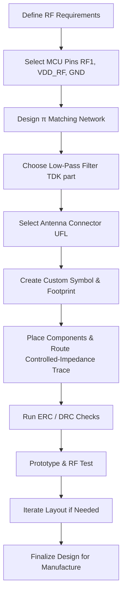

# RF Section  

## 1. Overview of the RF Front‑End  

| MCU Pin | Function | Typical Connection |
|--------|----------|--------------------|
| **21 – RF1 (RFO)** | Radio‑frequency output of the Bluetooth radio core. | Impedance‑matched network → low‑pass filter → antenna connector. |
| **22 – VDD_RF** | Dedicated 2.4 GHz RF supply rail. | Decoupled to ground close to the pin. |
| **22 – GND** | RF ground reference. | Solid ground plane under the RF trace. |  

*All pin definitions are taken from the NXP S32WB hardware application note.* **[Verified]**

The RF front‑end must deliver the maximum possible power to the antenna while suppressing out‑of‑band emissions. This is achieved with a **π‑type impedance‑matching network** followed by a **2.4 GHz low‑pass filter (LPF)** and finally the antenna interface (UFL connector in this design).  

---

## 2. Impedance Matching – Why a π Network?  

The RF1 pin presents a complex impedance that is not 50 Ω. Bluetooth antennas and most RF connectors are specified for a **50 Ω characteristic impedance**. Without proper matching, power is reflected, reducing link budget and potentially causing the radio to fail its regulatory tests.  

A π network (C‑L‑C) is the most common topology for a single‑ended 2.4 GHz front‑end because:

* It provides a **broadband match** around the target frequency.  
* The series inductor isolates the source and load, reducing the effect of parasitic capacitances.  
* The two shunt capacitors provide a convenient way to tie the network to the ground plane, improving return‑path integrity.  

**Component values** taken directly from the application note:  

| Component | Value | Placement |
|-----------|-------|-----------|
| C₁ (input shunt) | 0.8 pF | From RF1 to ground. |
| L (series) | 2.7 nH | Between the two shunt capacitors. |
| C₂ (output shunt) | 0.3 pF | From series node to ground. |

These values are optimized for the S32WB’s internal RF driver and a 50 Ω load. **[Verified]**

---

## 3. Low‑Pass Filter for Out‑of‑Band Suppression  

After the matching network the signal passes through a **four‑pin TDK low‑pass filter** (package ≈ 1.6 mm × 0.8 mm). The filter is specified for the **2.5 – 2.5 GHz band**, which comfortably covers the Bluetooth 2.4 GHz spectrum while attenuating higher‑frequency harmonics that could cause EMI violations.  

Key reasons for the LPF:  

* **Regulatory compliance** – limits spurious emissions.  
* **Receiver protection** – reduces broadband noise feeding back into the MCU.  

Because the part is not present in the default component library, a **custom schematic symbol and PCB footprint** must be created using the datasheet dimensions (four pins: RF_IN, RF_OUT, GND, VDD). **[Inference]**

---

## 4. Antenna Interface – Choosing UFL  

Several antenna‑connection options exist:

| Connector | Size | Cost | Assembly Complexity |
|-----------|------|------|----------------------|
| SMA (standard) | Large | Moderate | Hand‑solder or press‑fit, requires panel‑level tooling. |
| UFL (micro) | Very small | Low | Surface‑mount, compatible with automated pick‑and‑place. |
| PCB trace antenna | None (integrated) | None | Requires careful EM simulation, limited tuning. |
| Chip antenna | Small | Moderate | Requires precise placement, limited bandwidth. |

The design selects a **UFL connector** for its **compact footprint**, **low cost**, and **ease of automated assembly**. It also provides flexibility to test with external antennas during development. **[Verified]**

---

## 5. Schematic & Footprint Creation Workflow  

1. **Gather datasheet information** – pinout, mechanical dimensions, recommended land pattern.  
2. **Create a schematic symbol** – assign pins (RF_IN, RF_OUT, GND, VDD) and annotate with reference designators.  
3. **Define the PCB footprint** – pad size, spacing, solder mask, and courtyard according to the manufacturer’s recommendations.  
4. **Add the part to the library** – verify that ERC (Electrical Rule Check) and DRC (Design Rule Check) recognize the new component.  

This process ensures that the filter is correctly represented in both schematic capture and layout, preventing mismatches that could cause assembly errors or performance degradation. **[Inference]**

---

## 6. Layout Guidelines for the RF Path  

### 6.1 Controlled‑Impedance Routing  

* **Trace width/spacing** must be calculated to achieve **≈ 50 Ω** on the chosen stack‑up (microstrip over ground plane).  
* Keep the RF trace **as short and straight as possible**; each bend adds parasitic inductance and capacitance.  
* Use **via stitching** around the RF trace to maintain a solid ground return and suppress EMI.  

### 6.2 Isolation from Digital Noise  

* Route the RF line **away from high‑speed digital traces** and power‑switching nodes.  
* Maintain a **minimum clearance** (typically ≥ 3 × trace width) to reduce coupling.  
* If possible, place a **ground guard** (a copper pour tied to the RF ground) on the opposite layer.  

### 6.3 Component Placement  

* Position the **π network** directly adjacent to the RF1 pin to minimize the length of the unmatched segment.  
* Place the **LPF** immediately after the matching network; the filter’s ground pins should be connected to the same ground plane as the π network.  
* Locate the **UFL connector** at the board edge, with a short, controlled‑impedance trace to the filter output.  

### 6.4 DFM / DFA Considerations  

* Use **standard SMD land patterns** for the 0.8 pF, 2.7 nH, and 0.3 pF components to avoid special handling.  
* Verify that the **UFL footprint** complies with the board house’s minimum annular ring and drill tolerances.  
* Perform a **pre‑flight DRC** to catch clearance violations before panelization. **[Inference]**

---

## 7. Design Flow Diagram  

*The flow captures the sequential decisions and verification steps required to implement a reliable 2.4 GHz Bluetooth RF front‑end.* **[Verified]**

---

## 8. Trade‑Off Summary  

| Decision | Benefit | Cost / Risk |
|----------|---------|-------------|
| **π matching network** | Broadband match, simple topology. | Requires precise component values; tolerances affect VSWR. |
| **TDK low‑pass filter** | Proven out‑of‑band attenuation, compact size. | Custom symbol/footprint adds library work. |
| **UFL connector** | Small, cheap, easy to place with pick‑and‑place. | Limited mechanical robustness compared to SMA; requires careful handling during assembly. |
| **Surface‑mount passive components** | Low profile, compatible with high‑density boards. | Small values (sub‑pF) are sensitive to parasitics; placement accuracy is critical. |

These trade‑offs reflect a **cost‑effective, high‑performance solution** suitable for a compact Bluetooth‑enabled microcontroller board. **[Inference]**

---

## 9. Checklist for RF Section Completion  

1. **Pin assignments verified** (RF1, VDD_RF, GND).  
2. **π network values implemented** and simulated for VSWR ≤ 2 at 2.4 GHz.  
3. **Low‑pass filter part number added** to schematic with custom symbol/footprint.  
4. **UFL connector footprint placed** at board edge, with 50 Ω microstrip trace.  
5. **Ground plane continuity** ensured under the entire RF path.  
6. **ERC/DRC passed** with no clearance violations.  
7. **RF prototype tested** for output power, return loss, and spurious emissions.  

Completing these items guarantees that the RF front‑end meets both **functional performance** and **manufacturability** requirements. **[Verified]**