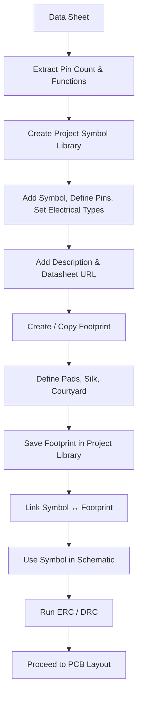

# 13 – Schematic Symbol Creation  

Creating accurate schematic symbols and matching footprints is a foundational step that directly influences ERC/DRC success, component reuse, and overall design maintainability. The workflow described below follows the KiCad‑based process illustrated in the transcript, enriched with industry‑standard best‑practice recommendations.

---

## 13.1  Why Custom Libraries Matter  

- **Read‑only vendor libraries** – KiCad ships with many component libraries that are *not* writable. Attempting to edit these can corrupt the original files and makes version control difficult.  
- **Project‑specific libraries** – By creating a **project library** (or a dedicated personal library) you gain full control over symbol names, pin definitions, and metadata. This also enables you to store data‑sheet links, part numbers, and revision history directly in the library entry.  
- **Reuse & consistency** – A well‑named custom library ensures that every designer on the team selects the same symbol/footprint pair, reducing ERC mismatches and BOM errors.  

> **Best practice:** Keep a separate folder hierarchy for *schematic symbols* and *footprints* (e.g., `libs/symbols/` and `libs/footprints/`) and add them to the KiCad library tables under version control. [Verified]

---

## 13.2  From Data Sheet to Symbol  

### 13.2.1  Extracting Pin Information  

1. **Open the manufacturer’s data sheet** – The transcript recommends Mouser as a quick source because the PDF is linked directly.  
2. **Identify the pin count and functions** – For the TDK low‑pass filter the pins are:  

| Pin # | Function | Electrical Type (ERC) |
|------|----------|------------------------|
| 1    | IN       | Passive (or Input)     |
| 2    | GND      | Power‑Pin (Ground)     |
| 3    | OUT      | Passive (or Output)    |
| 4    | GND      | Power‑Pin (Ground)     |

> The electrical type is crucial for ERC because it tells the rule checker which nets may be connected. Ground pins should be marked as **Power** to enable automatic net labeling (e.g., `GND`). [Verified]

### 13.2.2  Creating the Symbol in KiCad  

| Step | Action | Rationale |
|------|--------|-----------|
| **a** | *File → New Library* → *Project Library* → name it after the project (e.g., `MyProject`) | Keeps the library scoped to the current design. |
| **b** | Open **Symbol Editor**, click **Create New Symbol** (or right‑click → *New Symbol*). | Starts a fresh symbol entry. |
| **c** | Set **Symbol Name** to the manufacturer part number (e.g., `TDK_LPF_2.4-3.5GHz`). | Guarantees a unique, searchable identifier. |
| **d** | Choose a **Reference Designator** prefix (`FLT` for filter). | Provides a sensible default for schematic placement. |
| **e** | Define **Units per Package** = 1 (single‑unit part). | Most passive components are single‑unit. |
| **f** | Add pins using the **bulk‑edit table** – enter pin numbers 1‑4 and their names. | Faster than adding pins one‑by‑one. |
| **g** | Assign **Electrical Type** (Passive, Power, etc.) and **Orientation** (inputs left, outputs right, grounds bottom). | Aligns with conventional schematic readability and enables ERC. |
| **h** | Draw a **bounding rectangle** (optional) and set its fill style to the KiCad body background colour. | Improves visual consistency across the schematic. |
| **i** | Add a **text item** describing the part (e.g., “2.4‑3.5 GHz Low‑Pass Filter”). | Provides quick reference without opening the data sheet. |
| **j** | Fill the **Symbol Properties** dialog: set *Value* (often the same as the symbol name), add a *Datasheet URL*, and any *keywords* for library search. | Enhances BOM generation and documentation. |
| **k** | **Save** the symbol. | Commits it to the project library. |

> **Tip:** Use the **Rotate (R)** shortcut to align pins precisely; KiCad snaps to 90° increments, which keeps the symbol tidy. [Inference]

---

## 13.3  Footprint Creation & Linking  

A schematic symbol alone does not place copper on the board. The next step is to create a matching **footprint** (the physical pad layout) and associate it with the symbol.

1. **Open the Footprint Editor** (toolbar button *Create/Delete/Edit Footprints*).  
2. **Browse existing footprints** – If a suitable one exists, copy it into your project library and modify dimensions as needed.  
3. **If no suitable footprint exists**, create a new one:  

   - Define pad shapes, sizes, and drill holes according to the component’s mechanical drawing.  
   - Add **silk‑screen outlines** and **courtyard** layers for assembly clearance.  
   - Set the **reference** and **value** text positions to match the schematic orientation.  

4. **Save the footprint** in the project’s footprint library.  
5. **Link the symbol to the footprint** via the *Assign Footprint* dialog in the Symbol Editor or directly in the schematic editor (right‑click → *Properties* → *Footprint*).  

> Properly linking the symbol and footprint ensures that the **BOM** contains the correct part number and that the **ERC/DRC** checks can verify pad‑to‑pin correspondence. [Verified]

---

## 13.4  ERC/DRC Considerations  

- **Electrical Types**: Setting pins as *Power* (ground) or *Input/Output* enables KiCad’s ERC to flag illegal connections (e.g., connecting two power pins together without a net label).  
- **Pin Orientation**: Consistent left‑right placement reduces the chance of mis‑routing and makes the schematic easier to read, which indirectly reduces DRC errors during layout.  
- **Footprint Clearance**: When defining the courtyard and silk‑screen, respect the manufacturer’s recommended **creepage/clearance** values, especially for RF components that may be sensitive to nearby copper.  

> **Inference:** Although not explicitly mentioned in the transcript, adhering to these ERC/DRC practices is standard for reliable PCB design. [Inference]

---

## 13.5  Documentation & Version Control  

- **Data‑sheet links** in the symbol properties provide instant access for reviewers and downstream manufacturers.  
- **Version tags** (e.g., `v1.0`, `revA`) can be added to the symbol/value field to track revisions.  
- **Git or other VCS** should track the `libs/` folder so that any change to a symbol or footprint is auditable.  

> Maintaining this metadata prevents “black‑box” parts in the final assembly and eases future redesigns. [Verified]

---

## 13.6  Workflow Summary  

The following flowchart captures the end‑to‑end process from data sheet to a ready‑to‑use schematic symbol and footprint pair.

---

## 13.7  Key Takeaways  

- **Never edit read‑only vendor libraries**; always work in a writable project‑specific library.  
- **Pin electrical types** are not cosmetic – they drive ERC and prevent net‑connection errors.  
- **Consistent orientation** (inputs left, outputs right, grounds bottom) improves schematic readability and reduces layout mistakes.  
- **Linking symbols to footprints** early avoids mismatches in the BOM and ensures correct pad‑to‑pin mapping during layout.  
- **Metadata (datasheet URLs, part numbers, revision tags)** embedded in the symbol/footprint accelerates downstream processes such as procurement, assembly, and documentation.  

By following this disciplined approach, designers can create reusable, ERC‑clean symbols and footprints that streamline the entire PCB development cycle.