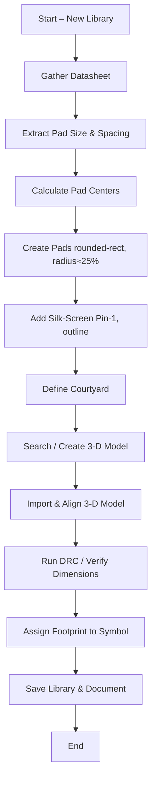

# 14 – Footprint Creation  

Creating a reliable PCB footprint is a critical step that bridges the schematic and the physical board. The process combines data‑sheet interpretation, DFM (Design‑for‑Manufacturability) rules, and verification tools such as 3‑D viewers. The sections below outline a repeatable workflow, the key decisions that must be made, and best‑practice guidelines for robust footprint development.

---

## 1. Library Management  

| Action | Recommended Practice | Rationale |
|--------|----------------------|-----------|
| **Create a project‑specific library** | Use *File → New Library* → *Project library* and give it a descriptive name (e.g., `MyProject_Footprints`). | Keeps all custom parts isolated from the vendor libraries, simplifying version control and downstream sharing. |
| **Naming convention** | For generic packages use a functional name (e.g., `UF_QFN48`). For unique parts, mirror the part number (e.g., `BPF12345`). | Guarantees a one‑to‑one mapping between the schematic symbol and the physical footprint, avoiding ambiguity when the datasheet lacks an official package name. |
| **Assigning the footprint** | After the footprint is saved, open the schematic symbol editor, click *Display Symbol Properties* → *Footprint* and browse to the newly created footprint. | Guarantees that the schematic and layout stay synchronized throughout the design flow. |

> **Best‑Practice:** Keep the library hierarchy flat (no nested sub‑folders) unless you manage a very large component set. This reduces path‑length errors when the project is moved between workstations. [Verified]

---

## 2. Interpreting the Datasheet  

### 2.1 Pad Geometry  

1. **Pad size** – Extract the recommended land pattern dimensions (e.g., width = 0.275 mm, height = 0.70 mm).  
2. **Pad shape** – Convert rectangular pads to *rounded‑rectangle* with a corner radius ≈ 25 % of the pad width. This improves solder‑paste gasketing and reduces the risk of solder bridges. [Inference]  
3. **Pad numbering** – Follow the datasheet’s pin numbering, remembering that many manufacturers present the view from the **bottom** of the component (third‑angle projection). Translate this to the top‑view used in the PCB editor.  

### 2.2 Pad Placement  

The datasheet usually provides only **pad‑to‑pad spacing** and overall package dimensions. Center‑to‑center coordinates must be calculated:

```
X_center = (pad_width/2) + (spacing/2) + (adjacent_pad_width/2)
Y_center = (pad_height/2) + (vertical_spacing/2) + (adjacent_pad_height/2)
```

Round coordinates to a practical precision (e.g., two decimal places) because manufacturing tolerances rarely support sub‑0.01 mm accuracy. [Inference]

> **Tip:** Use the KiCad *Measure* tool or a spreadsheet to keep calculations transparent and reproducible.  

---

## 3. DFM‑Driven Pad Design  

| DFM Consideration | Recommended Setting | Impact |
|-------------------|---------------------|--------|
| **Pad shape** | Rounded rectangle, 25 % radius of width | Better solder‑paste release, reduced voiding. |
| **Minimum copper‑to‑copper clearance** | Follow IPC‑2221 (typically ≥ 0.2 mm for standard FR‑4) | Prevents short circuits during assembly. |
| **Solder mask expansion** | 0.05 mm–0.10 mm beyond pad edge | Guarantees mask coverage while allowing sufficient solder fillet. |
| **Silk‑screen clearance** | ≥ 0.15 mm from pad edge | Avoids solder mask adhesion problems. |
| **Courtyard definition** | 0.5 mm margin around the outermost pad | Provides assembly and pick‑and‑place clearance. |

> **Why it matters:** Even a perfectly dimensioned pad will fail if the solder mask or silk screen encroaches on it, leading to open or shorted joints. [Verified]

---

## 4. Adding Mechanical Information  

### 4.1 3‑D Model Integration  

1. **Source the model** – Prefer vendor‑provided STEP files. If unavailable, search reputable libraries (e.g., Ultra Librarian) or generate a model from the mechanical drawing.  
2. **Import** – In the footprint editor, open *Footprint Properties* → *3D Models*, click **+**, and select the STEP file.  
3. **Alignment** – Adjust rotation and offset until the model’s pads coincide with the copper pads. Verify in the 3‑D viewer.  
4. **Verification** – Cross‑check the model dimensions against the datasheet; mismatches often arise from generic models that omit solder‑mask or lead extensions.  

> **Best‑Practice:** Store the STEP file inside the project’s `3DModels` folder and reference it with a relative path. This ensures portability across machines and version‑control systems. [Inference]

### 4.2 Silk‑Screen Markings  

* **Pin‑1 indicator** – Draw a small circle or “1” next to the Pad 1 location on the *Silk Screen* layer. This aids manual placement and visual inspection.  
* **Component outline** – Sketch a simple rectangle or contour around the part on the silk screen to give a visual cue of the component’s footprint.  

> **Note:** Keep silk‑screen line widths ≤ 0.12 mm to stay within typical fabrication capabilities. [Verified]

### 4.3 Courtyard & Assembly Layer  

Define a *Courtyard* (often on the `F.CrtYd`/`B.CrtYd` layers) that encloses the entire component plus a 0.5 mm margin. This is used by pick‑and‑place machines and by DFM checks to detect component crowding.  

---

## 5. Workflow Summary  

The following flowchart captures the end‑to‑end footprint creation process described above.



> **Key checkpoints** are the DRC run after pad placement (step J) and the visual verification of the 3‑D model alignment (step I). Skipping either often leads to assembly failures. [Inference]

---

## 6. Common Pitfalls & Mitigations  

| Pitfall | Symptom | Mitigation |
|---------|---------|------------|
| **Incorrect pin view** (using bottom‑view coordinates directly) | Pads appear mirrored on the board, causing routing errors. | Always convert third‑angle projection to top‑view before entering coordinates. |
| **Over‑precise coordinates** (e.g., 0.6134 mm) | Manufacturer rounds values, leading to slight misalignment and possible solder bridges. | Round to two decimal places or to the nearest manufacturer tolerance. |
| **Missing 3‑D model** | Mechanical clearance checks rely on bounding boxes only, increasing risk of component clash. | Even a simple generic STEP model is better than none; create one if necessary. |
| **Silk‑screen too close to pads** | Mask adhesion failure, solder bridges. | Maintain ≥ 0.15 mm clearance; use design rule checks to enforce. |
| **Using rectangular pads for rounded‑corner recommendations** | Poor solder paste release, higher defect rate. | Follow IPC‑7351B “Rounded‑Rectangle” recommendation (≈ 25 % radius). |

---

## 7. References & Standards  

* **IPC‑7351B** – Generic Requirements for Surface Mount Design and Land Pattern Standard.  
* **IPC‑2221** – Generic Standard on Printed Board Design.  
* **KiCad Documentation** – Footprint Editor, 3‑D Model Integration.  
* **Vendor Mechanical Libraries** – Ultra Librarian, SnapEDA, manufacturer STEP archives.  

---

*End of Chapter 14 – Footprint Creation*