# 15 RF Section – Continued  

## Overview  

The RF front‑end of the board consists of a **matching network**, a **low‑pass filter**, and an **UFL antenna connector**. The schematic is built by placing the custom DLF‑type part (the matching network) from the internal library, wiring it to the filter, and then routing the filtered RF signal to the connector. Ground references are duplicated for each sub‑circuit to keep the schematic tidy and to simplify later net‑class assignments.  

> **Key takeaway:** Consistent net naming (e.g., prefix `RF_`) and early definition of net classes dramatically reduce ERC/DRC errors and streamline the PCB layout stage. [Verified]

---

## 1. Component Placement and Symbol Selection  

| Component | Library Symbol | Footprint | Placement Tips |
|-----------|----------------|-----------|----------------|
| Matching Network (DLF‑type) | `DLF1_16` (custom) | Corresponding RF footprint | Place as close as possible to the MCU RF pin to minimise trace length and parasitic inductance. |
| Low‑Pass Filter | Standard LC filter symbol | 0402/0603 footprint (depending on part) | Keep filter between matching network and connector; orient for a straight‑through RF path. |
| UFL Connector | Coaxial connector symbol (UFL) | UFL‑MHF‑type footprint | Locate at board edge; provide sufficient clearance for the coaxial cable and for any required shielding. |

*The “Coaxial Double” symbol used in the schematic represents the physical UFL connector; it is a convenient placeholder that automatically adds the required shield and signal pins.* [Verified]

---

## 2. Ground Strategy  

- **Duplicate ground symbols** for each RF block (matching network, filter, connector).  
- Use the **wire tool** to tie all duplicated grounds together, forming a single RF ground net (`RF_GND`).  
- This approach keeps the schematic readable and ensures that the net‑class for RF ground can be defined with the appropriate **clearance/creepage** rules later in the layout. [Inference]

---

## 3. Net Naming Conventions  

A disciplined naming scheme is essential for large mixed‑signal boards:

```
RF_...   – all RF‑related nets (e.g., RF_IN, RF_OUT, RF_GND)
SNPS_... – power rails for the “snps” (presumably Snapdragon) subsystem
...
```

- **Benefits**  
  - Automatic grouping into **net classes** (e.g., `RF` class with controlled‑impedance rules).  
  - Simplified **ERC** because mismatched prefixes are flagged.  
  - Faster **BOM** generation and design reviews.  

> **Best practice:** Define net classes early in the schematic and lock them before layout to avoid accidental rule changes. [Verified]

---

## 4. RF Protection and Matching Network Variants  

### 4.1. Connector Protection  

- **Why:** The antenna connector is exposed to the external environment and can be subjected to ESD, over‑voltage, or accidental short‑circuits.  
- **Typical solutions**  
  - Series **RF choke** or **ferrite bead** right after the connector.  
  - **Transient Voltage Suppression (TVS)** diodes rated for the RF frequency band.  
  - **RF‑rated series resistors** (e.g., 0 Ω for minimal loss, higher values for protection).  

> Adding protection is **strongly recommended** for any production design, even if the basic schematic omits it for simplicity. [Inference]

### 4.2. Matching Network Topologies  

- The presented design uses a **single‑ended LC network** – the most basic form.  
- Alternative topologies (e.g., **Pi‑network**, **T‑network**, or **balun‑based** solutions) may be required when:  
  - The antenna impedance deviates from 50 Ω.  
  - The operating band is wide or includes multiple channels.  
  - The board must accommodate different antenna types (e.g., chip antenna vs. external whip).  

> Selecting the appropriate network is a trade‑off between **design complexity**, **component count**, and **bandwidth**. [Inference]

---

## 5. Preparing for PCB Layout  

### 5.1. Controlled‑Impedance Routing  

- The RF trace from the matching network through the low‑pass filter to the UFL connector should be routed as a **50 Ω microstrip** (or stripline, depending on stack‑up).  
- **Key parameters** (to be defined with the fab house):  
  - Dielectric thickness and material (e.g., FR‑4 1.6 mm, or a low‑loss laminate for higher frequencies).  
  - Copper weight (typically 1 oz).  
  - Ground plane continuity beneath the RF trace.  

> Maintaining a consistent impedance minimizes reflections and preserves antenna matching. [Verified]

### 5.2. Via Stitching and Shielding  

- **Via stitching** around the RF ground plane reduces EMI and provides a low‑inductance return path.  
- For the UFL connector, consider a **via fence** surrounding the coaxial shield pad to improve shielding effectiveness.  

> Excessive via density can increase cost; balance stitching frequency with DFM guidelines. [Inference]

### 5.3. Clearance and Creepage  

- RF sections often coexist with high‑speed digital or power domains.  
- Apply **clearance rules** (e.g., ≥ 3 mil) between RF traces and noisy digital lines to limit coupling.  
- **Creepage** distances become critical if the board operates at elevated voltages (e.g., > 30 V).  

> These rules are enforced via the net‑class definitions created from the naming convention. [Verified]

---

## 6. Integration with the MCU Programming Interface  

The RF front‑end is driven by a microcontroller that requires a **programming interface** (e.g., SWD, JTAG, or UART).  

- **Placement**: Keep the programming header away from the RF path to avoid coupling.  
- **Routing**: Use separate ground/power planes for the programming interface, or add a **ground guard** if the lines run near RF traces.  

> Providing a clean, isolated programming path simplifies firmware updates and reduces the risk of corrupting RF performance. [Inference]

---

## 7. Summary Flow  

```mermaid
flowchart LR
    MCU[MCU RF Pin] -->|Matching Network| MATCH[DLF Matching Network]
    MATCH -->|Low‑Pass Filter| LPF[Low‑Pass Filter]
    LPF -->|Filtered RF| CONN[UFL Connector]
    CONN -->|Antenna| ANT[External Antenna]
    style MCU fill:#f9f,stroke:#333,stroke-width:2px
    style MATCH fill:#bbf,stroke:#333,stroke-width:2px
    style LPF fill:#bbf,stroke:#333,stroke-width:2px
    style CONN fill:#bbf,stroke:#333,stroke-width:2px
    style ANT fill:#cfc,stroke:#333,stroke-width:2px
```



*The diagram illustrates the linear RF signal path and highlights where protection and impedance control should be applied.* [Verified]

---

## 8. Checklist for the RF Section  

| Item | Reason | Status |
|------|--------|--------|
| Consistent `RF_` net naming | Enables net‑class creation | ✅ |
| Duplicate ground symbols merged into `RF_GND` | Simplifies ERC/DRC | ✅ |
| Controlled‑impedance trace defined | Preserves antenna match | ☐ |
| Via stitching around RF ground | Reduces EMI | ☐ |
| Connector protection (TVS/ferrite) | Improves reliability | ☐ |
| Matching network tuned for antenna | Ensures 50 Ω match | ☐ |
| Programming interface isolated from RF | Prevents coupling | ☐ |

> **Next steps:** Finalise the matching network component values, define the stack‑up with the fab house, and begin detailed layout with the above constraints in mind. [Inference]