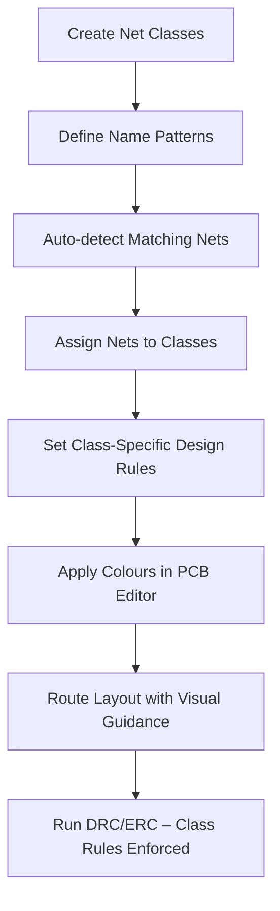

# Net Classes  

Net classes are logical groupings of schematic nets that allow a designer to apply **common attributes**—such as design‑rule constraints, visual colour schemes, and layer‑assignment policies—to many signals at once.  In KiCad the feature is accessed through **Edit → Edit Schematic Setup → Project Net Classes**.  

## 1. Defining Net Classes  

1. Open the *Project Net Classes* dialog.  
2. Click **Add** to create a new class and give it a meaningful name (e.g., `RF`, `USB`, `POWER`, `GROUND`, `SER_DEBUG`, `SWD`).  
3. For each class, define a **pattern** that matches the intended schematic net names.  
   * Example pattern: `SL*RF` matches any net whose name begins with `SL` and ends with `RF` (e.g., `SL1_RF`, `SL2_RF`).  
   * A power‑class pattern such as `+*` captures all nets that start with a plus sign (`+3.3V`, `+5V`).  

When the pattern is entered, KiCad automatically filters the net list and shows all matching nets on the right‑hand side. Selecting the matches and clicking **Assign** moves those nets into the chosen class.  

> **Result:** All RF‑related nets are now members of the `RF` class, all USB nets belong to `USB`, etc.  This bulk‑assignment eliminates the need to edit each net individually.  [Verified]

## 2. Why Use Net Classes?  

| Benefit | Explanation |
|---|---|
| **Consistent Design Rules** | Custom DRC/ERC rules (e.g., minimum clearance, width, via style) can be attached to a net class, guaranteeing that every net in the class obeys the same constraints.  This is especially important for high‑speed or RF signals where impedance and spacing are critical.  [Inference] |
| **Visual Organisation** | KiCad lets you assign a unique colour to each net class in the PCB editor.  During layout, colour‑coded nets are instantly recognisable, reducing routing errors and speeding up verification.  [Verified] |
| **Simplified Net Management** | Adding a new net that follows the naming convention automatically inherits the class attributes, so the design scales without extra bookkeeping.  [Inference] |
| **Manufacturability Checks** | By grouping power nets, you can enforce stricter clearance or copper‑area rules that satisfy DFM guidelines for current handling and thermal performance.  [Speculation] |

## 3. Practical Workflow  

The diagram illustrates the typical sequence from class creation to final rule enforcement.  

## 4. Common Net‑Class Strategies  

### 4.1 Power & Ground  
* **Naming convention:** Prefix all power nets with a plus sign (`+`).  
* **Pattern:** `+*` captures every power net, allowing you to apply a *Power* net class.  
* **Design‑rule implications:**  
  * Minimum trace width based on expected current.  
  * Wider copper pours for low‑impedance ground planes.  
  * Mandatory copper‑area connections to thermal relief pads.  

### 4.2 High‑Speed / RF  
* **Naming convention:** Include a unique identifier such as `RF` or `USB` in the net name.  
* **Pattern examples:** `SL*RF`, `*USB*`.  
* **Design‑rule implications:**  
  * Controlled‑impedance width/spacing.  
  * Length‑matching constraints for differential pairs.  
  * Restricted via types (e.g., micro‑vias only).  

### 4.3 Debug & Programming Interfaces  
* **Classes:** `SER_DEBUG`, `SWD`.  
* **Purpose:** Keep these low‑speed, often‑accessed nets separate from high‑speed traffic, simplifying routing and allowing relaxed clearance rules.  

## 5. Integration with PCB Layout  

After saving the net‑class configuration (OK → Close), open the PCB editor:

* **Colour Assignment:** `Design → Net Classes → Colours`. Choose distinct hues for each class to improve visual discrimination.  
* **Rule Assignment:** `Design Rules → Net Class Rules`. Here you can set per‑class constraints such as *minimum clearance*, *track width*, *via size*, and *layer restrictions*.  

When the layout is complete, running **DRC** will automatically verify that every net complies with its class‑specific rules, and **ERC** will flag any electrical mismatches (e.g., a power net inadvertently placed in a low‑current class).  

## 6. Best Practices & Tips  

* **Consistent Naming:** Adopt a clear naming scheme early (e.g., `+3V3`, `+5V`, `SL1_RF`, `SL2_USB`). This ensures patterns remain simple and reliable.  [Inference]  
* **Avoid Over‑Granular Classes:** Too many small classes increase configuration overhead and can lead to conflicting rules. Group nets by functional similarity (power, high‑speed, debug) rather than by individual signal.  [Speculation]  
* **Document Patterns:** Keep a short table in the project README that lists each net class and its associated pattern. Future collaborators can quickly understand the intent.  
* **Validate Early:** After assigning nets, run a quick **ERC** in the schematic editor to confirm that no net was missed or mis‑assigned.  

---

By leveraging net classes, a PCB design gains **structured control**, **visual clarity**, and **automated rule enforcement**, all of which contribute to a more reliable and manufacturable product.