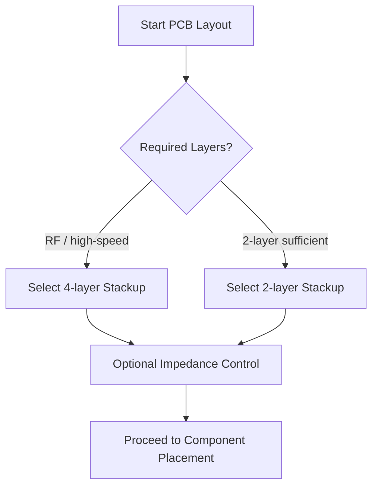

# 04 – PCB Set‑Up  

This section describes the essential preparation steps that must be performed before any component placement or routing can begin. It covers layer configuration, stack‑up definition, surface finish selection, solder‑mask parameters, and the establishment of design‑rule constraints. The goal is to create a manufacturable board that meets electrical performance targets (e.g., controlled‑impedance RF traces) while keeping cost and risk under control.

---

## 1. Opening the Board Editor  

The PCB editor is launched from the top toolbar ( *Open PCB in Board Editor* ). A blank canvas appears, ready for layout. The editor provides a distinct set of toolbars and command palettes compared to the schematic editor, so familiarising yourself with the new controls is the first practical step.

---

## 2. Layer Configuration  

### 2.1 Enabling Required Layers  

| Layer | Typical Use | Recommended State |
|------|--------------|-------------------|
| **Top Copper** | Signal, power, ground | Enabled |
| **Bottom Copper** | Signal, power, ground | Enabled |
| **Inner Copper 1 / 2** | Reference planes, additional routing | Enabled (for multi‑layer boards) |
| **Solder Mask (Top/Bottom)** | Protects copper, defines clearance | Enabled |
| **Silkscreen (Top/Bottom)** | Component designators, board ID | Enabled |
| **Paste** | Stencil generation for SMT | Enabled |
| **Mask (Solder‑mask) Layer** | Same as solder mask – keep enabled | Enabled |
| **Fabrication Adhesive** | Rarely used, adds cost | **Disabled** |
| **User Eco Layers** | Custom graphics, documentation | **Disabled** (unless needed) |

Disabling unused layers reduces file size and eliminates the possibility of accidental edits that could cause DFM (Design‑for‑Manufacturability) issues.  

[Verified]

### 2.2 Layer Stack‑up Tab  

The *Physical Stack‑up* tab defines the order and material of each dielectric and copper layer. Modern designs almost always favour a four‑layer stack for digital and RF applications because it offers:

* Dedicated ground and power reference planes that improve signal integrity and reduce EMI.  
* Shorter trace lengths on internal layers, easing controlled‑impedance routing.  
* Comparable cost to a two‑layer board for most fab houses, while delivering superior electrical performance.  

[Inference]

---

## 3. Stack‑up Definition  

### 3.1 Selecting a Four‑Layer Stack  

A typical 1.6 mm, four‑layer board from a mid‑range fab house (e.g., PCB Way) uses the following construction:

| Layer | Material | Thickness | Dielectric Constant (εᵣ) |
|------|----------|-----------|---------------------------|
| **L1 – Top Copper** | 1 oz (≈35 µm) copper | 35 µm | – |
| **Prepreg 1** | 2116 (FR‑4) | ~0.11 mm | 4.29 |
| **L2 – Inner Copper 1** | 1 oz copper | 35 µm | – |
| **Core** | F4 (FR‑4) | ~1.2 mm | 4.6 |
| **L3 – Inner Copper 2** | 1 oz copper | 35 µm | – |
| **Prepreg 2** | 2116 (FR‑4) | ~0.11 mm | 4.29 |
| **L4 – Bottom Copper** | 1 oz copper | 35 µm | – |
| **Solder‑mask / Silkscreen** | Standard fab‑specified | – | – |

The stack‑up is entered into the board‑setup dialog by selecting the appropriate dielectric material (via the three‑dot selector) and typing the εᵣ values. The resulting total board thickness is just under 1.6 mm, matching the fab’s standard panel.  

[Verified]

### 3.2 Impedance‑Controlled Option  

Because the design contains RF traces, the *Impedance Controlled* flag is enabled. This activates the internal calculator that uses the defined dielectric thicknesses and copper weights to compute trace widths for target impedances (e.g., 50 Ω microstrip). Even if the fab does not require the flag, keeping it on ensures that the layout tool enforces the correct geometry.  

[Inference]

### 3.3 Communicating the Stack‑up  

The completed stack‑up should be exported (e.g., as a PDF or CSV) and attached to the fabrication files. This guarantees that the manufacturer uses the exact materials and thicknesses you designed for, avoiding costly re‑spins.  

[Verified]

---

## 4. Surface Finish & Copper Treatment  

* **Finish** – Hot‑Air Solder Leveling (HASL), lead‑free.  
  *HASL* provides a reliable, low‑cost finish suitable for most consumer‑grade boards. For high‑frequency or fine‑pitch designs, a higher‑performance finish (ENIG, Immersion Gold) may be required, but this adds cost.  

[Verified]

---

## 5. Solder‑Mask Parameters  

### 5.1 Expansion (Clearance)  

*Default*: 0 mm (fabricator‑determined).  
*Recommended*: 2–3 mil (≈0.08 mm) to ensure adequate clearance between mask openings and copper features.  

[Verified]

### 5.2 Minimum Web Width (Mask Bridge)  

The minimum continuous mask width depends on the mask colour:

| Mask Colour | Minimum Bridge (typical) |
|-------------|--------------------------|
| **Green** | 100 µm (recommended 125 µm) |
| **Red / Blue / White / Black** | Larger (manufacturer‑specific) |

Choosing a green mask allows the tighter 100 µm bridge, which is advantageous for dense routing. The value is entered as **0.125 mm** (125 µm) to stay within the fab’s recommended tolerance.  

[Verified]

---

## 6. Text & Graphics  

Default settings for silkscreen text, line widths, and graphic objects are generally sufficient for most designs. Adjust only if the fab imposes specific minimum line/space rules (e.g., 4 mil for silkscreen).  

[Verified]

---

## 7. Design Rules & Net Classes  

### 7.1 Establishing DRC Constraints  

Before placing any component, define the **Design Rule Check (DRC)** parameters:

| Rule | Typical Value | Reason |
|------|---------------|--------|
| **Clearance (copper‑to‑copper)** | 6 mil (0.15 mm) or per fab spec | Prevents shorts and ensures manufacturability |
| **Via Drill / Annular Ring** | 0.3 mm drill, 0.15 mm annular | Guarantees reliable plating |
| **Trace Width (signal)** | 6 mil minimum, wider for high‑current nets | Balances resistance, current capacity, and fab capability |
| **Differential Pair Spacing** | 6 mil (or as required for target impedance) | Controls differential impedance and crosstalk |
| **Impedance Tolerance** | ±10 % of target | Meets RF performance specs |

These rules are stored in the board‑setup dialog and applied automatically during routing.  

[Verified]

### 7.2 Net Classes  

Create **Net Classes** to group signals with similar constraints (e.g., *High‑Speed*, *Power*, *Ground*). Assign each class its own width, clearance, and impedance settings. This reduces manual editing and ensures consistency across the board.  

[Verified]

---

## 8. Summary Flow  

The following flowchart captures the decision process for layer count and stack‑up selection, reflecting the trade‑offs discussed above.

---

## 9. Key Takeaways  

* **Enable only the layers you need** – disables unnecessary data and prevents accidental edits.  
* **Four‑layer stack‑ups** are the sweet spot for modern digital/RF designs, offering reference planes and controlled impedance at a modest cost increase.  
* **Import the exact manufacturer stack‑up** (dielectric types, copper weights, εᵣ values) into the CAD tool to guarantee correct impedance calculations.  
* **Set solder‑mask expansion and minimum bridge** according to the chosen mask colour; green masks typically allow tighter tolerances.  
* **Define DRC rules and net classes early** – they enforce manufacturability and electrical performance throughout the layout process.  

By following these set‑up steps, the board design will be well‑aligned with fabrication capabilities, cost targets, and performance requirements.