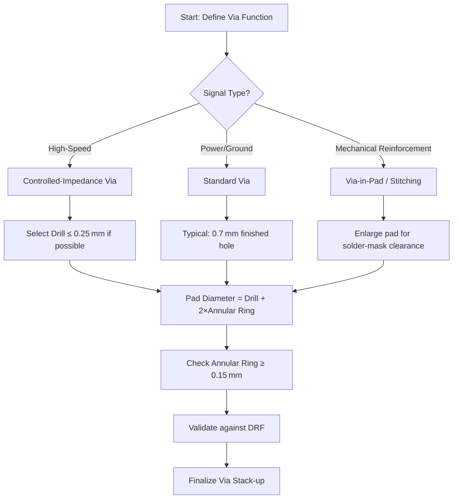

# Trace and Via Sizes  

Understanding and controlling trace widths and via dimensions is fundamental to a reliable, manufacturable PCB. This section outlines practical sizing choices, the underlying calculations that justify them, and the design‑rule considerations that accompany high‑speed or cost‑sensitive projects.

---

## 1. Trace Width Selection  

| Typical Minimum Width | Example Width Set* |
|-----------------------|--------------------|
| 0.15 mm (6 mil)       | 0.15 mm, 0.20 mm, 0.35 mm, 0.50 mm, 1.00 mm |

*The set above is illustrative; actual widths are chosen based on current‑carrying requirements, impedance targets, and the manufacturer’s design‑rule file (DRF).  

### 1.1 Why 0.15 mm?  
A 0.15 mm trace is often the smallest width a standard fab house will accept without a cost surcharge. It satisfies most low‑current signal routes while keeping the copper density within typical DFM limits. Selecting this as the baseline ensures that any narrower trace would trigger a “cost‑adder” clause in the quotation.  

### 1.2 Current‑Carrying Capacity  
For a given copper thickness (e.g., 1 oz/ft² ≈ 35 µm), the IPC‑2221 standard provides a simple rule‑of‑thumb:  

\[
I = k \cdot (W \cdot T)^{0.44}
\]

where *I* is the allowable current, *W* the trace width, *T* the copper thickness, and *k* a constant that depends on temperature rise. Using this relationship, designers can map the required current to a minimum width and then round up to the nearest width in the chosen set.  

### 1.3 Impedance‑Controlled Traces  
High‑speed, RF, or differential signals often require a specific characteristic impedance (e.g., 50 Ω, 100 Ω). In those cases the trace width is dictated by the stack‑up geometry (dielectric thickness, permittivity, reference plane proximity) rather than by current alone. Controlled‑impedance routing is therefore a separate design flow that must be enabled in the layout tool (e.g., KiCad’s “Design Rules → Length/Tuning”).  

> **Note:** Impedance‑controlled traces are mandatory for any signal whose rise time is comparable to the propagation delay of the board’s dielectric. See the dedicated “Impedance Control” chapter for detailed methodology. [Verified]

---

## 2. Via Geometry  

Via dimensions are a balance between electrical performance, mechanical reliability, and manufacturing cost. The following examples illustrate a typical decision tree.

### 2.1 Standard Via (0.7 mm finished hole)  

* **Finished hole:** 0.7 mm (≈ 28 mil)  
* **Pad diameter:** 1.3 mm (≈ 51 mil) – gives an annular ring of  

\[
\frac{1.3\text{ mm} - 0.7\text{ mm}}{2}=0.30\text{ mm}
\]

which comfortably exceeds the typical minimum of 0.15 mm required by most fabricators.  

* **Use case:** General‑purpose signal, power, or ground connections where impedance control is not critical.  

> The 0.15 mm annular ring is derived from the pad‑hole relationship and matches the manufacturer’s minimum specification. [Inference]

### 2.2 Fine‑Pitch Via (0.25 mm finished hole)  

* **Finished hole:** 0.25 mm (≈ 10 mil) – the smallest drill size a fab will accept without a surcharge.  
* **Minimum pad:** 0.65 mm (≈ 26 mil) → annular ring  

\[
\frac{0.65\text{ mm} - 0.25\text{ mm}}{2}=0.20\text{ mm}
\]

still above the 0.15 mm floor.  

* **Use case:** High‑density interconnect (HDI) boards, fine‑pitch BGA, or where routing space is at a premium.  

> Selecting a 0.25 mm drill avoids the “cost‑adder” that would be triggered by smaller holes. [Verified]

### 2.3 Large‑Diameter Via (0.4 mm finished hole)  

* **Finished hole:** 0.4 mm (≈ 16 mil)  
* **Pad diameter:** 0.9 mm (≈ 35 mil) → annular ring  

\[
\frac{0.9\text{ mm} - 0.4\text{ mm}}{2}=0.25\text{ mm}
\]

* **Use case:** High‑current power or ground vias, thermal relief, or mechanical reinforcement.  

> The larger pad also improves solder‑mask clearance and reduces the risk of plating defects. [Inference]

### 2.4 Via‑in‑Pad Considerations  

When a via is placed directly beneath a component pad (e.g., BGA or QFN), the pad must be enlarged to accommodate the annular ring while still meeting the component’s land pattern. Designers often add a solder‑mask “copper pour” or use a “via‑in‑pad with anti‑pad” to preserve clearance for the solder mask.  

---

## 3. Design‑Rule and Manufacturability Implications  

| Parameter | Typical Minimum | Impact on Cost / Yield |
|-----------|----------------|------------------------|
| Trace width | 0.15 mm | Below this, most fab houses apply a surcharge. |
| Via drill (finished) | 0.25 mm | Smaller drills increase tool wear and may require a premium. |
| Annular ring | 0.15 mm | Insufficient ring leads to plating failures and reliability issues. |
| Pad‑to‑pad clearance (creepage) | 0.5 mm (depends on voltage) | Tight clearance can trigger safety‑related re‑work. |

* **DRC vs. ERC:** Design Rule Check (DRC) enforces geometric constraints (trace width, via clearance), while Electrical Rule Check (ERC) validates net connectivity and component pin assignments. Both must be run after any change to trace or via dimensions.  

* **Cost Trade‑offs:**  
  * **Smaller features** → higher fab complexity → higher unit price.  
  * **Larger features** → lower cost but may increase board size or reduce component density.  

* **Reliability:** Adequate annular rings and pad sizes improve plating uniformity, reducing the likelihood of via voids that can cause premature failure under thermal cycling.  

---

## 4. When to Use Controlled‑Impedance Routing  

* **High‑speed digital (≥ 1 Gbps)** – differential pairs, length‑matched traces, and 50 Ω single‑ended lines.  
* **RF front‑ends** – microstrip or stripline geometries that must meet tight impedance tolerances (± 5 %).  
* **Mixed‑signal boards** – where analog and digital domains coexist; impedance control prevents crosstalk and reflections.  

In these scenarios, the trace width is calculated from the stack‑up (dielectric thickness, permittivity, reference plane distance) rather than from current‑carrying needs. The layout tool must be configured with the exact stack‑up parameters, and the DRC should enforce the calculated width and spacing.  

> For a typical 4‑layer board with a 0.18 mm FR‑4 dielectric to the reference plane, a 0.15 mm trace yields ≈ 50 Ω microstrip. Adjustments are made iteratively to meet the target. [Speculation]

---

## 5. Summary of Best Practices  

1. **Start with the manufacturer’s DRF** – adopt the smallest trace and via sizes that do not incur a cost surcharge (e.g., 0.15 mm trace, 0.25 mm via).  
2. **Calculate annular rings** to ensure ≥ 0.15 mm clearance between pad edge and drilled hole.  
3. **Select via sizes based on function** – fine‑pitch for density, larger for current or mechanical strength.  
4. **Enable controlled‑impedance rules** only when the signal speed or RF requirements demand it; otherwise, prioritize manufacturability.  
5. **Run DRC/ERC after every geometry change** to catch violations early and avoid costly re‑spins.  

By adhering to these guidelines, designers can achieve a balanced compromise between electrical performance, reliability, and production cost.