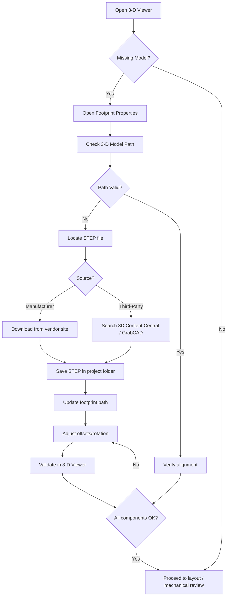

# Adding Missing 3‑D Models  

*Ensuring that every component on a PCB has an accurate 3‑D representation is essential for mechanical clearance checks, assembly verification, and seamless hand‑off to downstream teams.*  

---  

## 1. Overview  

When a PCB layout is opened in a 3‑D viewer, the software attempts to load the STEP (or equivalent) model that is linked to each footprint. If the link is broken, the model will be missing or displayed incorrectly, which can hide critical clearance violations or cause mis‑alignment during enclosure design. The workflow described below outlines how to detect missing models, locate reliable geometry, and integrate it into the design with proper alignment.  

---  

## 2. Accessing the 3‑D Viewer  

| Action | Result |
|--------|--------|
| Press **Alt + 3** (or select the 3‑D viewer icon in the top‑left toolbar) | Opens the interactive 3‑D view. |
| Left‑mouse drag | Rotates the board. |
| Mouse‑wheel (or middle‑button drag) | Zooms in/out. |

Using the viewer early in the design process gives an immediate visual cue about which components lack geometry.  

---  

## 3. Identifying Missing or Corrupt 3‑D Links  

1. **Inspect the 3‑D view** – components that appear as flat pads or are completely invisible are candidates for missing models.  
2. **Open the footprint properties** – double‑click the component or right‑click → *Properties*. The *3‑D Model* tab shows the file path.  
3. **Look for error icons** – a red “X” or “file not found” message indicates that the CAD tool cannot locate the referenced STEP file.  

> **Why it happens:** Library updates, OS migrations, or manual deletions often leave stale paths (e.g., a reference to a KiCad 6 model folder after upgrading to KiCad 7).  

---  

## 4. Sourcing Correct 3‑D Geometry  

### 4.1 Manufacturer Libraries  

The most reliable source is the component manufacturer’s own 3‑D CAD package.  

* **Procedure**  
  1. Note the exact part number from the schematic (e.g., *Molex 503048‑0410*).  
  2. Navigate to the manufacturer’s website → *Downloads* → *3‑D Models*.  
  3. Download the provided STEP (or IGES) file, usually packaged in a ZIP archive.  

> This approach guarantees that the model matches the physical dimensions, pin‑to‑pin spacing, and mechanical tolerances required for the part. [Verified]  

### 4.2 Third‑Party Repositories  

When manufacturers do not supply a model, two community resources are highly useful:  

* **3D Content Central** – searchable database of user‑uploaded STEP files, often vetted by the community.  
* **GrabCAD** – large repository of engineering models, including many generic connectors and passive components.  

> **Caution:** Verify the model’s dimensions against the datasheet before use; community uploads can contain scaling errors. [Inference]  

---  

## 5. Integrating the Model into the CAD Environment  

### 5.1 File Placement  

Two common strategies exist:  

| Strategy | Advantages | Disadvantages |
|----------|------------|---------------|
| **Project‑local folder** (e.g., `project_root/3D_models/`) | Portable; version‑controlled with the project repository. | Requires each collaborator to keep the folder in sync. |
| **Global CAD library folder** (e.g., `C:\Program Files\KiCad\share\footprints\3d_models\`) | Shared across all projects on a workstation. | Ties the design to a specific machine configuration. |

For most collaborative projects, a **project‑local folder** is recommended.  

### 5.2 Editing Footprint Properties  

1. Open the footprint’s *Properties* dialog.  
2. In the *3‑D Model* tab, click the folder icon and browse to the STEP file you saved.  
3. Select the file; the path will be stored relative to the project (if the folder is inside the project).  

### 5.3 Aligning Origin, Rotation, and Offsets  

Most manufacturer STEP files are centered on the component’s mechanical datum, not on the PCB pad stack. Manual alignment is therefore required:  

| Parameter | Typical Adjustment | Effect |
|-----------|-------------------|--------|
| **X/Y offset** | Shift to align the model’s pins with the footprint’s through‑hole locations. | Corrects lateral mis‑placement. |
| **Z offset** | Raise or lower to match the copper thickness and solder mask height. | Prevents the model from intersecting the board surface. |
| **Rotation (yaw/pitch/roll)** | Rotate in 90° increments (or finer if needed) to line up the pin orientation. | Aligns the model’s pin‑1 marker with the footprint’s pin‑1. |

The offsets are entered directly in the *3‑D Model* tab. After each change, re‑open the 3‑D viewer (Alt + 3) to verify the alignment.  

> **Tip:** Keep a small “reference” component (e.g., a 0402 resistor) with a known-good model in the same view to gauge scale and orientation. [Speculation]  

---  

## 6. Validation in the 3‑D Viewer  

Once all models are linked and roughly aligned:  

1. **Rotate the board** to view each component from multiple angles.  
2. **Check for interferences** – ensure that no model penetrates the copper, solder mask, or other components.  
3. **Confirm enclosure fit** – if an enclosure model is available, load it and verify clearances.  

If any model still appears displaced, return to the footprint properties and fine‑tune the offsets.  

---  

## 7. Best Practices & Recommendations  

| Practice | Rationale |
|----------|-----------|
| **Add 3‑D models early** (right after footprint placement) | Prevents a backlog of missing models later in the design cycle. |
| **Store STEP files alongside the project** | Guarantees reproducibility across machines and version control systems. |
| **Use manufacturer‑provided geometry whenever possible** | Guarantees dimensional fidelity and reduces the risk of clearance errors. |
| **Document the source of each model** (e.g., URL, version) in the footprint’s *Description* field | Facilitates future updates and audit trails. |
| **Run a final 3‑D clearance check before DRC** | Mechanical clearance issues are easier to spot in 3‑D than in 2‑D DRC. |
| **Maintain a “missing‑model” checklist** | A simple spreadsheet or issue‑tracker entry ensures no component is overlooked. |

---  

## 8. Common Pitfalls  

| Pitfall | Symptom | Remedy |
|---------|---------|--------|
| **Stale library paths after CAD upgrade** | “File not found” errors pointing to an old KiCad version folder. | Re‑link each missing model to the new path or relocate the STEP files to a version‑agnostic folder. |
| **Incorrect model scaling** | Component appears too large or too small in 3‑D view. | Verify the model’s units (mm vs. inches) and re‑export if necessary. |
| **Mis‑aligned pin‑1 orientation** | Pin‑1 marker on the model does not match the footprint’s pin‑1. | Apply a 90° rotation or adjust the X/Y offsets accordingly. |
| **Using generic “pad‑only” footprints for connectors** | No 3‑D model available because the footprint is defined as pads only. | Replace with a dedicated connector footprint that includes a 3‑D model reference, or create a custom footprint with a linked model. |

---  

## 9. Process Flow Diagram  

The following flowchart summarises the end‑to‑end procedure for adding missing 3‑D models to a PCB design.  

---  

## 10. Summary  

A complete set of correctly linked and aligned 3‑D models is a **non‑negotiable prerequisite** for modern PCB projects. By systematically checking the 3‑D viewer, sourcing reliable geometry, and storing the files alongside the project, designers eliminate hidden mechanical risks and streamline collaboration with mechanical engineers and manufacturers. Implementing the workflow and best‑practice checklist above will ensure that every component is represented accurately from the first layout iteration through to final production.