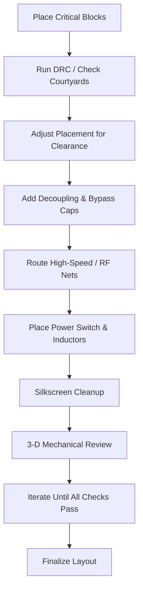

# Layout Fine‑Tuning  

Designing a robust PCB is an iterative exercise that balances electrical performance, manufacturability, and mechanical fit. This section captures the essential decisions, constraints, and best‑practice techniques that should be applied once the schematic is locked and the critical components have been identified.

---

## 1. Placement Strategy – Critical First  

1. **Identify the “must‑be‑close” groups** – USB protection diode (D1), USB connector (J1), and the USB controller (U2) form a tight functional block. Place them together before any other parts.  
2. **Reserve space for high‑speed / RF paths** – The crystal, its load capacitors, and any RF front‑end (filters, UFL connector) should be positioned to minimise trace length and avoid unnecessary bends.  
3. **Defer non‑critical items** – Switches, LDO regulators, status LEDs, and boot‑mode jumpers can be placed after the high‑priority blocks are locked in. This reduces the chance of having to reshuffle critical nets later.  

> *Placing critical components first dramatically simplifies subsequent routing and reduces the number of layer transitions required.* [Verified]

---

## 2. Courtyard, Clearance, and DRC  

- **Courtyard layers** are visual guides that indicate the minimum keep‑out area for a component’s mechanical envelope. Overlapping courtyards or pads is a hard DFM violation.  
- **Creepage & clearance** rules must be respected, especially around protection diodes and high‑voltage nets. Use the CAD tool’s DRC to enforce the required spacing.  

> *Overlapping courtyards or pads is a no‑go.* [Verified]

When a component (e.g., D1) forces a neighboring part (J3) to shift, move the latter just enough to restore the required clearance while preserving a clean routing corridor.

---

## 3. Grid Selection & Alignment  

- **Fine grid** (e.g., 0.1 mm) enables precise alignment of pads and reduces the need for manual nudging.  
- Aligning components on a common grid encourages **orthogonal routing** (pure vertical or horizontal) which the autorouter and manual routing tools handle more efficiently.  
- Occasionally a pad will not sit exactly on the grid; a small compromise is acceptable if it yields a straighter trace path.  

> *Changing the grid to a finer pitch helped align the RF components and keep the rat’s‑nest straight.* [Verified]

---

## 4. RF & High‑Speed Routing Considerations  

| Goal | Recommended Practice |
|------|-----------------------|
| **Minimise trace length** | Place the crystal as close as possible to the MCU pins; route directly from pins 2/3 to the load caps and then to the crystal. |
| **Maintain straight paths** | Avoid 45° or curved segments; use 90° bends only when necessary and keep them away from the crystal. |
| **Control impedance** | For frequencies above a few hundred MHz, define a controlled‑impedance microstrip or stripline stack‑up. |
| **Via placement** | Use short, low‑inductance vias for the crystal and filter nets; avoid stitching vias that add unnecessary length. |

> *Shorter RF traces generally improve signal integrity, but they can make routing around dense pin clusters harder.* [Inference]

---

## 5. Decoupling & Bypass Capacitor Placement  

- **Every power pin** should have at least one decoupling capacitor placed **as close as possible** to the pin’s pad.  
- For the MCU, locate the bulk decoupling (e.g., 10 µF) near the power entry and the high‑frequency caps (e.g., 0.1 µF) directly on the pins.  
- Align the caps on a common grid to enable parallel routing and reduce the number of vias.  

> *The load capacitors for the crystal (C17, C18) should sit next to the crystal to minimise loop area.* [Verified]

---

## 6. Power‑Switch & Inductor Layout  

- **Inductors** that feed a power‑switch should be placed so that the current path from the switch to the inductor is **vertical** (or horizontal) and as short as possible. This reduces parasitic inductance and eases routing.  
- When multiple inductors are present, stagger them to keep their magnetic fields from coupling excessively.  
- Keep the **switch node** (e.g., boot‑zero switch) close to the LDO input and output pins, and route the associated capacitors (C14, etc.) with minimal bends.  

> *Moving L1 left created a straight vertical connection, eliminating awkward angles.* [Inference]

---

## 7. Silk‑Screen Management  

- Ensure that silkscreen text and reference designators **do not overlap** pads, vias, or copper pours.  
- Use the CAD tool’s move command (`M`) to nudge labels into clear space.  
- Keep the silkscreen legible for assembly and inspection; avoid overly dense labeling near high‑density components.  

> *Silkscreen was cleaned up to avoid overlapping text.* [Verified]

---

## 8. 3‑D Mechanical Verification  

- Switch to the **3‑D viewer** (`Alt+3`) frequently. It reveals mechanical interferences (e.g., component height, connector clearance) that are invisible in 2‑D layout.  
- Verify that the board fits within the intended enclosure, that connectors clear mating parts, and that tall components (inductors, connectors) do not collide with the enclosure or other boards.  

> *The 3‑D viewer is used for mechanical sanity checks and to spot errors early.* [Verified]

---

## 9. Iterative Refinement Workflow  

The layout process is cyclic:

Each iteration should be followed by a **DRC/ERC run**, a quick visual inspection in the 3‑D view, and a sanity check of the rat’s‑nest to ensure that the remaining routing effort is manageable.

---

## 10. Summary of Best Practices  

| Practice | Rationale |
|----------|-----------|
| **Place critical components first** | Reduces routing congestion and preserves optimal signal paths. |
| **Respect courtyard and clearance rules** | Prevents mechanical clashes and manufacturing defects. |
| **Use a fine grid for alignment** | Enables straight, orthogonal routing and simplifies via placement. |
| **Keep RF traces short and straight** | Improves signal integrity and reduces parasitic effects. |
| **Locate decoupling capacitors as close as possible to power pins** | Minimises loop inductance and noise coupling. |
| **Align inductors and power‑switch nodes vertically/horizontally** | Shortens high‑current paths and eases routing. |
| **Maintain clean silkscreen** | Facilitates assembly, inspection, and serviceability. |
| **Leverage the 3‑D viewer early and often** | Catches mechanical interferences before fabrication. |
| **Iterate continuously** | Each refinement uncovers new opportunities for improvement and error correction. |

Applying these guidelines systematically yields a layout that is electrically robust, manufacturable, and mechanically sound, while keeping the design effort and cost under control.